# AlephAuto

Job queue framework with real-time dashboard for automation pipelines.

```mermaid
graph TD
    root["AlephAuto<br/><i>v1.0.0 &bull; Node + Python</i>"]

    root --> api["api/<br/><i>REST API + WebSocket</i>"]
    root --> frontend["frontend/<br/><i>React Dashboard (Vite + TS)</i>"]
    root --> sidequest["sidequest/<br/><i>Job Queue Framework</i>"]
    root --> packages["packages/<br/><i>Shared Workspace Pkgs</i>"]
    root --> tests["tests/<br/><i>Unit, Integration, Accuracy</i>"]
    root --> scripts["scripts/<br/><i>Deploy, Config, Monitoring</i>"]
    root --> docs["docs/<br/><i>Architecture, Runbooks, API</i>"]
    root --> config["config/<br/><i>PM2 Ecosystem</i>"]
    root --> output["output/<br/><i>Reports &amp; Scan Results</i>"]

    api --> api_routes["routes/<br/>jobs, scans, pipelines, reports"]
    api --> api_mw["middleware/<br/>auth, validation, rate-limit"]
    api --> api_types["types/<br/>Zod schemas"]
    api --> api_utils["utils/<br/>port-manager, worker-registry, api-error"]

    frontend --> fe_src["src/<br/>components, services, store"]

    sidequest --> sq_core["core/<br/>server, job-repo, git-workflow, constants"]
    sidequest --> sq_pipe["pipeline-core/<br/>scan-orchestrator, similarity (Python)"]
    sidequest --> sq_runners["pipeline-runners/<br/>7 pipeline entry points"]
    sidequest --> sq_workers["workers/<br/>repomix, git-activity, schema, cleanup"]

    packages --> pkg_log["@shared/logging<br/>Pino utilities"]
    packages --> pkg_io["@shared/process-io<br/>Child process utilities"]

    tests --> t_unit["unit/"]
    tests --> t_int["integration/"]
    tests --> t_acc["accuracy/"]

    style root fill:#9999ff,stroke:#333,color:#000
    style api fill:#99ff99,stroke:#333,color:#000
    style frontend fill:#99ff99,stroke:#333,color:#000
    style sidequest fill:#99ff99,stroke:#333,color:#000
    style packages fill:#99ff99,stroke:#333,color:#000
    style tests fill:#99ff99,stroke:#333,color:#000
    style scripts fill:#99ff99,stroke:#333,color:#000
    style docs fill:#99ff99,stroke:#333,color:#000
    style config fill:#99ff99,stroke:#333,color:#000
    style output fill:#ffeb99,stroke:#333,color:#000
```



## Pipelines

| # | Pipeline | Language | Schedule | Output |
|---|----------|----------|----------|--------|
| 1 | **Duplicate Detection** | JS (1-2) + Python (3-7) | 2 AM daily | HTML/MD/JSON reports + PRs |
| 2 | **Schema Enhancement** | JS | 3 AM daily | Modified READMEs + JSON |
| 3 | **Git Activity Reporter** | JS | Sunday 8 PM | Jekyll MD + SVG |
| 4 | **Repository Cleanup** | JS | Sunday 3 AM | Cleanup logs |
| 5 | **Repomix** | JS | 2 AM daily | `condense/*.txt` |
| 6 | **Codebase Health** | JS + Python | Manual | MD/JSON reports |
| 7 | **Dashboard Populate** | JS | 6 AM/6 PM | Cloudflare KV + reports |

## Quick Start

```bash
pnpm install
npm run build:frontend
doppler setup --project bottleneck --config dev
```

```bash
doppler run -- npm start                  # Repomix cron
doppler run -- npm run dashboard          # Dashboard UI → http://localhost:8080
npm test && npm run test:integration      # Tests
npm run typecheck                         # Type check
```

## Architecture

```
SidequestServer (Base)
├── Event-driven lifecycle: created → queued → running → completed/failed
├── Concurrency control (default: 5)
├── Auto-retry with circuit breaker
├── Sentry integration
├── GitWorkflowManager (branch/commit/PR)
└── JobRepository (SQLite persistence)

Multi-Language Pipeline (Duplicate Detection)
  JS Stages 1-2: repo scanning, pattern detection
       │ JSON stdin/stdout
  Python Stages 3-7: extraction, annotation, similarity, grouping, reports
```

## Directory Structure

```
├── api/                    # REST API + WebSocket (Express)
│   ├── routes/            # Endpoint handlers (jobs, scans, pipelines, reports)
│   ├── types/             # Zod schemas → TypeScript inference
│   ├── middleware/        # Auth, validation, rate-limit, error-handler
│   └── utils/             # Port manager, worker registry, API error helpers
├── frontend/              # React dashboard (Vite + TypeScript)
│   └── src/               # Components, services, store, types
├── sidequest/             # AlephAuto job queue framework
│   ├── core/              # server.js, job-repository, git-workflow, constants
│   ├── pipeline-core/     # Scan orchestrator, similarity (Python)
│   ├── pipeline-runners/  # 7 pipeline entry points
│   └── workers/           # Worker implementations
├── packages/              # pnpm workspace packages
│   ├── shared-logging/    # @shared/logging (Pino)
│   └── shared-process-io/ # @shared/process-io (child process utils)
├── tests/                 # Unit, integration, accuracy tests
├── docs/                  # Architecture, runbooks, API reference
├── scripts/               # Deploy, config monitoring, health checks
├── config/                # PM2 ecosystem configs
├── output/                # Generated reports and scan results
├── cloudflare-workers/    # Edge worker (n0ai-proxy)
├── data/                  # Static data files
└── logs/                  # Runtime logs
```

## Commands

```bash
# Development
doppler run -- npm start                   # Server
npm run dashboard                          # Dashboard UI
npm run build:frontend                     # Build React app

# Pipelines
doppler run -- node sidequest/pipeline-runners/duplicate-detection-pipeline.js --run-now
npm run docs:enhance                       # Schema.org injection
npm run git:weekly                         # Git activity report
npm run dashboard:populate                 # Quality metrics (seed)
npm run dashboard:populate:full            # Quality metrics (LLM judge)

# Testing
npm test                                   # Unit tests
npm run test:integration                   # Integration tests
npm run typecheck                          # TypeScript checks

# Production
doppler run -c prd -- pm2 start config/ecosystem.config.cjs
./scripts/deploy-traditional-server.sh --update
```

## Key Files

| Purpose | File |
|---------|------|
| Pipeline coordinator | `sidequest/pipeline-core/scan-orchestrator.ts` |
| Base job queue | `sidequest/core/server.js` |
| Job repository | `sidequest/core/job-repository.js` |
| Git workflow manager | `sidequest/core/git-workflow-manager.js` |
| Constants | `sidequest/core/constants.js` |
| Job status types | `api/types/job-status.ts` |
| API error utilities | `api/utils/api-error.js` |
| Port manager | `api/utils/port-manager.js` |
| Worker registry | `api/utils/worker-registry.js` |

## Docs

- [API Reference](docs/API_REFERENCE.md) - 22 REST endpoints
- [System Data Flow](docs/architecture/SYSTEM-DATA-FLOW.md) - Architecture diagrams
- [Error Handling](docs/architecture/ERROR_HANDLING.md) - Retry logic, circuit breaker
- [Type System](docs/architecture/TYPE_SYSTEM.md) - Zod + TypeScript patterns
- [Pipeline Execution](docs/runbooks/pipeline-execution.md) - PM2/Doppler patterns
- [Troubleshooting](docs/runbooks/troubleshooting.md) - Debugging guide
- [MCP Servers](docs/MCP_SERVERS.md) - Sentry, Redis, TaskQueue, Filesystem

## License

MIT
