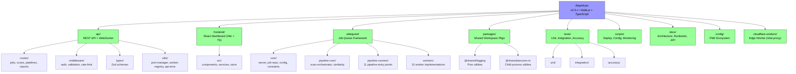

# AlephAuto

Job queue framework with real-time dashboard for automation pipelines.


```mermaid
graph TD
    root["AlephAuto<br/><i>v2.3.x &bull; Node.js + TypeScript</i>"]

    root --> api["api/<br/><i>REST API + WebSocket</i>"]
    root --> frontend["frontend/<br/><i>React Dashboard (Vite + TS)</i>"]
    root --> sidequest["sidequest/<br/><i>Job Queue Framework</i>"]
    root --> packages["packages/<br/><i>Shared Workspace Pkgs</i>"]
    root --> tests["tests/<br/><i>Unit, Integration, Accuracy</i>"]
    root --> scripts["scripts/<br/><i>Deploy, Config, Monitoring</i>"]
    root --> docs["docs/<br/><i>Architecture, Runbooks, API</i>"]
    root --> config["config/<br/><i>PM2 Ecosystem</i>"]
    root --> cloudflare["cloudflare-workers/<br/><i>Edge Worker (n0ai-proxy)</i>"]

    api --> api_routes["routes/<br/>jobs, scans, pipelines, reports"]
    api --> api_mw["middleware/<br/>auth, validation, rate-limit"]
    api --> api_types["types/<br/>Zod schemas"]
    api --> api_utils["utils/<br/>port-manager, worker-registry, api-error"]

    frontend --> fe_src["src/<br/>components, services, store"]

    sidequest --> sq_core["core/<br/>server, job-repo, config, constants"]
    sidequest --> sq_pipe["pipeline-core/<br/>scan-orchestrator, similarity"]
    sidequest --> sq_runners["pipeline-runners/<br/>11 pipeline entry points"]
    sidequest --> sq_workers["workers/<br/>10 worker implementations"]

    packages --> pkg_log["@shared/logging<br/>Pino utilities"]
    packages --> pkg_io["@shared/process-io<br/>Child process utilities"]

    tests --> t_unit["unit/"]
    tests --> t_int["integration/"]
    tests --> t_acc["accuracy/"]

    style root fill:#9999ff,stroke:#333,color:#000
    style api fill:#99ff99,stroke:#333,color:#000
    style frontend fill:#99ff99,stroke:#333,color:#000
    style sidequest fill:#99ff99,stroke:#333,color:#000
    style packages fill:#99ff99,stroke:#333,color:#000
    style tests fill:#99ff99,stroke:#333,color:#000
    style scripts fill:#99ff99,stroke:#333,color:#000
    style docs fill:#99ff99,stroke:#333,color:#000
    style config fill:#99ff99,stroke:#333,color:#000
    style cloudflare fill:#99ff99,stroke:#333,color:#000
```

## Pipelines

| # | Pipeline | Language | Schedule | Output |
|---|----------|----------|----------|--------|
| 1 | **Duplicate Detection** | TypeScript (all stages) | 2 AM daily | HTML/MD/JSON reports + PRs |
| 2 | **Schema Enhancement** | TS | 3 AM daily | Modified READMEs + JSON |
| 3 | **Git Activity Reporter** | TS | Sunday 8 PM | Jekyll MD + SVG |
| 4 | **Repository Cleanup** | TS | Sunday 3 AM | Cleanup logs |
| 5 | **Repomix** | TS | 2 AM daily | `docs/repomix/{repo-compressed.xml,repomix.xml}` |
| 6 | **Claude Health** | TS | 8 AM daily | MD/JSON reports |
| 7 | **Dashboard Populate** | TS | 6 AM/6 PM | Cloudflare KV + reports |
| 8 | **Bugfix Audit** | TS | Recurring | Audit reports |
| 9 | **Gitignore Update** | TS | Scheduled | Updated .gitignore files |
| 10 | **Plugin Management** | TS | Monday 9 AM | Audit reports |
| 11 | **Test Refactor** | TS | Manual | Refactored test files |

## Quick Start

```bash
pnpm install
npm run build:frontend
doppler setup --project integrity-studio --config dev
```

```bash
npm start                                 # Server (reads .env)
npm run dashboard                         # Dashboard UI → http://localhost:8080
npm run test:all:core                     # Core Node suites (env-gated)
npm run test:all:env                      # Env-sensitive suites requiring host capabilities
npm run test:all:full                     # Core + env-sensitive
npm run typecheck                         # Type check
npm run lint                              # ESLint check (eslint.config.js)
npm run lint:fix                          # ESLint auto-fix
```

## Architecture

```
SidequestServer (Base)
├── Event-driven lifecycle: created → queued → running → completed/failed
├── Concurrency control (default: 5)
├── Auto-retry with error classification
├── Sentry integration
├── BranchManager (branch/commit/PR)
└── JobRepository (PostgreSQL persistence)

Duplicate Detection Pipeline (pure TypeScript)
  Stages 1-2: repo scanning, pattern detection
  Stages 3-6: extraction, annotation, similarity, grouping
  Stage 7: report generation (HTML/JSON/Markdown via ReportCoordinator)
```

## Directory Structure

```
├── api/                    # REST API + WebSocket (23 routes)
│   ├── routes/            # Endpoint handlers (jobs, scans, pipelines, reports)
│   ├── types/             # Zod schemas → TypeScript inference
│   ├── middleware/        # Auth, validation, rate-limit, error-handler
│   └── utils/             # Port manager, worker registry, API error helpers
├── frontend/              # React dashboard (Vite + TypeScript)
│   └── src/               # Components, services, store, types
├── sidequest/             # AlephAuto job queue framework
│   ├── core/              # server.ts, job-repository, config, constants
│   ├── pipeline-core/     # Scan orchestrator, similarity
│   ├── pipeline-runners/  # 11 pipeline entry points
│   └── workers/           # Worker implementations
├── packages/              # pnpm workspace packages
│   ├── shared-logging/    # @shared/logging (Pino)
│   └── shared-process-io/ # @shared/process-io (child process utils)
├── tests/                 # Unit, integration, accuracy tests
├── docs/                  # Architecture, runbooks, API reference
├── scripts/               # Deploy, config monitoring, health checks
├── config/                # PM2 ecosystem config
├── cloudflare-workers/    # Edge worker (n0ai-proxy)
├── data/                  # Runtime data
└── logs/                  # Runtime logs (gzipped)
```

## Commands

```bash
# Development
npm start                                  # Server (reads .env)
npm run dashboard                          # Dashboard UI
npm run build:frontend                     # Build React app

# Job Execution Control
# Disable job creation before CI/CD deployments:
#   Set DISABLE_JOB_EXECUTION=true in .env
# Resume after deployment:
#   Set DISABLE_JOB_EXECUTION=false in .env
# All job-creation endpoints return 503 Service Unavailable when disabled

# Pipelines
doppler run -- node --strip-types sidequest/pipeline-runners/duplicate-detection-pipeline.ts --run-now
npm run docs:enhance                       # Schema.org injection
npm run git:weekly                         # Git activity report
npm run claude:health                      # Claude health check
npm run dashboard:populate                 # Quality metrics (seed)
npm run dashboard:populate:full            # Quality metrics (LLM judge)
npm run bugfix:once                        # Bugfix audit (one-shot)
npm run gitignore:update                   # Gitignore update
npm run plugin:audit                       # Plugin management audit

# Testing
npm test                                   # Unit tests
npm run test:integration                   # Integration tests
npm run test:all:core                      # Core Node suites (SKIP_ENV_SENSITIVE_TESTS=1)
npm run test:all:env                       # Env-sensitive suites requiring host capabilities
npm run test:all:full                      # Core + env-sensitive
npm run typecheck                          # TypeScript checks
npm run lint                              # ESLint check (eslint.config.js)
npm run lint:fix                          # ESLint auto-fix

# Production
doppler run -c prd -- pm2 start config/ecosystem.config.cjs
./scripts/deploy/deploy-traditional-server.sh --update
```

## Key Files

| Purpose | File |
|---------|------|
| Pipeline coordinator | `sidequest/pipeline-core/scan-orchestrator.ts` |
| Structural similarity | `sidequest/pipeline-core/similarity/structural.ts` |
| Base job queue | `sidequest/core/server.ts` |
| Base pipeline runner | `sidequest/pipeline-runners/base-pipeline.ts` |
| Job repository | `sidequest/core/job-repository.ts` |
| Centralized config | `sidequest/core/config.ts` |
| Domain constants | `sidequest/core/constants.ts` |
| Error classifier | `sidequest/pipeline-core/errors/error-classifier.ts` |
| Branch manager | `sidequest/pipeline-core/git/branch-manager.ts` |
| Job status types | `api/types/job-status.ts` |
| API error utilities | `api/utils/api-error.ts` |
| Port manager | `api/utils/port-manager.ts` |
| Worker registry | `api/utils/worker-registry.ts` |

## Docs

- [API Reference](docs/API_REFERENCE.md) - REST API endpoints
- [System Data Flow](docs/architecture/SYSTEM-DATA-FLOW.md) - Architecture diagrams
- [Error Handling](docs/architecture/ERROR_HANDLING.md) - Retry logic, circuit breaker
- [Type System](docs/architecture/TYPE_SYSTEM.md) - Zod + TypeScript patterns
- [Pipeline Execution](docs/runbooks/pipeline-execution.md) - PM2/Doppler patterns
- [Troubleshooting](docs/runbooks/troubleshooting.md) - Debugging guide
- [MCP Servers](docs/MCP_SERVERS.md) - Sentry, Redis, TaskQueue, Filesystem
- [Adding Pipelines](docs/ADDING_PIPELINES.md) - Pipeline creation guide
- [Installation & Deployment](docs/INSTALL.md) - Setup, production deployment, GitHub Pages
- [Changelog](docs/CHANGELOG.md) - Legacy/cross-project history
- [Release Changelogs](docs/changelog/README.md) - v2.x release history (latest: v2.3.29)

## Known Issues

See [docs/BACKLOG.md](docs/BACKLOG.md#known-issues) for active known issues.

## License

MIT
