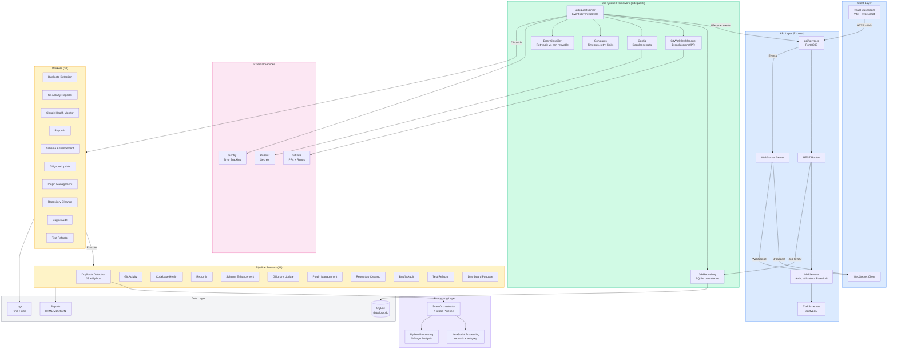
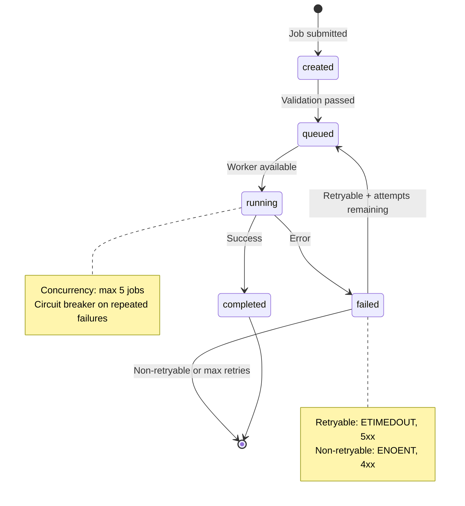
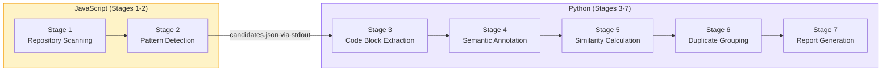

# AlephAuto Architecture

## System Overview

```mermaid
graph TB
    subgraph Client["Client Layer"]
        Dashboard["React Dashboard<br/>Vite + TypeScript"]
        WS_Client["WebSocket Client"]
    end

    subgraph API["API Layer (Express)"]
        Server["api/server.js<br/>Port 8080"]
        WS_Server["WebSocket Server"]
        Routes["REST Routes"]
        Middleware["Middleware<br/>Auth, Validation, Rate-limit"]
        Types["Zod Schemas<br/>api/types/"]
    end

    subgraph Framework["Job Queue Framework (sidequest/)"]
        SQ["SidequestServer<br/>Event-driven lifecycle"]
        JobRepo["JobRepository<br/>SQLite persistence"]
        GitWF["GitWorkflowManager<br/>Branch/commit/PR"]
        Config["Config<br/>Doppler secrets"]
        Constants["Constants<br/>Timeouts, retry, limits"]
        ErrClass["Error Classifier<br/>Retryable vs non-retryable"]
    end

    subgraph Workers["Workers (10)"]
        DupW["Duplicate Detection"]
        GitW["Git Activity Reporter"]
        HealthW["Claude Health Monitor"]
        RepomixW["Repomix"]
        SchemaW["Schema Enhancement"]
        GitignoreW["Gitignore Update"]
        PluginW["Plugin Management"]
        CleanupW["Repository Cleanup"]
        BugfixW["Bugfix Audit"]
        TestW["Test Refactor"]
    end

    subgraph Pipelines["Pipeline Runners (11)"]
        DupP["Duplicate Detection<br/>JS + Python"]
        GitP["Git Activity"]
        HealthP["Codebase Health"]
        RepomixP["Repomix"]
        SchemaP["Schema Enhancement"]
        GitignoreP["Gitignore Update"]
        PluginP["Plugin Management"]
        CleanupP["Repository Cleanup"]
        BugfixP["Bugfix Audit"]
        TestP["Test Refactor"]
        DashP["Dashboard Populate"]
    end

    subgraph Processing["Processing Layer"]
        Orchestrator["Scan Orchestrator<br/>7-Stage Pipeline"]
        JSProc["JavaScript Processing<br/>repomix + ast-grep"]
        PyProc["Python Processing<br/>5-Stage Analysis"]
    end

    subgraph Data["Data Layer"]
        SQLite[(SQLite<br/>data/jobs.db)]
        Logs["Logs<br/>Pino + gzip"]
        Reports["Reports<br/>HTML/MD/JSON"]
    end

    subgraph External["External Services"]
        Doppler["Doppler<br/>Secrets"]
        Sentry["Sentry<br/>Error Tracking"]
        GitHub["GitHub<br/>PRs + Repos"]
    end

    Dashboard -->|HTTP + WS| Server
    WS_Client -->|WebSocket| WS_Server
    Server --> Routes
    Routes --> Middleware
    Middleware --> Types
    Routes -->|Job CRUD| JobRepo
    Server -->|Events| WS_Server
    WS_Server -->|Broadcast| WS_Client

    SQ -->|Lifecycle events| Server
    SQ --> JobRepo
    SQ --> GitWF
    SQ --> Config
    SQ --> Constants
    SQ --> ErrClass

    Workers -->|Execute| Pipelines
    SQ -->|Dispatch| Workers

    DupP --> Orchestrator
    Orchestrator --> JSProc
    Orchestrator --> PyProc

    JobRepo --> SQLite
    Workers --> Logs
    Pipelines --> Reports

    Config --> Doppler
    SQ --> Sentry
    GitWF --> GitHub

    style Client fill:#dbeafe,stroke:#3b82f6
    style API fill:#dbeafe,stroke:#3b82f6
    style Framework fill:#d1fae5,stroke:#10b981
    style Workers fill:#fef3c7,stroke:#f59e0b
    style Pipelines fill:#fef3c7,stroke:#f59e0b
    style Processing fill:#ede9fe,stroke:#8b5cf6
    style Data fill:#f3f4f6,stroke:#6b7280
    style External fill:#fce7f3,stroke:#ec4899
```

## Job Lifecycle

```mermaid
stateDiagram-v2
    [*] --> created: Job submitted
    created --> queued: Validation passed
    queued --> running: Worker available
    running --> completed: Success
    running --> failed: Error
    failed --> queued: Retryable + attempts remaining
    failed --> [*]: Non-retryable or max retries
    completed --> [*]

    note right of running
        Concurrency: max 5 jobs
        Circuit breaker on repeated failures
    end note

    note right of failed
        Retryable: ETIMEDOUT, 5xx
        Non-retryable: ENOENT, 4xx
    end note
```

## Duplicate Detection Pipeline (JS + Python)

```mermaid
graph LR
    subgraph JS["JavaScript (Stages 1-2)"]
        S1["Stage 1<br/>Repository Scanning"]
        S2["Stage 2<br/>Pattern Detection"]
    end

    subgraph PY["Python (Stages 3-7)"]
        S3["Stage 3<br/>Code Block Extraction"]
        S4["Stage 4<br/>Semantic Annotation"]
        S5["Stage 5<br/>Similarity Calculation"]
        S6["Stage 6<br/>Duplicate Grouping"]
        S7["Stage 7<br/>Report Generation"]
    end

    S1 --> S2
    S2 -->|candidates.json via stdout| S3
    S3 --> S4
    S4 --> S5
    S5 --> S6
    S6 --> S7

    style JS fill:#fef3c7,stroke:#f59e0b
    style PY fill:#ede9fe,stroke:#8b5cf6
```

## Repository Structure

```mermaid
graph TD
    root["AlephAuto"]

    root --> api["api/<br/>REST API + WebSocket"]
    root --> frontend["frontend/<br/>React Dashboard"]
    root --> sidequest["sidequest/<br/>Job Queue Framework"]
    root --> packages["packages/<br/>Shared Libraries"]
    root --> tests["tests/<br/>Unit + Integration"]
    root --> docs["docs/<br/>Documentation"]
    root --> scripts["scripts/<br/>Deploy + Utilities"]
    root --> config["config/<br/>PM2 Ecosystem"]

    api --> routes["routes/ (5)"]
    api --> types["types/ (Zod)"]
    api --> middleware["middleware/"]
    api --> utils["utils/<br/>port-manager, worker-registry"]

    sidequest --> core["core/<br/>server, db, git-workflow,<br/>job-repo, config, constants"]
    sidequest --> workers["workers/ (10)"]
    sidequest --> runners["pipeline-runners/ (11)"]
    sidequest --> pcore["pipeline-core/<br/>orchestrator, similarity"]

    packages --> logging["@shared/logging<br/>Pino"]
    packages --> processio["@shared/process-io<br/>Child process utils"]

    style root fill:#f9f9f9,stroke:#333,stroke-width:2px
    style api fill:#dbeafe,stroke:#3b82f6
    style frontend fill:#dbeafe,stroke:#3b82f6
    style sidequest fill:#d1fae5,stroke:#10b981
    style packages fill:#d1fae5,stroke:#10b981
    style tests fill:#fef3c7,stroke:#f59e0b
    style docs fill:#f3f4f6,stroke:#6b7280
    style scripts fill:#f3f4f6,stroke:#6b7280
    style config fill:#f3f4f6,stroke:#6b7280
```
