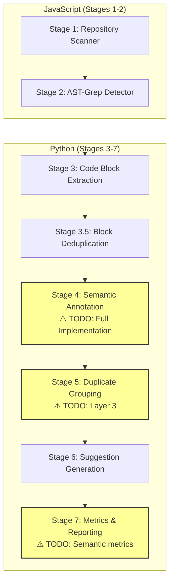
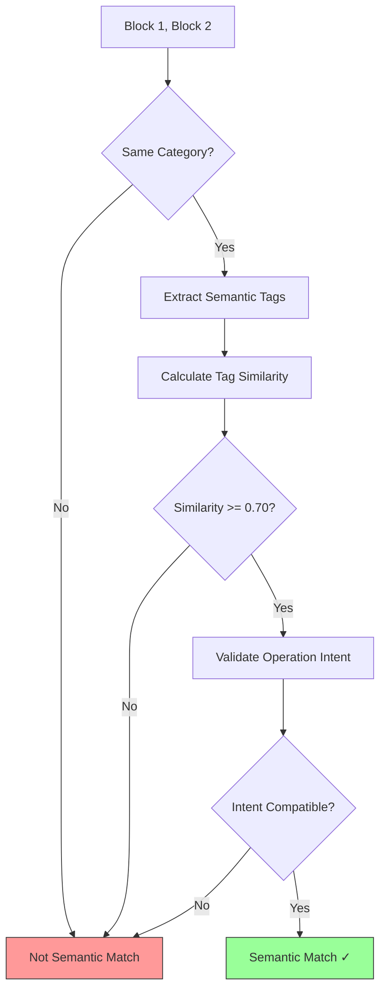

# Layer 3: Semantic Similarity Implementation Plan

**Status:** TODO
**Priority:** High
**Last Updated:** 2026-02-01
**Backlog Items:** [H1, H2, H3, H4, H5](../BACKLOG.md#high-priority---feature-implementation)

---

## Table of Contents

1. [Overview](#overview)
2. [Current Architecture](#current-architecture)
3. [Layer 3 Design](#layer-3-design)
4. [Implementation Plan](#implementation-plan)
5. [Integration Points](#integration-points)
6. [Data Structures](#data-structures)
7. [Algorithm Specification](#algorithm-specification)
8. [Testing Strategy](#testing-strategy)
9. [Migration Steps](#migration-steps)

---

## Overview

### What is Layer 3?

Layer 3 (Semantic Similarity) is the third tier of the multi-layer duplicate detection algorithm. It groups code blocks that are **semantically equivalent** but may differ structurally - meaning they perform the same logical operation using different syntax or approaches.

### Why Layer 3?

| Layer | Detection Method | Example Match |
|-------|-----------------|---------------|
| **Layer 1** | Exact hash | Identical code (copy-paste) |
| **Layer 2** | Structural similarity | Same structure, different variable names |
| **Layer 3** | Semantic equivalence | Different structure, same purpose |

**Example - All should group together:**
```javascript
// Block A: Array filtering with arrow function
const adults = users.filter(u => u.age >= 18);

// Block B: Array filtering with traditional function
const adults = users.filter(function(u) { return u.age >= 18; });

// Block C: Manual loop implementation
const adults = [];
for (const u of users) {
  if (u.age >= 18) adults.push(u);
}
```

Layers 1-2 would **not** group these. Layer 3 would recognize they all perform "filter users by age >= 18".

### Backlog Coverage

This implementation addresses these TODOs:

| ID | Location | Description |
|----|----------|-------------|
| H1 | `grouping.py:387` | Layer 3 - Semantic similarity implementation |
| H2 | `extract_blocks.py:286` | Detect language from file extension |
| H3 | `extract_blocks.py:684` | Implement full semantic annotator (Stage 4) |
| H4 | `extract_blocks.py:699` | Implement semantic grouping for duplicate detection |
| H5 | `extract_blocks.py:702` | Calculate duplication percentage properly |

---

## Current Architecture

### Pipeline Stages



### Current Grouping Flow

**File:** `sidequest/pipeline-core/similarity/grouping.py`

```python
def group_by_similarity(blocks, similarity_threshold=0.90):
    """Current implementation (layers 0-2 only)"""

    # Layer 0: Filter trivial blocks
    complex_blocks = [b for b in blocks if is_complex_enough(b)]

    # Layer 1: Exact hash matching
    exact_groups = _group_by_exact_hash(complex_blocks)

    # Layer 2: Structural similarity
    structural_groups = _group_by_structural_similarity(ungrouped, threshold)

    # TODO: Layer 3 - Semantic similarity
    # Group remaining blocks by category + semantic tags

    return groups
```

### Current Limitations

1. **No semantic annotation** - Stage 4 only assigns basic categories
2. **No category+tags matching** - Layer 3 placeholder never executes
3. **No semantic metrics** - `semantic_duplicates` always 0
4. **Hardcoded language** - Always assumes JavaScript

---

## Layer 3 Design

### Semantic Equivalence Criteria

Two code blocks are semantically equivalent if they share:

1. **Same category** (required)
2. **Compatible semantic tags** (weighted match)
3. **Same operation intent** (inferred from tags)

### Semantic Tag Taxonomy

```
semantic_tags:
├── operation:
│   ├── filter, map, reduce, find, sort
│   ├── validate, transform, aggregate
│   └── fetch, store, delete, update
├── domain:
│   ├── user, auth, payment, notification
│   ├── file, database, cache, queue
│   └── api, webhook, event
├── pattern:
│   ├── guard_clause, early_return, null_check
│   ├── error_handling, retry_logic, timeout
│   └── pagination, batching, streaming
└── data_type:
    ├── array, object, string, number
    ├── date, boolean, null, undefined
    └── promise, observable, generator
```

### Matching Algorithm



---

## Implementation Plan

### Phase 1: Language Detection (H2)

**File:** `sidequest/pipeline-core/extractors/extract_blocks.py:286`

```python
# Current (hardcoded)
language='javascript',  # TODO: Detect from file extension

# Implementation
LANGUAGE_MAP = {
    '.js': 'javascript',
    '.jsx': 'javascript',
    '.ts': 'typescript',
    '.tsx': 'typescript',
    '.py': 'python',
    '.rb': 'ruby',
    '.go': 'go',
    '.rs': 'rust',
}

def detect_language(file_path: str) -> str:
    """Detect programming language from file extension."""
    ext = Path(file_path).suffix.lower()
    return LANGUAGE_MAP.get(ext, 'unknown')
```

### Phase 2: Semantic Annotator (H3)

**New File:** `sidequest/pipeline-core/annotators/semantic_annotator.py`

```python
from dataclasses import dataclass
from typing import Set, List

@dataclass
class SemanticAnnotation:
    """Rich semantic metadata for a code block."""
    category: str
    operations: Set[str]
    domains: Set[str]
    patterns: Set[str]
    data_types: Set[str]
    intent: str  # High-level description of what the code does

class SemanticAnnotator:
    """Stage 4: Full semantic annotation of code blocks."""

    def extract_annotation(self, block: CodeBlock) -> SemanticAnnotation:
        """
        Analyze code block and extract semantic metadata.

        Uses pattern matching and AST analysis to identify:
        - Operations (filter, map, validate, etc.)
        - Domain concepts (user, auth, payment, etc.)
        - Code patterns (guard clause, error handling, etc.)
        - Data types being processed
        """
        operations = self._extract_operations(block.source_code)
        domains = self._extract_domains(block.source_code, block.tags)
        patterns = self._extract_patterns(block.source_code)
        data_types = self._extract_data_types(block.source_code)
        intent = self._infer_intent(operations, domains, patterns)

        return SemanticAnnotation(
            category=block.category,
            operations=operations,
            domains=domains,
            patterns=patterns,
            data_types=data_types,
            intent=intent
        )

    def _extract_operations(self, code: str) -> Set[str]:
        """Extract operation types from code."""
        operations = set()

        # Array operations
        ARRAY_OPS = {
            r'\.filter\s*\(': 'filter',
            r'\.map\s*\(': 'map',
            r'\.reduce\s*\(': 'reduce',
            r'\.find\s*\(': 'find',
            r'\.some\s*\(': 'some',
            r'\.every\s*\(': 'every',
            r'\.sort\s*\(': 'sort',
            r'for\s*\(' : 'iterate',
            r'while\s*\(': 'iterate',
        }

        for pattern, op in ARRAY_OPS.items():
            if re.search(pattern, code):
                operations.add(op)

        # CRUD operations
        CRUD_OPS = {
            r'\.(get|fetch|read|load)\s*\(': 'read',
            r'\.(post|create|insert|add)\s*\(': 'create',
            r'\.(put|update|patch|modify)\s*\(': 'update',
            r'\.(delete|remove|destroy)\s*\(': 'delete',
        }

        for pattern, op in CRUD_OPS.items():
            if re.search(pattern, code, re.IGNORECASE):
                operations.add(op)

        return operations

    def _extract_domains(self, code: str, tags: List[str]) -> Set[str]:
        """Extract domain concepts from code and tags."""
        domains = set()

        DOMAIN_PATTERNS = {
            r'\b(user|users|account|profile)\b': 'user',
            r'\b(auth|login|logout|token|session)\b': 'auth',
            r'\b(payment|charge|invoice|billing)\b': 'payment',
            r'\b(email|notification|alert|message)\b': 'notification',
            r'\b(file|upload|download|attachment)\b': 'file',
            r'\b(database|db|query|record)\b': 'database',
            r'\b(cache|redis|memcached)\b': 'cache',
            r'\b(api|endpoint|route|request)\b': 'api',
        }

        text = code + ' '.join(tags)
        for pattern, domain in DOMAIN_PATTERNS.items():
            if re.search(pattern, text, re.IGNORECASE):
                domains.add(domain)

        return domains

    def _extract_patterns(self, code: str) -> Set[str]:
        """Identify code patterns."""
        patterns = set()

        # Guard clause / early return
        if re.search(r'if\s*\([^)]+\)\s*return', code):
            patterns.add('guard_clause')

        # Null check
        if re.search(r'(===?\s*null|!==?\s*null|\?\?|\.?\s*\?\s*\.)', code):
            patterns.add('null_check')

        # Error handling
        if re.search(r'try\s*\{|catch\s*\(|\.catch\s*\(', code):
            patterns.add('error_handling')

        # Validation
        if re.search(r'(validate|isValid|check|verify)\s*\(', code, re.IGNORECASE):
            patterns.add('validation')

        return patterns

    def _extract_data_types(self, code: str) -> Set[str]:
        """Identify data types being processed."""
        types = set()

        if re.search(r'\[\s*\]|\bArray\b|\.length\b', code):
            types.add('array')
        if re.search(r'\{\s*\}|\bObject\b|\.keys\b|\.values\b', code):
            types.add('object')
        if re.search(r'["\']|\.toString\b|\.trim\b', code):
            types.add('string')
        if re.search(r'\bPromise\b|\.then\b|async\b|await\b', code):
            types.add('promise')

        return types

    def _infer_intent(
        self,
        operations: Set[str],
        domains: Set[str],
        patterns: Set[str]
    ) -> str:
        """Generate high-level intent description."""
        parts = []

        if operations:
            parts.append('+'.join(sorted(operations)))
        if domains:
            parts.append('on:' + '+'.join(sorted(domains)))
        if patterns:
            parts.append('with:' + '+'.join(sorted(patterns)))

        return '|'.join(parts) if parts else 'unknown'
```

### Phase 3: Layer 3 Grouping (H1, H4)

**File:** `sidequest/pipeline-core/similarity/grouping.py:387`

```python
def _group_by_semantic_similarity(
    blocks: List[CodeBlock],
    annotations: Dict[str, SemanticAnnotation],
    threshold: float = 0.70
) -> List[Tuple[List[CodeBlock], float]]:
    """
    Layer 3: Group blocks by semantic equivalence.

    Matches blocks with:
    - Same category
    - Similar semantic tags (>= threshold)
    - Compatible operation intent
    """
    if not blocks:
        return []

    groups = []
    used = set()

    for i, block1 in enumerate(blocks):
        if i in used:
            continue

        ann1 = annotations.get(block1.block_id)
        if not ann1:
            continue

        group = [block1]
        similarities = []

        for j in range(i + 1, len(blocks)):
            if j in used:
                continue

            block2 = blocks[j]
            ann2 = annotations.get(block2.block_id)
            if not ann2:
                continue

            # Must have same category
            if ann1.category != ann2.category:
                continue

            # Calculate semantic similarity
            similarity = _calculate_semantic_similarity(ann1, ann2)

            if similarity >= threshold:
                # Validate intent compatibility
                if _intents_compatible(ann1.intent, ann2.intent):
                    group.append(block2)
                    similarities.append(similarity)
                    used.add(j)

        if len(group) >= 2:
            used.add(i)
            avg_similarity = sum(similarities) / len(similarities)
            groups.append((group, avg_similarity))

    return groups


def _calculate_semantic_similarity(
    ann1: SemanticAnnotation,
    ann2: SemanticAnnotation
) -> float:
    """
    Calculate similarity between two semantic annotations.

    Weighted scoring:
    - Operations: 40%
    - Domains: 25%
    - Patterns: 20%
    - Data types: 15%
    """
    def jaccard(set1: Set[str], set2: Set[str]) -> float:
        if not set1 and not set2:
            return 1.0  # Both empty = compatible
        if not set1 or not set2:
            return 0.5  # One empty = partial match
        intersection = len(set1 & set2)
        union = len(set1 | set2)
        return intersection / union if union > 0 else 0.0

    op_sim = jaccard(ann1.operations, ann2.operations)
    domain_sim = jaccard(ann1.domains, ann2.domains)
    pattern_sim = jaccard(ann1.patterns, ann2.patterns)
    type_sim = jaccard(ann1.data_types, ann2.data_types)

    # Weighted average
    return (
        op_sim * 0.40 +
        domain_sim * 0.25 +
        pattern_sim * 0.20 +
        type_sim * 0.15
    )


def _intents_compatible(intent1: str, intent2: str) -> bool:
    """Check if two intents describe compatible operations."""
    if intent1 == intent2:
        return True

    # Extract operation components
    ops1 = set(intent1.split('|')[0].split('+')) if intent1 else set()
    ops2 = set(intent2.split('|')[0].split('+')) if intent2 else set()

    # At least one common operation required
    return bool(ops1 & ops2)
```

### Phase 4: Metrics Update (H5)

**File:** `sidequest/pipeline-core/extractors/extract_blocks.py:699-702`

```python
def calculate_metrics(
    blocks: List[CodeBlock],
    groups: List[DuplicateGroup],
    total_repo_lines: int
) -> Dict[str, Any]:
    """Calculate comprehensive duplication metrics."""

    exact_groups = [g for g in groups if g.similarity_method == 'exact_match']
    structural_groups = [g for g in groups if g.similarity_method == 'structural']
    semantic_groups = [g for g in groups if g.similarity_method == 'semantic']

    total_duplicated_lines = sum(g.total_lines for g in groups)

    return {
        'total_code_blocks': len(blocks),
        'total_duplicate_groups': len(groups),

        # By method
        'exact_duplicates': len(exact_groups),
        'structural_duplicates': len(structural_groups),
        'semantic_duplicates': len(semantic_groups),  # H4: Now populated

        # Line metrics
        'total_duplicated_lines': total_duplicated_lines,
        'potential_loc_reduction': sum(
            g.total_lines - g.total_lines // g.occurrence_count
            for g in groups
        ),

        # H5: Calculate duplication percentage properly
        'duplication_percentage': (
            (total_duplicated_lines / total_repo_lines * 100)
            if total_repo_lines > 0 else 0.0
        ),

        # Suggestion metrics
        'total_suggestions': len(groups),  # 1:1 with groups
        'quick_wins': len([
            g for g in groups
            if g.occurrence_count <= 3 and len(g.affected_files) == 1
        ]),
        'high_impact_suggestions': len([
            g for g in groups
            if g.total_lines >= 20 or g.occurrence_count >= 5
        ]),
    }
```

---

## Integration Points

### Updated Pipeline Flow

```python
def main():
    """Updated main() with full Layer 3 support."""

    # ... existing stages 1-3.5 ...

    # Stage 4: FULL Semantic Annotation (H3)
    annotator = SemanticAnnotator()
    annotations = {
        block.block_id: annotator.extract_annotation(block)
        for block in blocks
    }

    # Update blocks with semantic tags
    for block in blocks:
        ann = annotations[block.block_id]
        block.semantic_tags = list(ann.operations | ann.domains | ann.patterns)

    # Stage 5: Multi-layer grouping (including Layer 3)
    groups = group_duplicates_with_semantics(blocks, annotations)

    # Stage 6: Generate suggestions
    suggestions = generate_suggestions(groups)

    # Stage 7: Calculate metrics (H5)
    total_lines = sum(b.line_count for b in blocks)
    metrics = calculate_metrics(blocks, groups, total_lines)
```

### Updated group_by_similarity

```python
def group_by_similarity(
    blocks: List[CodeBlock],
    annotations: Dict[str, SemanticAnnotation],
    similarity_threshold: float = 0.90,
    semantic_threshold: float = 0.70
) -> List[DuplicateGroup]:
    """
    Multi-layer grouping with full Layer 3 support.
    """
    groups = []
    grouped_ids = set()

    # Layer 0: Complexity filter
    complex_blocks = [b for b in blocks if is_complex_enough(b)]

    # Layer 1: Exact hash matching
    # ... existing code ...

    # Layer 2: Structural similarity
    # ... existing code ...

    # Layer 3: Semantic similarity (NEW)
    remaining = [b for b in complex_blocks if b.block_id not in grouped_ids]
    print(f"Layer 3: Checking {len(remaining)} blocks for semantic similarity...",
          file=sys.stderr)

    semantic_groups = _group_by_semantic_similarity(
        remaining,
        annotations,
        semantic_threshold
    )

    for group_blocks, similarity_score in semantic_groups:
        group = _create_duplicate_group(
            group_blocks,
            similarity_score,
            'semantic'  # New similarity method
        )
        groups.append(group)
        for block in group_blocks:
            grouped_ids.add(block.block_id)

    print(f"Layer 3: Found {len(semantic_groups)} semantic duplicate groups",
          file=sys.stderr)

    return groups
```

---

## Data Structures

### Extended CodeBlock

```python
class CodeBlock(BaseModel):
    """Code block with semantic metadata."""

    # Existing fields
    block_id: str
    pattern_id: str
    location: SourceLocation
    source_code: str
    language: str  # H2: Now detected from extension
    category: str
    tags: List[str]

    # New semantic fields
    semantic_tags: List[str] = []  # operation:filter, domain:user, etc.
    intent: str = ""  # High-level intent string
```

### Extended DuplicateGroup

```python
class DuplicateGroup(BaseModel):
    """Duplicate group with semantic metadata."""

    # Existing fields
    group_id: str
    member_block_ids: List[str]
    similarity_score: float
    similarity_method: str  # 'exact_match', 'structural', 'semantic'

    # New semantic fields
    shared_operations: List[str] = []  # Operations common to all members
    shared_domains: List[str] = []  # Domains common to all members
    semantic_confidence: float = 0.0  # Confidence in semantic grouping
```

---

## Algorithm Specification

### Semantic Similarity Formula

```
SemanticSimilarity(A, B) =
    0.40 × Jaccard(A.operations, B.operations) +
    0.25 × Jaccard(A.domains, B.domains) +
    0.20 × Jaccard(A.patterns, B.patterns) +
    0.15 × Jaccard(A.data_types, B.data_types)

Where:
    Jaccard(X, Y) = |X ∩ Y| / |X ∪ Y|
```

### Thresholds

| Parameter | Value | Rationale |
|-----------|-------|-----------|
| Semantic similarity threshold | 0.70 | Lower than structural (0.90) since semantic matches are inherently fuzzier |
| Minimum shared operations | 1 | At least one common operation required |
| Category match | Required | Must be same category to be semantic matches |

### Complexity

| Operation | Time Complexity | Space Complexity |
|-----------|-----------------|------------------|
| Annotation (per block) | O(n) | O(k) |
| Semantic grouping | O(n²) | O(n) |
| Total Layer 3 | O(n² + n×k) | O(n) |

Where n = number of blocks, k = average code length

---

## Testing Strategy

### Unit Tests

```python
def test_semantic_annotator_extracts_operations():
    """Test operation extraction."""
    annotator = SemanticAnnotator()
    code = "users.filter(u => u.active).map(u => u.name)"

    ann = annotator.extract_annotation(CodeBlock(source_code=code, ...))

    assert 'filter' in ann.operations
    assert 'map' in ann.operations

def test_semantic_similarity_same_operations():
    """Test semantic similarity for same operations."""
    ann1 = SemanticAnnotation(
        operations={'filter', 'map'},
        domains={'user'},
        patterns=set(),
        data_types={'array'}
    )
    ann2 = SemanticAnnotation(
        operations={'filter', 'map'},
        domains={'user'},
        patterns={'guard_clause'},
        data_types={'array'}
    )

    similarity = _calculate_semantic_similarity(ann1, ann2)
    assert similarity >= 0.85  # High similarity

def test_layer3_groups_semantic_equivalents():
    """Test Layer 3 groups semantically equivalent code."""
    blocks = [
        CodeBlock(source_code="users.filter(u => u.age >= 18)", ...),
        CodeBlock(source_code="for (u of users) if (u.age >= 18) ...", ...),
    ]

    groups = group_by_similarity(blocks, ...)

    assert len(groups) == 1
    assert groups[0].similarity_method == 'semantic'
```

### Integration Tests

```python
def test_full_pipeline_with_semantic_grouping():
    """Test full pipeline produces semantic groups."""
    result = run_pipeline("test-repo-with-semantic-duplicates")

    assert result['metrics']['semantic_duplicates'] > 0
    assert any(
        g['similarity_method'] == 'semantic'
        for g in result['duplicate_groups']
    )
```

### Accuracy Tests

Add to `tests/accuracy/ground-truth.json`:

```json
{
  "semantic_duplicates": [
    {
      "description": "Array filter implementations",
      "blocks": ["filter-arrow.js:10", "filter-loop.js:15"],
      "expected_group": true,
      "expected_method": "semantic"
    }
  ]
}
```

---

## Migration Steps

### Step 1: Language Detection (H2)
1. Add `LANGUAGE_MAP` constant
2. Create `detect_language()` function
3. Update `extract_code_blocks()` to use detection
4. Add unit tests

### Step 2: Semantic Annotator (H3)
1. Create `annotators/semantic_annotator.py`
2. Implement `SemanticAnnotator` class
3. Add pattern libraries for operations/domains
4. Add unit tests

### Step 3: Layer 3 Grouping (H1, H4)
1. Add `_group_by_semantic_similarity()` to grouping.py
2. Add `_calculate_semantic_similarity()` helper
3. Update `group_by_similarity()` to call Layer 3
4. Add integration tests

### Step 4: Metrics Update (H5)
1. Update `calculate_metrics()` function
2. Add `semantic_duplicates` count
3. Fix `duplication_percentage` calculation
4. Update output JSON schema

### Step 5: Documentation
1. Update `similarity-algorithm.md`
2. Update `pipeline-data-flow.md`
3. Update `CHEAT-SHEET.md`
4. Close backlog items H1-H5

---

## Related Documentation

- [Multi-Layer Similarity Algorithm](./similarity-algorithm.md)
- [Pipeline Data Flow](./pipeline-data-flow.md)
- [Backlog](../BACKLOG.md)
- [Grouping Implementation](../../sidequest/pipeline-core/similarity/grouping.py)
- [Block Extraction](../../sidequest/pipeline-core/extractors/extract_blocks.py)

---

**Document Version:** 1.0
**Author:** Architecture Documentation
**Status:** Implementation Plan (Not Yet Implemented)
