# AlephAuto System Data Flow Documentation

**Last Updated:** 2025-12-02
**Version:** 1.0
**Author:** Architecture Documentation

## Table of Contents

1. [System Overview](#system-overview)
2. [Complete System Architecture](#complete-system-architecture)
3. [Data Flow Diagrams](#data-flow-diagrams)
   - [High-Level System Flow](#high-level-system-flow)
   - [API Request Flow](#api-request-flow)
   - [Job Queue Flow](#job-queue-flow)
   - [WebSocket Real-Time Flow](#websocket-real-time-flow)
   - [Database Flow](#database-flow)
   - [Error Handling Flow](#error-handling-flow)
4. [Component Interactions](#component-interactions)
5. [Inter-Process Communication](#inter-process-communication)
6. [Configuration Flow](#configuration-flow)
7. [Deployment Architecture](#deployment-architecture)

---

## System Overview

AlephAuto is a **job queue framework** with real-time dashboard for automation pipelines. The system processes 9 different pipeline types across JavaScript and Python, with real-time monitoring via WebSocket and comprehensive error tracking via Sentry.

### System Characteristics

| Characteristic | Value |
|---------------|-------|
| **Architecture** | Event-driven microservices |
| **Primary Language** | JavaScript/TypeScript + Python |
| **Database** | SQLite (WAL mode) |
| **Real-time** | WebSocket (ws library) |
| **Error Tracking** | Sentry v8 |
| **Config Management** | Doppler |
| **Process Manager** | PM2 |
| **Concurrency** | Configurable (default: 3 jobs) |

### Layer Architecture

```
┌─────────────────────────────────────────────────────────────────────┐
│                        PRESENTATION LAYER                            │
│  ┌─────────────────┐  ┌─────────────────┐  ┌─────────────────┐      │
│  │   Dashboard UI   │  │   REST API      │  │   WebSocket     │      │
│  │   (React/Vite)   │  │   (Express 5)   │  │   (ws library)  │      │
│  └─────────────────┘  └─────────────────┘  └─────────────────┘      │
└─────────────────────────────────────────────────────────────────────┘
                                  │
                                  ▼
┌─────────────────────────────────────────────────────────────────────┐
│                        APPLICATION LAYER                             │
│  ┌─────────────────┐  ┌─────────────────┐  ┌─────────────────┐      │
│  │  Route Handlers  │  │   Middleware    │  │  Event Manager  │      │
│  │  (api/routes/)   │  │   (validation)  │  │  (broadcasts)   │      │
│  └─────────────────┘  └─────────────────┘  └─────────────────┘      │
└─────────────────────────────────────────────────────────────────────┘
                                  │
                                  ▼
┌─────────────────────────────────────────────────────────────────────┐
│                        BUSINESS LOGIC LAYER                          │
│  ┌─────────────────────────────────────────────────────────────┐    │
│  │                    SidequestServer (Base)                    │    │
│  │  ┌──────────┐ ┌──────────┐ ┌──────────┐ ┌──────────┐        │    │
│  │  │Duplicate │ │ Schema   │ │   Git    │ │  Repo    │  ...   │    │
│  │  │Detection │ │Enhance   │ │ Activity │ │ Cleanup  │        │    │
│  │  └──────────┘ └──────────┘ └──────────┘ └──────────┘        │    │
│  └─────────────────────────────────────────────────────────────┘    │
└─────────────────────────────────────────────────────────────────────┘
                                  │
                                  ▼
┌─────────────────────────────────────────────────────────────────────┐
│                        DATA ACCESS LAYER                             │
│  ┌─────────────────┐  ┌─────────────────┐  ┌─────────────────┐      │
│  │   SQLite DB     │  │   File System   │  │   External      │      │
│  │   (jobs.db)     │  │   (reports)     │  │   Services      │      │
│  └─────────────────┘  └─────────────────┘  └─────────────────┘      │
└─────────────────────────────────────────────────────────────────────┘
```

---

## Complete System Architecture

### Full System Diagram

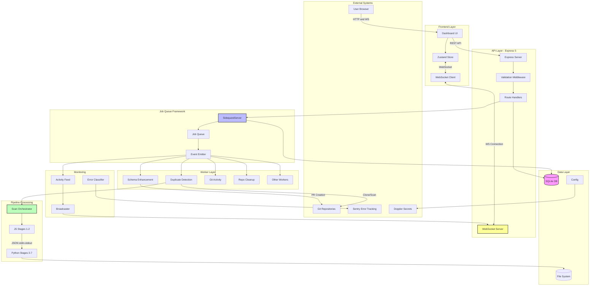

---

## Data Flow Diagrams

### High-Level System Flow

This diagram shows the complete request-to-response flow through the entire system:

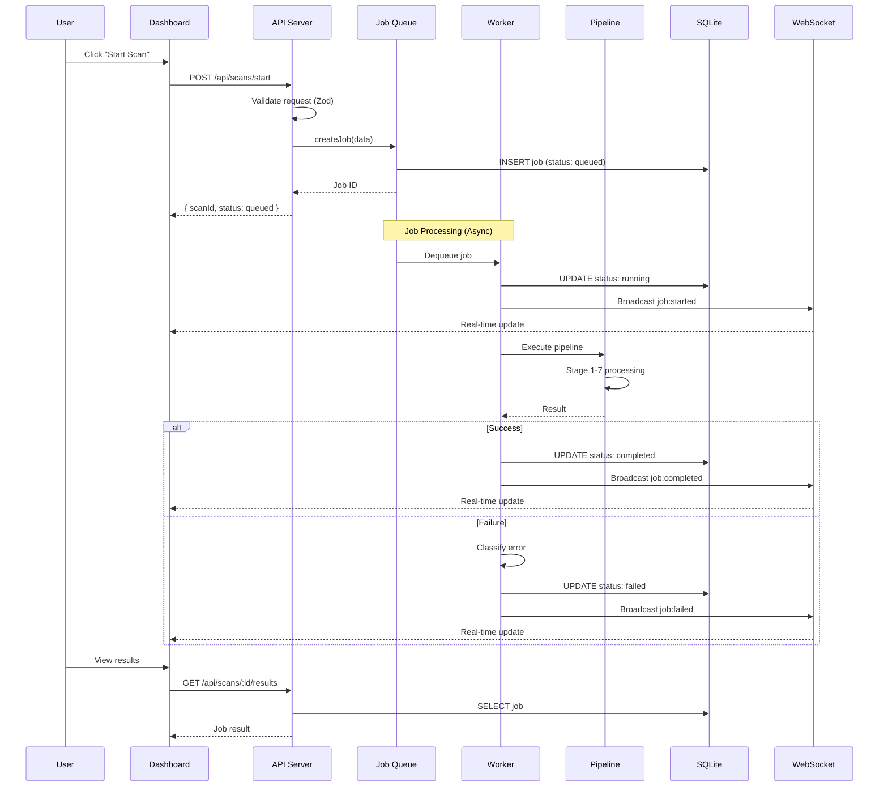

### API Request Flow

Detailed flow of HTTP requests through the API layer:

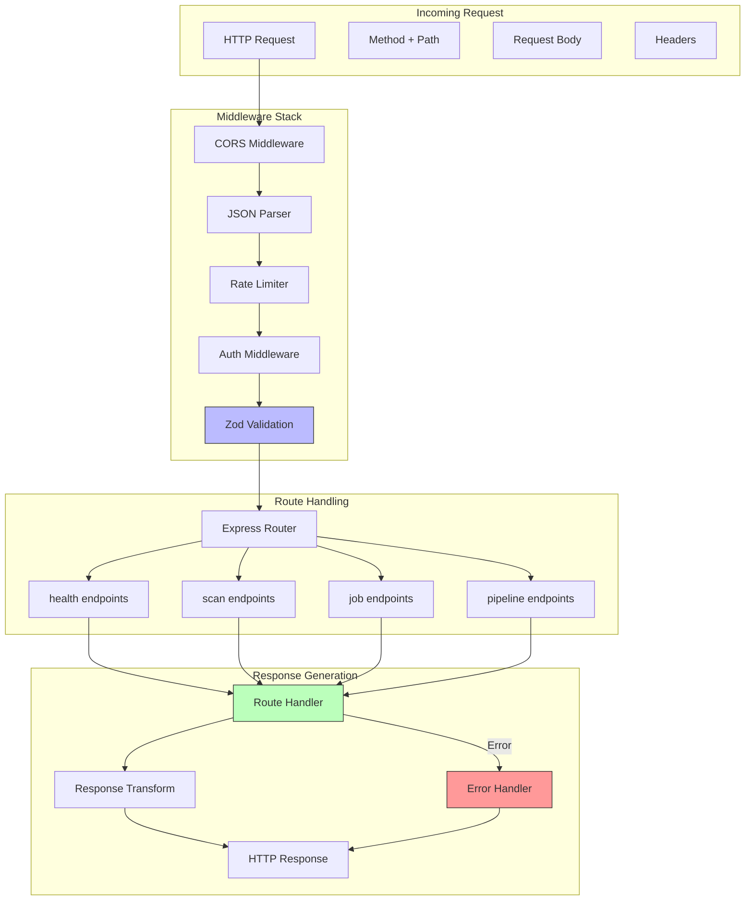

### Job Queue Flow

Complete job lifecycle from creation to completion:

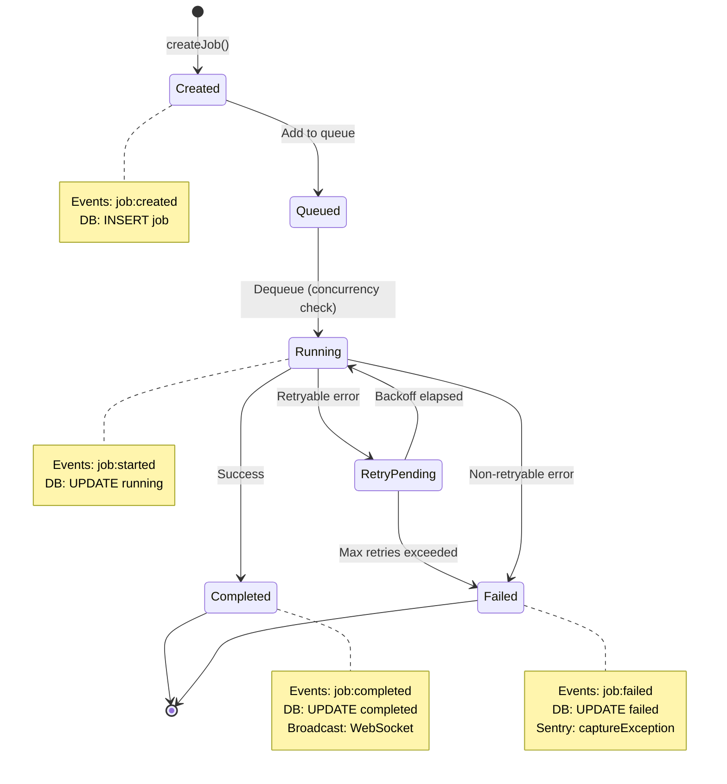

### WebSocket Real-Time Flow

Real-time communication between server and dashboard:

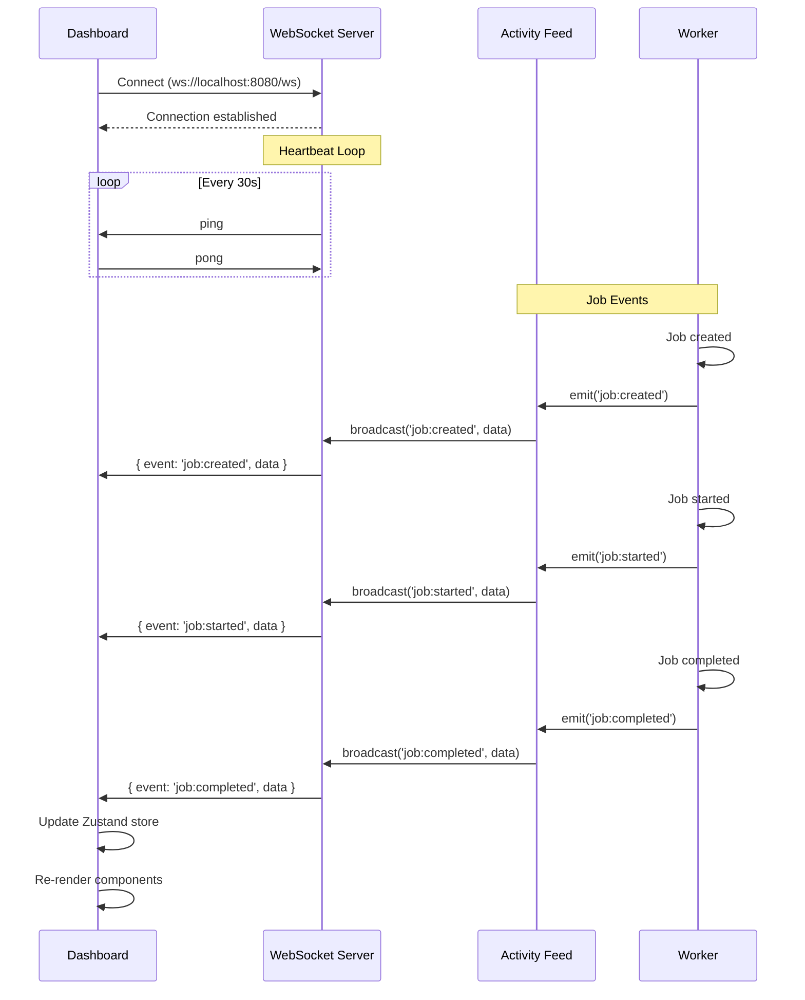

### Database Flow

SQLite database operations and schema:

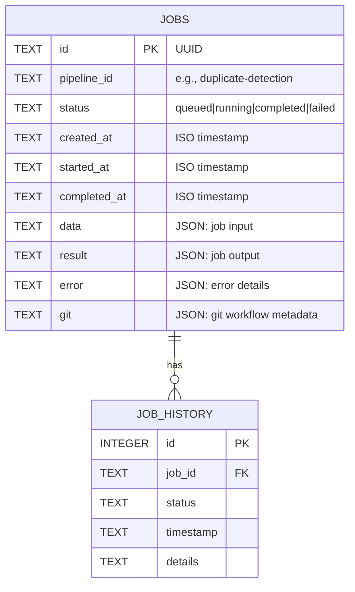

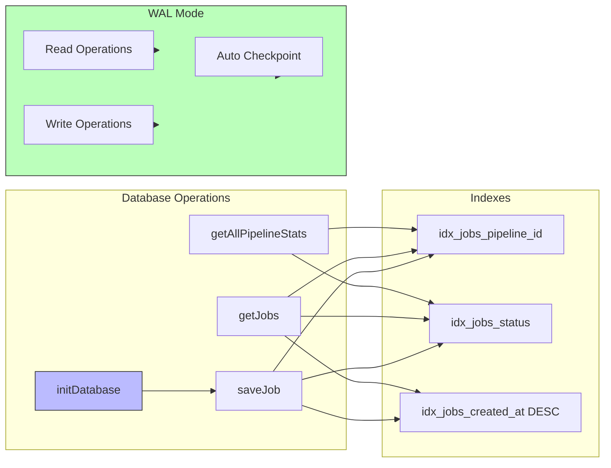

### Error Handling Flow

Complete error classification and handling:

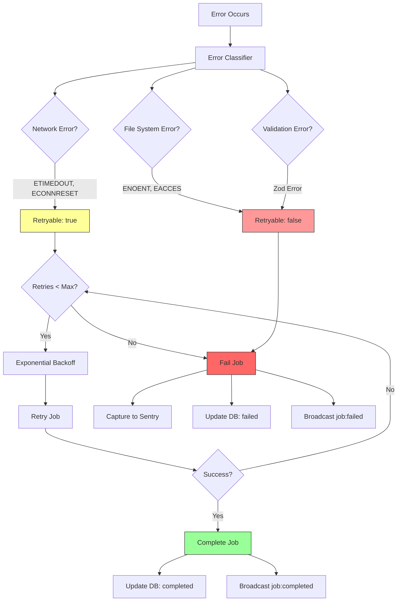

---

## Component Interactions

### Worker Registry Pattern

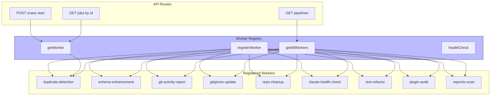

### Event Broadcasting Architecture

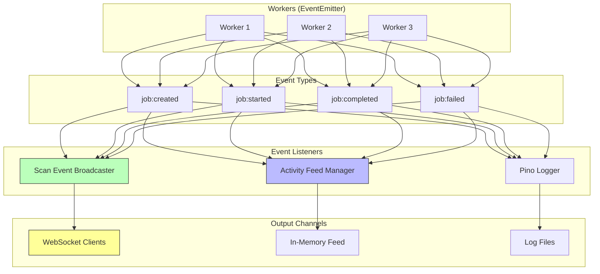

---

## Inter-Process Communication

### JavaScript ↔ Python Bridge

The duplicate detection pipeline bridges JavaScript and Python via JSON over stdin/stdout:

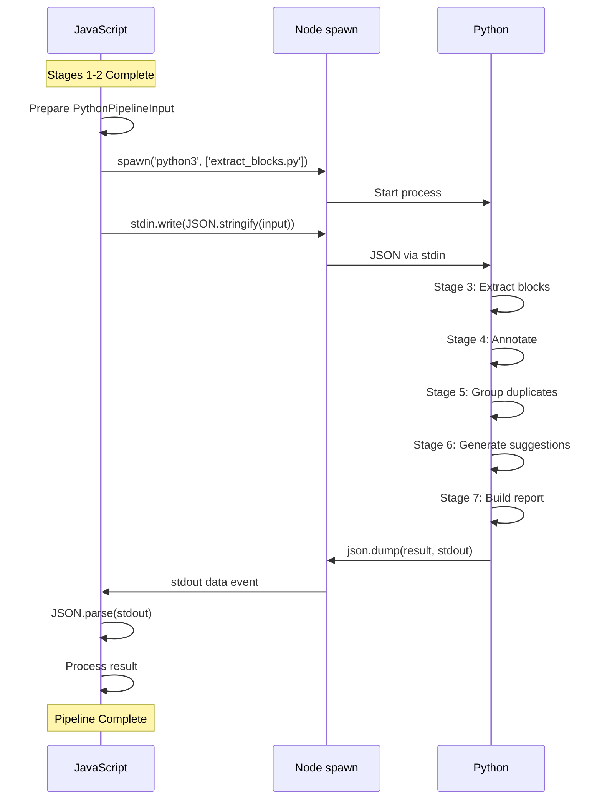

### Data Format Specifications

**JavaScript → Python (Input)**:

```typescript
interface PythonPipelineInput {
  repository_info: {
    path: string;
    name: string;
    git_remote?: string;
    branch?: string;
    languages: string[];
    file_count: number;
    total_lines: number;
  };
  pattern_matches: Array<{
    pattern_id: string;
    file_path: string;
    line_start: number;
    line_end: number;
    source_code: string;
    metadata?: Record<string, unknown>;
  }>;
  scan_config: {
    similarity_threshold: number;
    min_tokens: number;
    enable_semantic: boolean;
  };
}
```

**Python → JavaScript (Output)**:

```typescript
interface PythonPipelineOutput {
  code_blocks: Array<{
    block_id: string;
    pattern_id: string;
    location: {
      file_path: string;
      line_start: number;
      line_end: number;
    };
    source_code: string;
    category: string;
    tags: string[];
  }>;
  duplicate_groups: Array<{
    group_id: string;
    member_block_ids: string[];
    similarity_score: number;
    similarity_method: string;
    occurrence_count: number;
    affected_files: string[];
  }>;
  suggestions: Array<{
    suggestion_id: string;
    strategy: string;
    impact_score: number;
    roi_score: number;
    estimated_effort_hours: number;
    migration_steps: Array<{
      step_number: number;
      description: string;
      automated: boolean;
      estimated_time: string;
    }>;
  }>;
  metrics: {
    total_blocks: number;
    unique_blocks: number;
    duplicate_groups: number;
    total_duplicates: number;
    scan_duration_ms: number;
  };
}
```

---

## Configuration Flow

### Configuration Loading Hierarchy

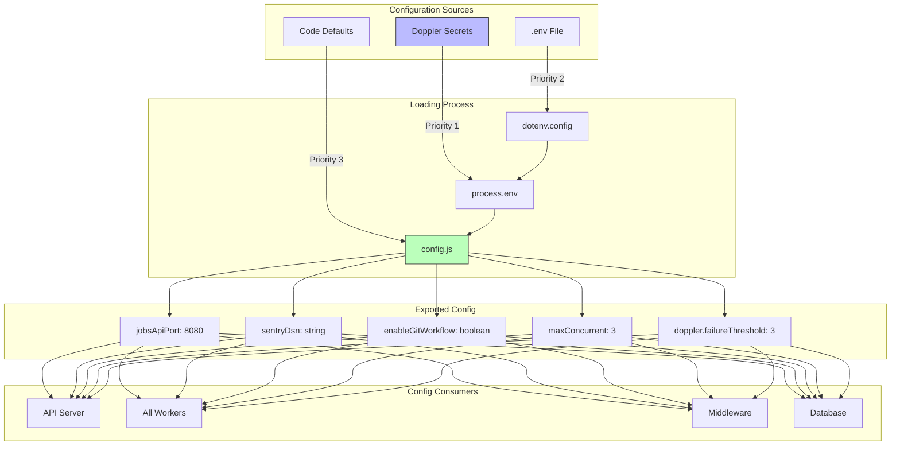

### Environment Variables Reference

| Variable | Default | Description |
|----------|---------|-------------|
| `JOBS_API_PORT` | 8080 | API server port |
| `SENTRY_DSN` | - | Sentry error tracking endpoint |
| `NODE_ENV` | development | Environment mode |
| `ENABLE_GIT_WORKFLOW` | false | Enable branch/PR creation |
| `ENABLE_PR_CREATION` | false | Auto-create PRs |
| `RUN_ON_STARTUP` | false | Run pipelines immediately |
| `MAX_CONCURRENT` | 3 | Max concurrent jobs |
| `REDIS_HOST` | localhost | Redis host (optional) |
| `REDIS_PORT` | 6379 | Redis port (optional) |

---

## Deployment Architecture

### Production Deployment Flow

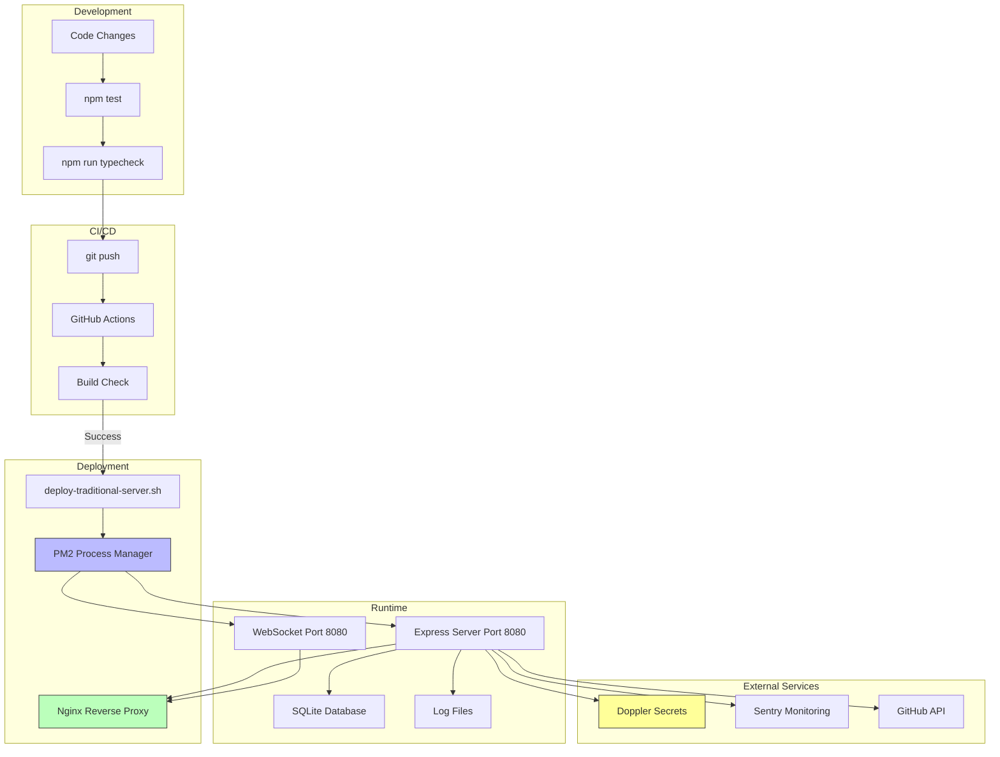

### PM2 Process Configuration

```javascript
// config/ecosystem.config.cjs
module.exports = {
  apps: [
    {
      name: 'alephauto-api',
      script: 'api/server.js',
      instances: 1,
      exec_mode: 'fork',
      env: {
        NODE_ENV: 'production'
      },
      max_memory_restart: '500M',
      error_file: './logs/pm2-error.log',
      out_file: './logs/pm2-out.log'
    }
  ]
};
```

### Nginx Configuration

```nginx
server {
    listen 80;
    server_name alephauto.example.com;

    # API routes
    location /api/ {
        proxy_pass http://localhost:8080;
        proxy_http_version 1.1;
        proxy_set_header Host $host;
        proxy_set_header X-Real-IP $remote_addr;
    }

    # WebSocket
    location /ws {
        proxy_pass http://localhost:8080;
        proxy_http_version 1.1;
        proxy_set_header Upgrade $http_upgrade;
        proxy_set_header Connection "upgrade";
    }

    # Static files (dashboard)
    location / {
        proxy_pass http://localhost:8080;
    }
}
```

---

## Quick Reference

### API Endpoints Summary

| Method | Endpoint | Description |
|--------|----------|-------------|
| `GET` | `/health` | Basic health check |
| `GET` | `/api/health/doppler` | Doppler cache health |
| `GET` | `/api/status` | Full system status |
| `POST` | `/api/scans/start` | Start intra-project scan |
| `POST` | `/api/scans/start-multi` | Start inter-project scan |
| `GET` | `/api/scans/:id/status` | Get scan status |
| `GET` | `/api/scans/:id/results` | Get scan results |
| `GET` | `/api/jobs` | List all jobs |
| `GET` | `/api/jobs/:id` | Get job details |
| `POST` | `/api/jobs/:id/cancel` | Cancel job |
| `POST` | `/api/jobs/:id/retry` | Retry failed job |
| `GET` | `/api/pipelines` | List pipelines |
| `GET` | `/api/pipelines/:id` | Pipeline details |

### Key File Locations

| Component | Path |
|-----------|------|
| API Server | `api/server.js` |
| Route Handlers | `api/routes/*.ts` |
| WebSocket | `api/websocket.js` |
| Base Queue | `sidequest/core/server.js` |
| Database | `sidequest/core/database.js` |
| Config | `sidequest/config.js` |
| Workers | `sidequest/workers/*.js` |
| Pipelines | `sidequest/pipeline-runners/*.js` |
| Orchestrator | `sidequest/pipeline-core/scan-orchestrator.ts` |

---

## Related Documentation

- **[Pipeline Data Flow](https://github.com/aledlie/AlephAuto/blob/main/docs/architecture/pipeline-data-flow.md)** - Individual pipeline details
- **[Similarity Algorithm](https://github.com/aledlie/AlephAuto/blob/main/docs/architecture/similarity-algorithm.md)** - Duplicate detection algorithm
- **[Error Handling](https://github.com/aledlie/AlephAuto/blob/main/docs/architecture/ERROR_HANDLING.md)** - Error classification and retry
- **[Type System](https://github.com/aledlie/AlephAuto/blob/main/docs/architecture/TYPE_SYSTEM.md)** - Zod schemas and TypeScript
- **[API Reference](https://github.com/aledlie/AlephAuto/blob/main/docs/API_REFERENCE.md)** - Complete API documentation
- **[Cheat Sheet](https://github.com/aledlie/AlephAuto/blob/main/docs/architecture/CHEAT-SHEET.md)** - Quick reference

---

**Document Version:** 1.0
**Last Updated:** 2025-12-02
**Maintainer:** Architecture Team
