# AlephAuto System Data Flow Documentation

> **Hub document.** Authoritative source for system-level architecture, data flow diagrams, and deployment. For pipeline-specific data flows, see [Pipeline Data Flow](./pipeline-data-flow.md). For error handling details, see [Error Handling](./ERROR_HANDLING.md). For pipeline list and critical patterns, see [CLAUDE.md](../../CLAUDE.md).

**Last Updated:** 2026-03-17
**Version:** 1.5

## Table of Contents

1. [System Overview](#system-overview)
2. [Complete System Architecture](#complete-system-architecture)
3. [Data Flow Diagrams](#data-flow-diagrams)
   - [High-Level System Flow](#high-level-system-flow)
   - [API Request Flow](#api-request-flow)
   - [Job Queue Flow](#job-queue-flow)
   - [WebSocket Real-Time Flow](#websocket-real-time-flow)
   - [Database Flow](#database-flow)
   - [Error Handling Flow](#error-handling-flow)
4. [Component Interactions](#component-interactions)
5. [Inter-Process Communication](#inter-process-communication)
6. [Configuration Flow](#configuration-flow)
7. [Deployment Architecture](#deployment-architecture)

---

## System Overview

AlephAuto is a **job queue framework** with real-time dashboard for automation pipelines. See [CLAUDE.md](../../CLAUDE.md) for the full list of 11 pipelines and critical coding patterns.

### System Characteristics

| Characteristic | Value |
|---------------|-------|
| **Architecture** | Event-driven microservices |
| **Primary Language** | TypeScript (pure TS pipelines) |
| **Database** | PostgreSQL |
| **Real-time** | WebSocket (ws library) |
| **Error Tracking** | Sentry v8 |
| **Config Management** | Doppler |
| **Process Manager** | PM2 |
| **Concurrency** | Configurable (default: 5 jobs) |

### Layer Architecture

```
┌─────────────────────────────────────────────────────────────────────┐
│                        PRESENTATION LAYER                            │
│  ┌─────────────────┐  ┌─────────────────┐  ┌─────────────────┐      │
│  │   Dashboard UI   │  │   REST API      │  │   WebSocket     │      │
│  │   (React/Vite)   │  │   (Express 5)   │  │   (ws library)  │      │
│  └─────────────────┘  └─────────────────┘  └─────────────────┘      │
└─────────────────────────────────────────────────────────────────────┘
                                  │
                                  ▼
┌─────────────────────────────────────────────────────────────────────┐
│                        APPLICATION LAYER                             │
│  ┌─────────────────┐  ┌─────────────────┐  ┌─────────────────┐      │
│  │  Route Handlers  │  │   Middleware    │  │  Event Manager  │      │
│  │  (api/routes/)   │  │   (validation)  │  │  (broadcasts)   │      │
│  └─────────────────┘  └─────────────────┘  └─────────────────┘      │
└─────────────────────────────────────────────────────────────────────┘
                                  │
                                  ▼
┌─────────────────────────────────────────────────────────────────────┐
│                        BUSINESS LOGIC LAYER                          │
│  ┌─────────────────────────────────────────────────────────────┐    │
│  │                    SidequestServer (Base)                    │    │
│  │  ┌──────────┐ ┌──────────┐ ┌──────────┐ ┌──────────┐        │    │
│  │  │Duplicate │ │ Schema   │ │   Git    │ │  Repo    │  ...   │    │
│  │  │Detection │ │Enhance   │ │ Activity │ │ Cleanup  │        │    │
│  │  └──────────┘ └──────────┘ └──────────┘ └──────────┘        │    │
│  └─────────────────────────────────────────────────────────────┘    │
│  ┌─────────────────┐  ┌─────────────────┐  ┌─────────────────┐      │
│  │GitWorkflow      │  │  WorkerRegistry │  │   Constants     │      │
│  │Manager          │  │  (stats/lookup) │  │   (timeouts)    │      │
│  └─────────────────┘  └─────────────────┘  └─────────────────┘      │
└─────────────────────────────────────────────────────────────────────┘
                                  │
                                  ▼
┌─────────────────────────────────────────────────────────────────────┐
│                        DATA ACCESS LAYER                             │
│  ┌─────────────────┐  ┌─────────────────┐  ┌─────────────────┐      │
│  │  JobRepository  │  │   File System   │  │   External      │      │
│  │  (PostgreSQL)   │  │   (reports)     │  │   Services      │      │
│  └─────────────────┘  └─────────────────┘  └─────────────────┘      │
└─────────────────────────────────────────────────────────────────────┘
```

---

## Complete System Architecture

### Visual System Map

High-level view of all layers, workers, and pipelines:

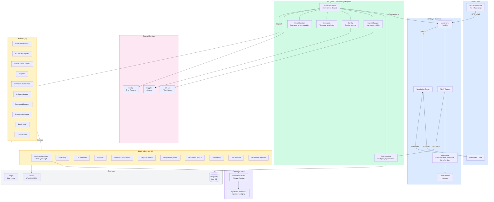
```mermaid
graph TB
    subgraph Client["Client Layer"]
        Dashboard["React Dashboard<br/>Vite + TypeScript"]
        WS_Client["WebSocket Client"]
    end

    subgraph API["API Layer (Express)"]
        Server["api/server.ts<br/>Port 8080"]
        WS_Server["WebSocket Server"]
        Routes["REST Routes"]
        Middleware["Middleware<br/>Auth, Validation, Rate-limit, Error-handler"]
        Types["Zod Schemas<br/>api/types/"]
    end

    subgraph Framework["Job Queue Framework (sidequest/)"]
        SQ["SidequestServer<br/>Event-driven lifecycle"]
        JobRepo["JobRepository<br/>PostgreSQL persistence"]
        GitWF["BranchManager<br/>Branch/commit/PR"]
        Config["Config<br/>Doppler secrets"]
        Constants["Constants<br/>Timeouts, retry, limits"]
        ErrClass["Error Classifier<br/>Retryable vs non-retryable"]
    end

    subgraph Workers["Workers (10)"]
        DupW["Duplicate Detection"]
        GitW["Git Activity Reporter"]
        HealthW["Claude Health Monitor"]
        RepomixW["Repomix"]
        SchemaW["Schema Enhancement"]
        GitignoreW["Gitignore Update"]
        DashW["Dashboard Populate"]
        CleanupW["Repository Cleanup"]
        BugfixW["Bugfix Audit"]
        TestW["Test Refactor"]
    end

    subgraph Pipelines["Pipeline Runners (11)"]
        DupP["Duplicate Detection<br/>Pure TypeScript"]
        GitP["Git Activity"]
        HealthP["Claude Health"]
        RepomixP["Repomix"]
        SchemaP["Schema Enhancement"]
        GitignoreP["Gitignore Update"]
        PluginP["Plugin Management"]
        CleanupP["Repository Cleanup"]
        BugfixP["Bugfix Audit"]
        TestP["Test Refactor"]
        DashP["Dashboard Populate"]
    end

    subgraph Processing["Processing Layer"]
        Orchestrator["Scan Orchestrator<br/>7-Stage Pipeline"]
        JSProc["TypeScript Processing<br/>repomix + ast-grep"]
    end

    subgraph Data["Data Layer"]
        PG[(PostgreSQL<br/>jobs DB)]
        Logs["Logs<br/>Pino + gzip"]
        Reports["Reports<br/>HTML/MD/JSON"]
    end

    subgraph External["External Services"]
        Doppler["Doppler<br/>Secrets"]
        Sentry["Sentry<br/>Error Tracking"]
        GitHub["GitHub<br/>PRs + Repos"]
    end

    Dashboard -->|HTTP + WS| Server
    WS_Client -->|WebSocket| WS_Server
    Server --> Routes
    Routes --> Middleware
    Middleware --> Types
    Routes -->|Job CRUD| JobRepo
    Server -->|Events| WS_Server
    WS_Server -->|Broadcast| WS_Client

    SQ -->|Lifecycle events| Server
    SQ --> JobRepo
    SQ --> GitWF
    SQ --> Config
    SQ --> Constants
    SQ --> ErrClass

    Workers -->|Execute| Pipelines
    SQ -->|Dispatch| Workers

    DupP --> Orchestrator
    Orchestrator --> JSProc

    JobRepo --> PG
    Workers --> Logs
    Pipelines --> Reports

    Config --> Doppler
    SQ --> Sentry
    GitWF --> GitHub

    style Client fill:#dbeafe,stroke:#3b82f6
    style API fill:#dbeafe,stroke:#3b82f6
    style Framework fill:#d1fae5,stroke:#10b981
    style Workers fill:#fef3c7,stroke:#f59e0b
    style Pipelines fill:#fef3c7,stroke:#f59e0b
    style Processing fill:#ede9fe,stroke:#8b5cf6
    style Data fill:#f3f4f6,stroke:#6b7280
    style External fill:#fce7f3,stroke:#ec4899
```

### Full System Diagram

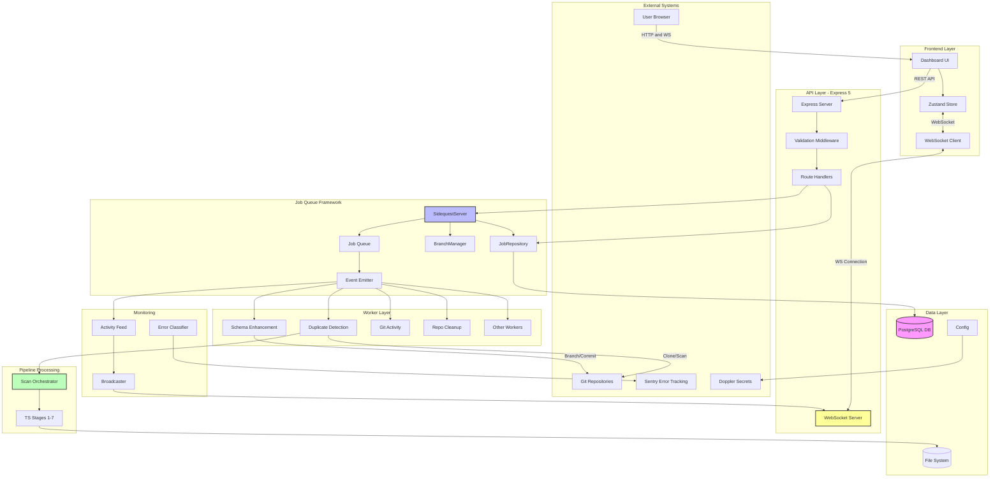
```mermaid
graph TB
    subgraph External["External Systems"]
        User["User Browser"]
        Git[Git Repositories]
        Sentry[Sentry Error Tracking]
        Doppler[Doppler Secrets]
    end

    subgraph Frontend["Frontend Layer"]
        Dashboard["Dashboard UI"]
        Store["Zustand Store"]
        WSClient["WebSocket Client"]
    end

    subgraph API["API Layer - Express 5"]
        Server["Express Server"]
        Routes["Route Handlers"]
        Middleware["Validation Middleware"]
        WSServer["WebSocket Server"]
    end

    subgraph JobQueue["Job Queue Framework"]
        BaseServer["SidequestServer"]
        Queue["Job Queue"]
        EventEmitter["Event Emitter"]
        GitWorkflow["BranchManager"]
        JobRepo["JobRepository"]
    end

    subgraph Workers["Worker Layer"]
        DD["Duplicate Detection"]
        SE["Schema Enhancement"]
        GA["Git Activity"]
        RC["Repo Cleanup"]
        Others["Other Workers"]
    end

    subgraph Pipeline["Pipeline Processing"]
        Orchestrator["Scan Orchestrator"]
        TSStages["TS Stages 1-7"]
    end

    subgraph Data["Data Layer"]
        PG[("PostgreSQL DB")]
        FileSystem[("File System")]
        Config["Config"]
    end

    subgraph Monitoring["Monitoring"]
        ActivityFeed["Activity Feed"]
        Broadcaster["Broadcaster"]
        ErrorClassifier["Error Classifier"]
    end

    %% User interactions
    User -->|"HTTP and WS"| Dashboard
    Dashboard --> Store
    Store <-->|WebSocket| WSClient
    WSClient <-->|WS Connection| WSServer

    %% API flow
    Dashboard -->|REST API| Server
    Server --> Middleware
    Middleware --> Routes
    Routes --> BaseServer

    %% Job queue flow
    BaseServer --> Queue
    Queue --> EventEmitter
    EventEmitter --> DD & SE & GA & RC & Others

    %% Worker to pipeline
    DD --> Orchestrator
    Orchestrator --> TSStages
    TSStages --> FileSystem

    %% Data persistence
    BaseServer --> JobRepo
    JobRepo --> PG
    Routes --> JobRepo

    BaseServer --> GitWorkflow
    Config --> Doppler

    %% Monitoring flow
    EventEmitter --> ActivityFeed
    ActivityFeed --> Broadcaster
    Broadcaster --> WSServer
    ErrorClassifier --> Sentry

    %% Git operations
    DD -->|Clone/Scan| Git
    SE -->|Branch/Commit| Git

    style BaseServer fill:#bbf,stroke:#333,stroke-width:2px
    style Orchestrator fill:#bfb,stroke:#333,stroke-width:2px
    style PG fill:#f9f,stroke:#333,stroke-width:2px
    style WSServer fill:#ff9,stroke:#333,stroke-width:2px
```

---

## Data Flow Diagrams

### High-Level System Flow

This diagram shows the complete request-to-response flow through the entire system:

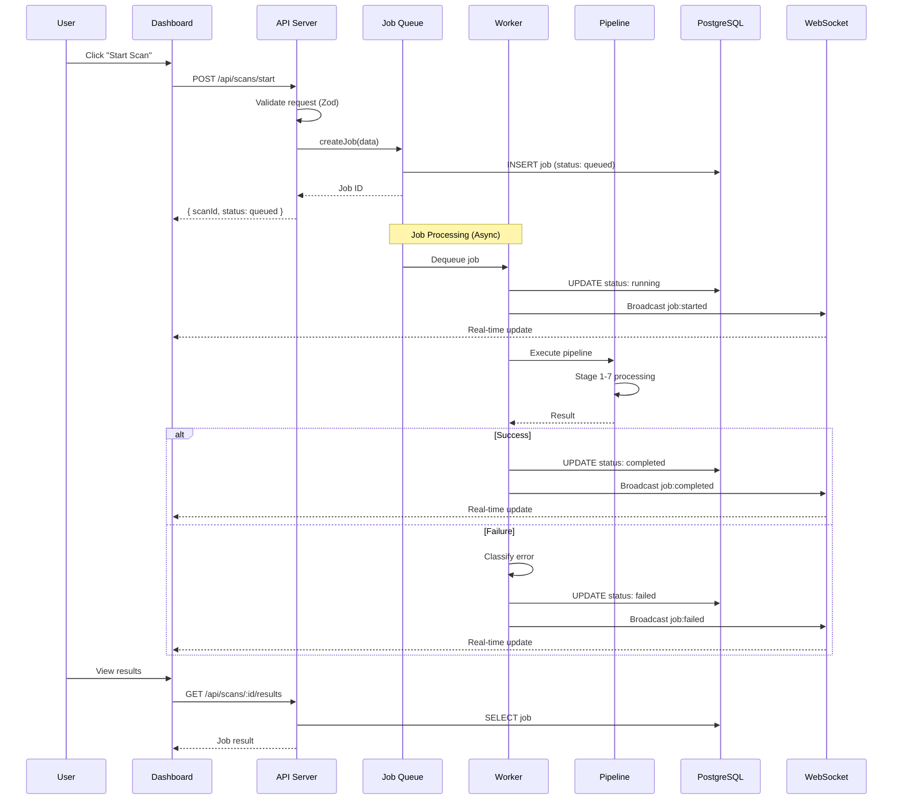
```mermaid
sequenceDiagram
    participant U as User
    participant D as Dashboard
    participant A as API Server
    participant Q as Job Queue
    participant W as Worker
    participant P as Pipeline
    participant DB as PostgreSQL
    participant WS as WebSocket

    U->>D: Click "Start Scan"
    D->>A: POST /api/scans/start
    A->>A: Validate request (Zod)
    A->>Q: createJob(data)
    Q->>DB: INSERT job (status: queued)
    Q-->>A: Job ID
    A-->>D: { scanId, status: queued }

    Note over Q,W: Job Processing (Async)

    Q->>W: Dequeue job
    W->>DB: UPDATE status: running
    W->>WS: Broadcast job:started
    WS-->>D: Real-time update

    W->>P: Execute pipeline
    P->>P: Stage 1-7 processing
    P-->>W: Result

    alt Success
        W->>DB: UPDATE status: completed
        W->>WS: Broadcast job:completed
        WS-->>D: Real-time update
    else Failure
        W->>W: Classify error
        W->>DB: UPDATE status: failed
        W->>WS: Broadcast job:failed
        WS-->>D: Real-time update
    end

    U->>D: View results
    D->>A: GET /api/scans/:id/results
    A->>DB: SELECT job
    A-->>D: Job result
```

### API Request Flow

Detailed flow of HTTP requests through the API layer:

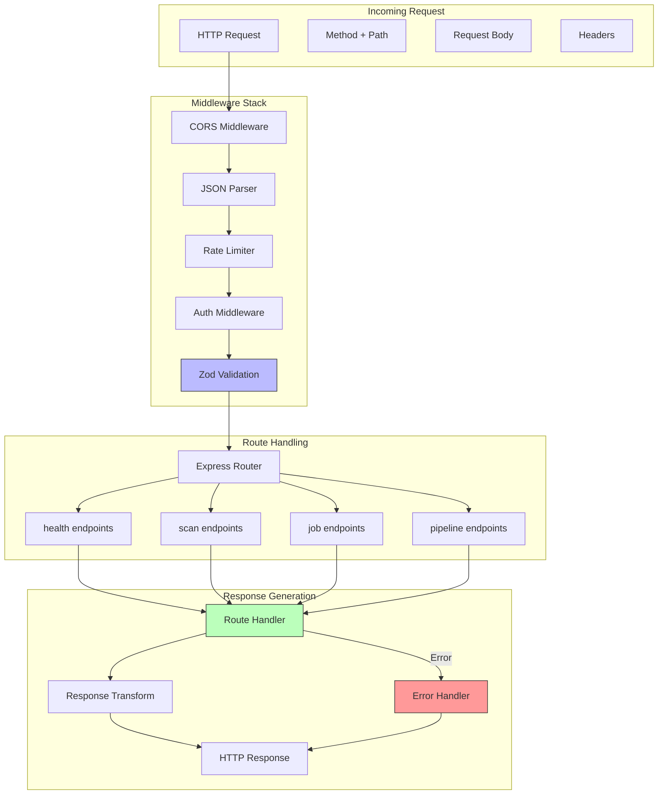
```mermaid
flowchart TB
    subgraph Request["Incoming Request"]
        HTTP[HTTP Request]
        Method[Method + Path]
        Body[Request Body]
        Headers[Headers]
    end

    subgraph Middleware["Middleware Stack"]
        CORS["CORS Middleware"]
        JSON["JSON Parser"]
        RateLimit["Rate Limiter"]
        Auth["Auth Middleware"]
        Validation["Zod Validation"]
    end

    subgraph Routing["Route Handling"]
        Router[Express Router]
        HealthRoutes["health endpoints"]
        ScanRoutes["scan endpoints"]
        JobRoutes["job endpoints"]
        PipelineRoutes["pipeline endpoints"]
    end

    subgraph Response["Response Generation"]
        Handler[Route Handler]
        Transform[Response Transform]
        ErrorHandler[Error Handler]
        Send[HTTP Response]
    end

    HTTP --> CORS
    CORS --> JSON
    JSON --> RateLimit
    RateLimit --> Auth
    Auth --> Validation
    Validation --> Router

    Router --> HealthRoutes
    Router --> ScanRoutes
    Router --> JobRoutes
    Router --> PipelineRoutes

    HealthRoutes --> Handler
    ScanRoutes --> Handler
    JobRoutes --> Handler
    PipelineRoutes --> Handler

    Handler --> Transform
    Handler -->|Error| ErrorHandler
    Transform --> Send
    ErrorHandler --> Send

    style Validation fill:#bbf,stroke:#333
    style Handler fill:#bfb,stroke:#333
    style ErrorHandler fill:#f99,stroke:#333
```

### Job Queue Flow

Complete job lifecycle from creation to completion:

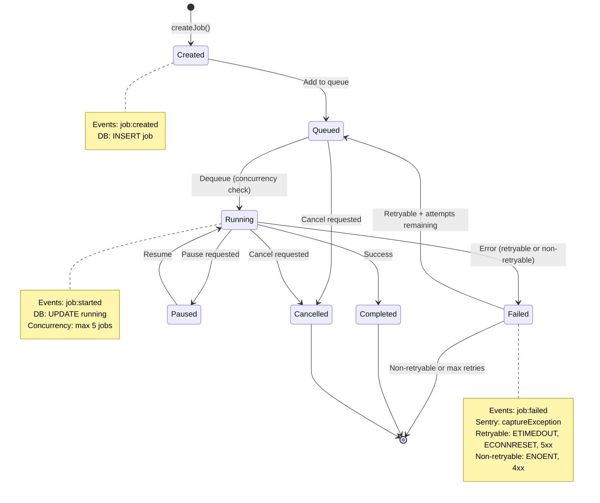
```mermaid
stateDiagram-v2
    [*] --> Created: createJob()

    Created --> Queued: Add to queue
    Queued --> Running: Dequeue (concurrency check)

    Running --> Completed: Success
    Running --> Failed: Error (retryable or non-retryable)

    Failed --> Queued: Retryable + attempts remaining
    Failed --> [*]: Non-retryable or max retries

    Queued --> Cancelled: Cancel requested
    Running --> Cancelled: Cancel requested

    Running --> Paused: Pause requested
    Paused --> Running: Resume

    Completed --> [*]
    Cancelled --> [*]

    note right of Created
        Events: job:created
        DB: INSERT job
    end note

    note right of Running
        Events: job:started
        DB: UPDATE running
        Concurrency: max 5 jobs
    end note

    note right of Failed
        Events: job:failed
        Sentry: captureException
        Retryable: ETIMEDOUT, ECONNRESET, 5xx
        Non-retryable: ENOENT, 4xx
    end note
```

### WebSocket Real-Time Flow

Real-time communication between server and dashboard:

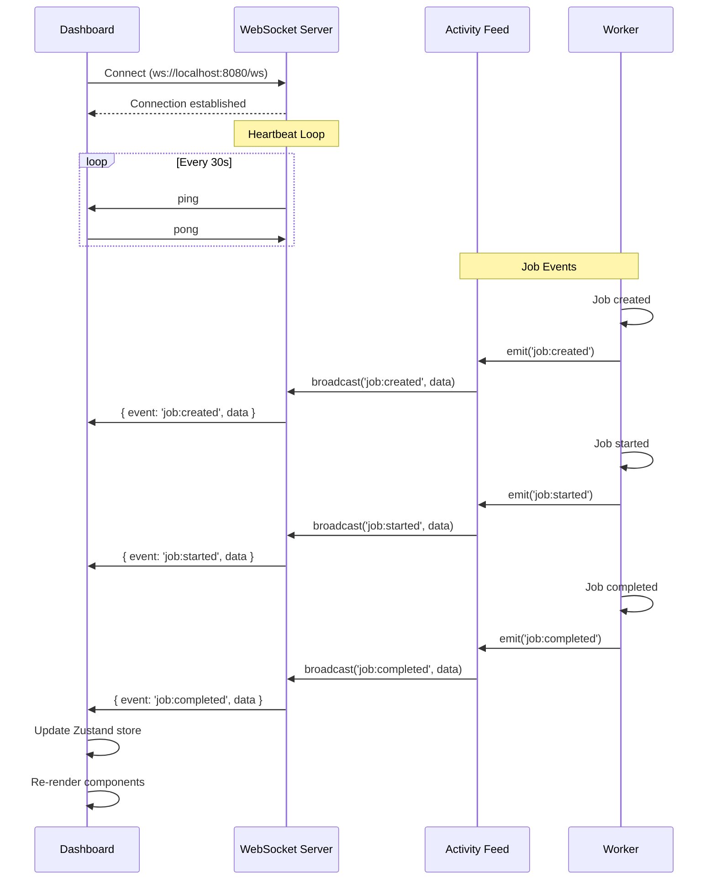
```mermaid
sequenceDiagram
    participant D as Dashboard
    participant WS as WebSocket Server
    participant AF as Activity Feed
    participant W as Worker

    D->>WS: Connect (ws://localhost:8080/ws)
    WS-->>D: Connection established

    Note over WS: Heartbeat Loop
    loop Every 30s
        WS->>D: ping
        D->>WS: pong
    end

    Note over W,AF: Job Events
    W->>W: Job created
    W->>AF: emit('job:created')
    AF->>WS: broadcast('job:created', data)
    WS->>D: { event: 'job:created', data }

    W->>W: Job started
    W->>AF: emit('job:started')
    AF->>WS: broadcast('job:started', data)
    WS->>D: { event: 'job:started', data }

    W->>W: Job completed
    W->>AF: emit('job:completed')
    AF->>WS: broadcast('job:completed', data)
    WS->>D: { event: 'job:completed', data }

    D->>D: Update Zustand store
    D->>D: Re-render components
```

### Database Flow

PostgreSQL database operations and schema:

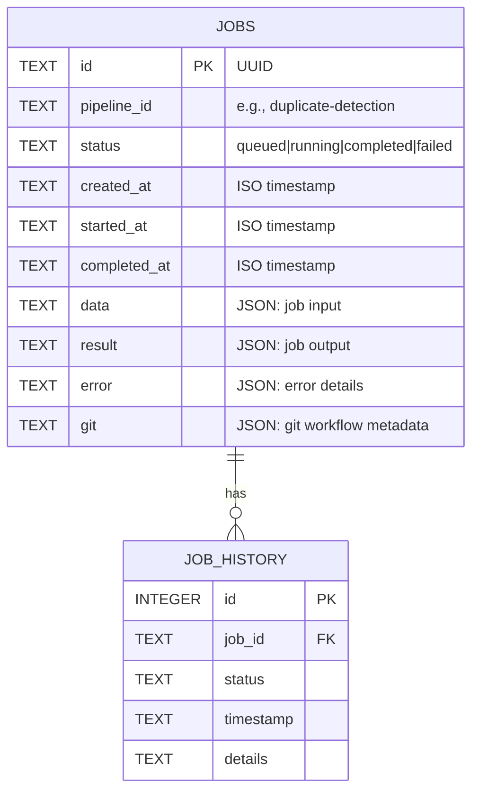
```mermaid
erDiagram
    JOBS {
        TEXT id PK "UUID"
        TEXT pipeline_id "e.g., duplicate-detection"
        TEXT status "queued|running|completed|failed"
        TEXT created_at "ISO timestamp"
        TEXT started_at "ISO timestamp"
        TEXT completed_at "ISO timestamp"
        TEXT data "JSON: job input"
        TEXT result "JSON: job output"
        TEXT error "JSON: error details"
        TEXT git "JSON: git workflow metadata"
    }

    JOBS ||--o{ JOB_HISTORY : "has"

    JOB_HISTORY {
        INTEGER id PK
        TEXT job_id FK
        TEXT status
        TEXT timestamp
        TEXT details
    }
```

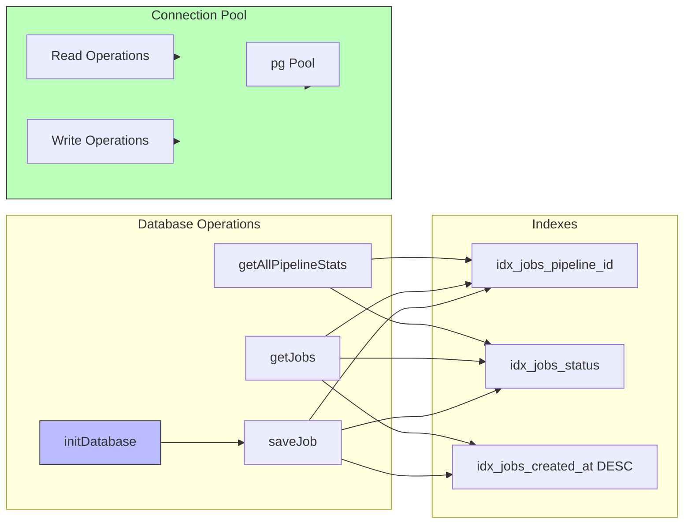
```mermaid
flowchart LR
    subgraph Operations["Database Operations"]
        direction TB
        Init["initDatabase"]
        Save["saveJob"]
        Get["getJobs"]
        Stats["getAllPipelineStats"]
    end

    subgraph Indexes["Indexes"]
        I1[idx_jobs_pipeline_id]
        I2[idx_jobs_status]
        I3[idx_jobs_created_at DESC]
    end

    subgraph Conn["Connection Pool"]
        Write[Write Operations]
        Read[Read Operations]
        Pool[pg Pool]
    end

    Init --> Save
    Save --> I1 & I2 & I3
    Get --> I1 & I2 & I3
    Stats --> I1 & I2

    Write --> Conn
    Read --> Conn
    Conn --> Pool

    style Init fill:#bbf,stroke:#333
    style Conn fill:#bfb,stroke:#333
```

### Error Handling Flow

For complete error classification, retry logic, circuit breakers, and worker registry patterns, see [Error Handling](./ERROR_HANDLING.md).

**Summary:** Errors are classified as retryable (ETIMEDOUT, 5xx) or non-retryable (ENOENT, 4xx). Retryable errors use exponential backoff up to max retries. All failures are captured to Sentry, persisted to PostgreSQL, and broadcast via WebSocket.

---

## Component Interactions

### Worker Registry Pattern

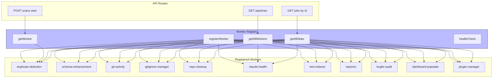
```mermaid
flowchart TB
    subgraph Registry["Worker Registry"]
        Register["registerWorker"]
        Get["getWorker"]
        All["getAllWorkers"]
        Stats["getAllStats"]
        Health["healthCheck"]
    end

    subgraph Workers["Registered Workers"]
        DD["duplicate-detection"]
        SE["schema-enhancement"]
        GA["git-activity"]
        GI["gitignore-manager"]
        RC["repo-cleanup"]
        CH["claude-health"]
        TR["test-refactor"]
        RM["repomix"]
        BA["bugfix-audit"]
        DP["dashboard-populate"]
        PM["plugin-manager"]
    end

    subgraph API["API Routes"]
        Start["POST scans start"]
        List["GET pipelines"]
        Status["GET jobs by id"]
    end

    Register --> DD & SE & GA & GI & RC & CH & TR & RM & BA & DP & PM

    Start --> Get
    Get --> DD

    List --> All
    All --> DD & SE & GA & GI & RC & CH & TR & RM & BA & DP & PM

    Status --> Stats
    Stats --> DD & SE & GA & GI & RC & CH & TR & RM & BA & DP & PM

    style Registry fill:#bbf,stroke:#333
```

### Event Broadcasting Architecture

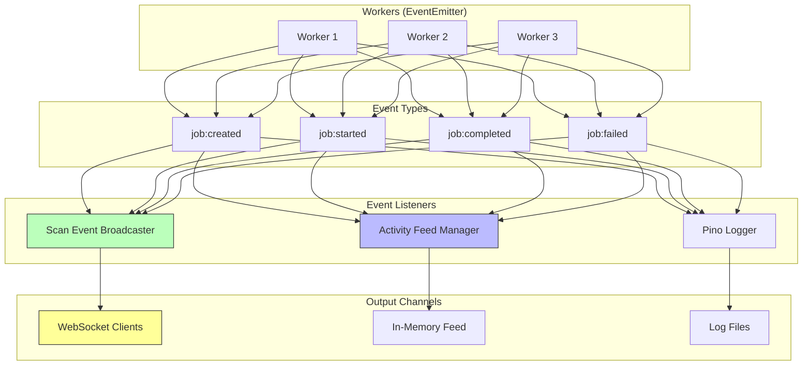
```mermaid
flowchart TB
    subgraph Workers["Workers (EventEmitter)"]
        W1[Worker 1]
        W2[Worker 2]
        W3[Worker 3]
    end

    subgraph Events["Event Types"]
        Created[job:created]
        Started[job:started]
        Completed[job:completed]
        Failed[job:failed]
    end

    subgraph Listeners["Event Listeners"]
        AF[Activity Feed Manager]
        SEB[Scan Event Broadcaster]
        Logger[Pino Logger]
    end

    subgraph Output["Output Channels"]
        WS[WebSocket Clients]
        Memory["In-Memory Feed"]
        Logs[Log Files]
    end

    W1 & W2 & W3 --> Created & Started & Completed & Failed

    Created & Started & Completed & Failed --> AF
    Created & Started & Completed & Failed --> SEB
    Created & Started & Completed & Failed --> Logger

    AF --> Memory
    SEB --> WS
    Logger --> Logs

    style AF fill:#bbf,stroke:#333
    style SEB fill:#bfb,stroke:#333
    style WS fill:#ff9,stroke:#333
```

### Abstraction Layers (v1.1)

The following abstractions were added to improve modularity and maintainability:

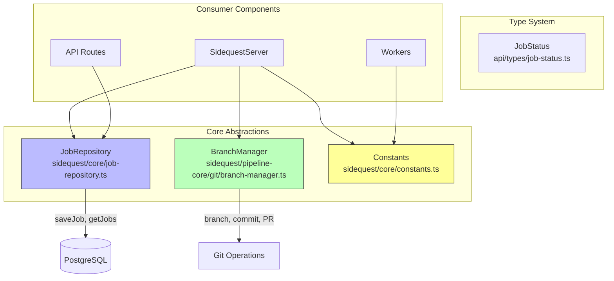
```mermaid
flowchart TB
    subgraph Core["Core Abstractions"]
        JobRepo["JobRepository<br/>sidequest/core/job-repository.ts"]
        GitWF["BranchManager<br/>sidequest/pipeline-core/git/branch-manager.ts"]
        Constants["Constants<br/>sidequest/core/constants.ts"]
    end

    subgraph Types["Type System"]
        JobStatus["JobStatus<br/>api/types/job-status.ts"]
    end

    subgraph Consumers["Consumer Components"]
        Server["SidequestServer"]
        Routes["API Routes"]
        Workers["Workers"]
    end

    Server --> JobRepo
    Server --> GitWF
    Server --> Constants
    Routes --> JobRepo
    Workers --> Constants

    JobRepo -->|"saveJob, getJobs"| DB[(PostgreSQL)]
    GitWF -->|"branch, commit, PR"| Git[Git Operations]

    style JobRepo fill:#bbf,stroke:#333
    style GitWF fill:#bfb,stroke:#333
    style Constants fill:#ff9,stroke:#333
```

**JobRepository** - Database abstraction implementing repository pattern:
- `saveJob(job)` - Persist job state
- `getJobs(filters)` - Query jobs with filters
- `getJobCounts(pipelineId)` - Get job statistics
- `getAllPipelineStats()` - Aggregate stats across pipelines

**BranchManager** - Encapsulates git operations:
- `createJobBranch()` - Create feature branch for job
- `commitChanges()` - Commit job results
- `pushBranch()` - Push to remote
- `createPullRequest()` - Create PR via GitHub API

**Constants** - Centralized configuration values:
- `TIMEOUTS.PYTHON_PIPELINE_MS` (600000ms)
- `TIMEOUTS.DATABASE_SAVE_INTERVAL_MS` (30000ms)
- `RETRY.MAX_ABSOLUTE_ATTEMPTS` (5)
- `CONCURRENCY.DEFAULT_MAX_JOBS` (5)

---

## Inter-Process Communication

### Duplicate Detection Pipeline (Pure TypeScript)

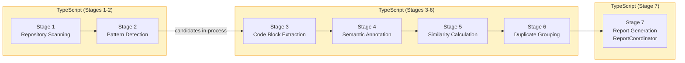
```mermaid
graph LR
    subgraph TS1["TypeScript (Stages 1-2)"]
        S1["Stage 1<br/>Repository Scanning"]
        S2["Stage 2<br/>Pattern Detection"]
    end

    subgraph TS2["TypeScript (Stages 3-6)"]
        S3["Stage 3<br/>Code Block Extraction"]
        S4["Stage 4<br/>Semantic Annotation"]
        S5["Stage 5<br/>Similarity Calculation"]
        S6["Stage 6<br/>Duplicate Grouping"]
    end

    subgraph TS3["TypeScript (Stage 7)"]
        S7["Stage 7<br/>Report Generation<br/>ReportCoordinator"]
    end

    S1 --> S2
    S2 -->|candidates in-process| S3
    S3 --> S4
    S4 --> S5
    S5 --> S6
    S6 --> S7

    style TS1 fill:#fef3c7,stroke:#f59e0b
    style TS2 fill:#fef3c7,stroke:#f59e0b
    style TS3 fill:#fef3c7,stroke:#f59e0b
```

### Pipeline Execution

The duplicate detection pipeline runs entirely in TypeScript:

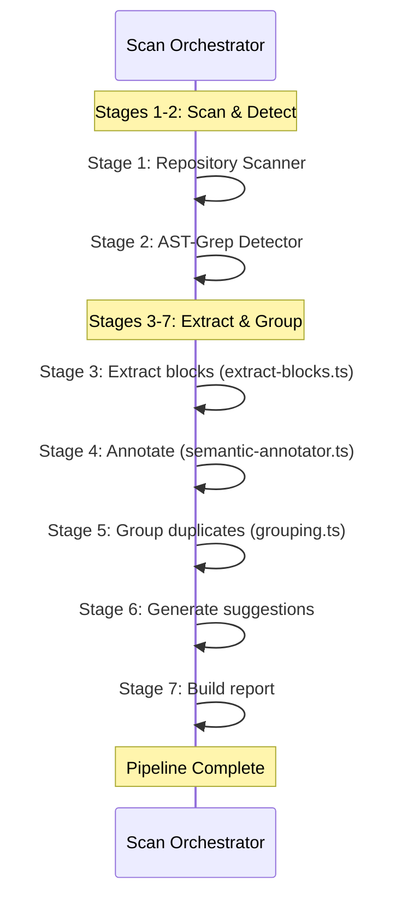
```mermaid
sequenceDiagram
    participant Orch as Scan Orchestrator

    Note over Orch: Stages 1-2: Scan & Detect

    Orch->>Orch: Stage 1: Repository Scanner
    Orch->>Orch: Stage 2: AST-Grep Detector

    Note over Orch: Stages 3-7: Extract & Group

    Orch->>Orch: Stage 3: Extract blocks (extract-blocks.ts)
    Orch->>Orch: Stage 4: Annotate (semantic-annotator.ts)
    Orch->>Orch: Stage 5: Group duplicates (grouping.ts)
    Orch->>Orch: Stage 6: Generate suggestions
    Orch->>Orch: Stage 7: Build report

    Note over Orch: Pipeline Complete
```

### Data Format Specifications

**TypeScript → Python (Input)**:

```typescript
interface PythonPipelineInput {
  repository_info: {
    path: string;
    name: string;
    git_remote?: string;
    branch?: string;
    languages: string[];
    file_count: number;
    total_lines: number;
  };
  pattern_matches: Array<{
    pattern_id: string;
    file_path: string;
    line_start: number;
    line_end: number;
    source_code: string;
    metadata?: Record<string, unknown>;
  }>;
  scan_config: {
    similarity_threshold: number;
    min_tokens: number;
    enable_semantic: boolean;
  };
}
```

**Python → TypeScript (Output)**:

```typescript
interface PythonPipelineOutput {
  code_blocks: Array<{
    block_id: string;
    pattern_id: string;
    location: {
      file_path: string;
      line_start: number;
      line_end: number;
    };
    source_code: string;
    category: string;
    tags: string[];
  }>;
  duplicate_groups: Array<{
    group_id: string;
    member_block_ids: string[];
    similarity_score: number;
    similarity_method: string;
    occurrence_count: number;
    affected_files: string[];
  }>;
  suggestions: Array<{
    suggestion_id: string;
    strategy: string;
    impact_score: number;
    roi_score: number;
    estimated_effort_hours: number;
    migration_steps: Array<{
      step_number: number;
      description: string;
      automated: boolean;
      estimated_time: string;
    }>;
  }>;
  metrics: {
    total_blocks: number;
    unique_blocks: number;
    duplicate_groups: number;
    total_duplicates: number;
    scan_duration_ms: number;
  };
}
```

---

## Configuration Flow

**Priority:** Doppler (1) > `.env` file (2) > code defaults (3). All config is accessed via `sidequest/core/config.ts` — never use `process.env` directly. See [CLAUDE.md](../../CLAUDE.md#2-configuration-never-use-processenv-directly) for config patterns and [Pipeline Execution](./pipeline-execution.md) for Doppler integration.

**Key variables:** `JOBS_API_PORT` (8080), `SENTRY_DSN`, `ENABLE_GIT_WORKFLOW`, `ENABLE_PR_CREATION`, `MAX_CONCURRENT` (5). See [CLAUDE.md](../../CLAUDE.md#environment-variables-doppler) for the full list.

---

## Deployment Architecture

### Production Deployment Flow

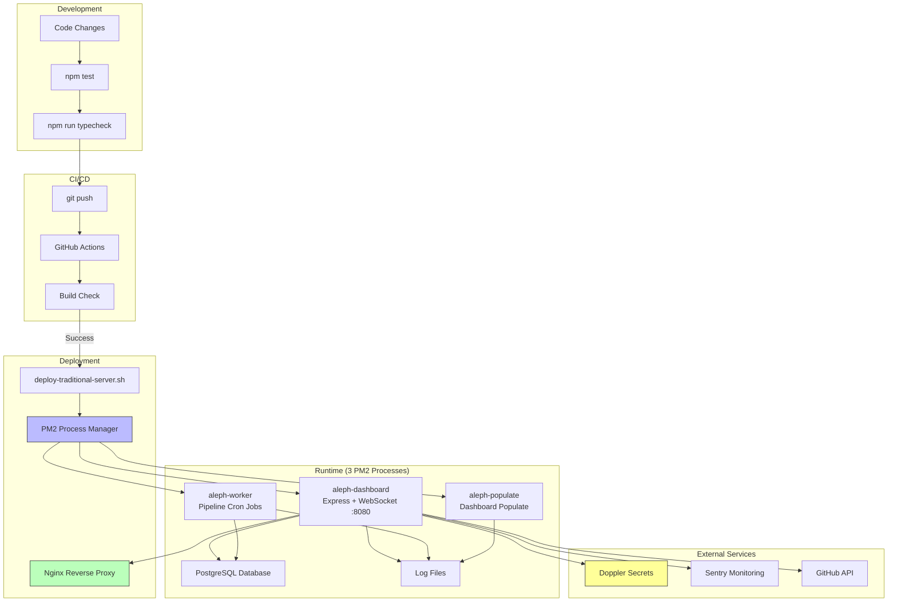
```mermaid
flowchart TB
    subgraph Development["Development"]
        Code[Code Changes]
        Test[npm test]
        TypeCheck[npm run typecheck]
    end

    subgraph CI["CI/CD"]
        Push[git push]
        Actions[GitHub Actions]
        Build[Build Check]
    end

    subgraph Deploy["Deployment"]
        Script[deploy-traditional-server.sh]
        PM2[PM2 Process Manager]
        Nginx[Nginx Reverse Proxy]
    end

    subgraph Runtime["Runtime (3 PM2 Processes)"]
        Express["aleph-dashboard<br/>Express + WebSocket :8080"]
        Worker["aleph-worker<br/>Pipeline Cron Jobs"]
        Populate["aleph-populate<br/>Dashboard Populate"]
        PG[PostgreSQL Database]
        Logs[Log Files]
    end

    subgraph External["External Services"]
        Doppler[Doppler Secrets]
        Sentry[Sentry Monitoring]
        GitHub[GitHub API]
    end

    Code --> Test --> TypeCheck --> Push
    Push --> Actions --> Build

    Build -->|Success| Script
    Script --> PM2

    PM2 --> Express & Worker & Populate
    Express --> Nginx

    Express --> PG & Logs
    Worker --> PG & Logs
    Populate --> Logs
    Express --> Doppler & Sentry & GitHub

    style PM2 fill:#bbf,stroke:#333
    style Nginx fill:#bfb,stroke:#333
    style Doppler fill:#ff9,stroke:#333
```

### PM2 Process Configuration

Three PM2 processes are defined in a single `config/ecosystem.config.cjs` (the populate process was previously in a separate `populate.config.cjs`, now inlined). Shared config is extracted into `SHARED_ENV` and `SHARED_LOGGING` constants to reduce duplication.

```javascript
// config/ecosystem.config.cjs
const SHARED_ENV = {
  NODE_ENV, SENTRY_DSN, SENTRY_ENVIRONMENT, PATH  // from process.env / Doppler
};
const SHARED_LOGGING = {
  log_date_format: 'YYYY-MM-DD HH:mm:ss Z',
  merge_logs: true, max_size: '10M', interpreter: 'node'
};

module.exports = {
  apps: [
    {
      name: 'aleph-dashboard',       // API + WebSocket server
      script: 'api/server.ts',
      node_args: '--strip-types --import ./api/preload.ts --max-old-space-size=512',
      env: { ...SHARED_ENV, JOBS_API_PORT, REDIS_HOST, REDIS_PORT },
      ...SHARED_LOGGING
    },
    {
      name: 'aleph-worker',          // Background pipelines (cron-scheduled)
      script: 'sidequest/pipeline-runners/duplicate-detection-pipeline.ts',
      node_args: '--strip-types',
      max_memory_restart: '1G',
      env: { ...SHARED_ENV, JOBS_API_PORT, REDIS_HOST, REDIS_PORT,
             CRON_SCHEDULE, DOC_CRON_SCHEDULE, GIT_CRON_SCHEDULE,
             PLUGIN_CRON_SCHEDULE, CLAUDE_HEALTH_CRON_SCHEDULE,
             CLOUDFLARE_KV_NAMESPACE_ID },
      ...SHARED_LOGGING
    },
    {
      name: 'aleph-populate',        // Dashboard populate pipeline (DP-H1)
      script: 'sidequest/pipeline-runners/dashboard-populate-pipeline.ts',
      args: '--cron',
      node_args: '--strip-types',
      max_memory_restart: '1G',
      env: { ...SHARED_ENV, DASHBOARD_CRON_SCHEDULE, CLOUDFLARE_KV_NAMESPACE_ID },
      ...SHARED_LOGGING
    }
  ]
};
```

### Nginx Configuration

```nginx
server {
    listen 80;
    server_name alephauto.example.com;

    # API routes
    location /api/ {
        proxy_pass http://localhost:8080;
        proxy_http_version 1.1;
        proxy_set_header Host $host;
        proxy_set_header X-Real-IP $remote_addr;
    }

    # WebSocket
    location /ws {
        proxy_pass http://localhost:8080;
        proxy_http_version 1.1;
        proxy_set_header Upgrade $http_upgrade;
        proxy_set_header Connection "upgrade";
    }

    # Static files (dashboard)
    location / {
        proxy_pass http://localhost:8080;
    }
}
```

---

## Quick Reference

### API Endpoints Summary

| Method | Endpoint | Description |
|--------|----------|-------------|
| `GET` | `/health` | Basic health check |
| `GET` | `/api/health/doppler` | Doppler cache health |
| `GET` | `/api/status` | Full system status |
| `POST` | `/api/scans/start` | Start intra-project scan |
| `POST` | `/api/scans/start-multi` | Start inter-project scan |
| `GET` | `/api/scans/:id/status` | Get scan status |
| `GET` | `/api/scans/:id/results` | Get scan results |
| `GET` | `/api/jobs` | List all jobs |
| `GET` | `/api/jobs/:id` | Get job details |
| `POST` | `/api/jobs/:id/cancel` | Cancel job |
| `POST` | `/api/jobs/:id/retry` | Retry failed job |
| `GET` | `/api/pipelines` | List pipelines |
| `GET` | `/api/pipelines/:id` | Pipeline details |

### Key File Locations

| Component | Path |
|-----------|------|
| API Server | `api/server.ts` |
| Route Handlers | `api/routes/*.ts` |
| WebSocket | `api/websocket.ts` |
| Base Queue | `sidequest/core/server.ts` |
| Job Repository | `sidequest/core/job-repository.ts` |
| Branch Manager | `sidequest/pipeline-core/git/branch-manager.ts` |
| Constants | `sidequest/core/constants.ts` |
| Database | `sidequest/core/database.ts` (pg) |
| Config | `sidequest/core/config.ts` |
| Job Status Types | `api/types/job-status.ts` |
| Worker Registry | `api/utils/worker-registry.ts` |
| Workers | `sidequest/workers/*.ts` |
| Pipelines | `sidequest/pipeline-runners/*.ts` |
| Orchestrator | `sidequest/pipeline-core/scan-orchestrator.ts` |

---

## Related Documentation

- [Pipeline Data Flow](./pipeline-data-flow.md) - Per-pipeline data formats and stages
- [Similarity Algorithm](./technical/similarity-algorithm.md) - Duplicate detection algorithm
- [Error Handling](./ERROR_HANDLING.md) - Error classification, retry, circuit breakers
- [Type System](./TYPE_SYSTEM.md) - Zod schemas and TypeScript patterns
- [Pipeline Execution](./pipeline-execution.md) - Node execution, Doppler, PM2
- [Adding Pipelines](./setup/ADDING_PIPELINES.md) - Step-by-step guide for new pipelines
- [CLAUDE.md](../../CLAUDE.md) - Pipeline list, critical patterns, quick reference

---

**Document Version:** 2.3.29
**Last Updated:** 2026-03-17
