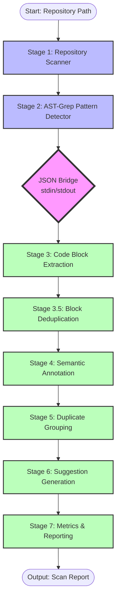
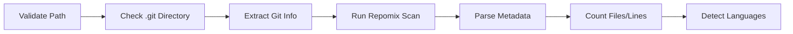
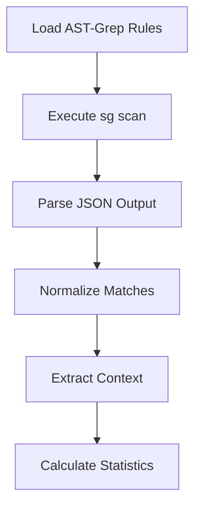
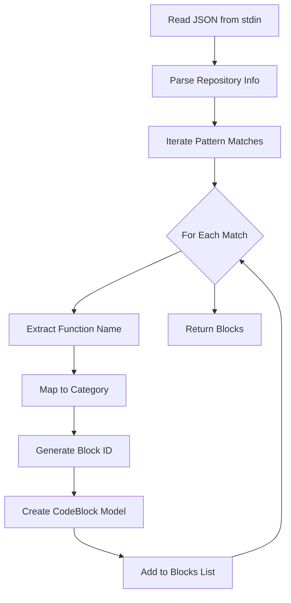
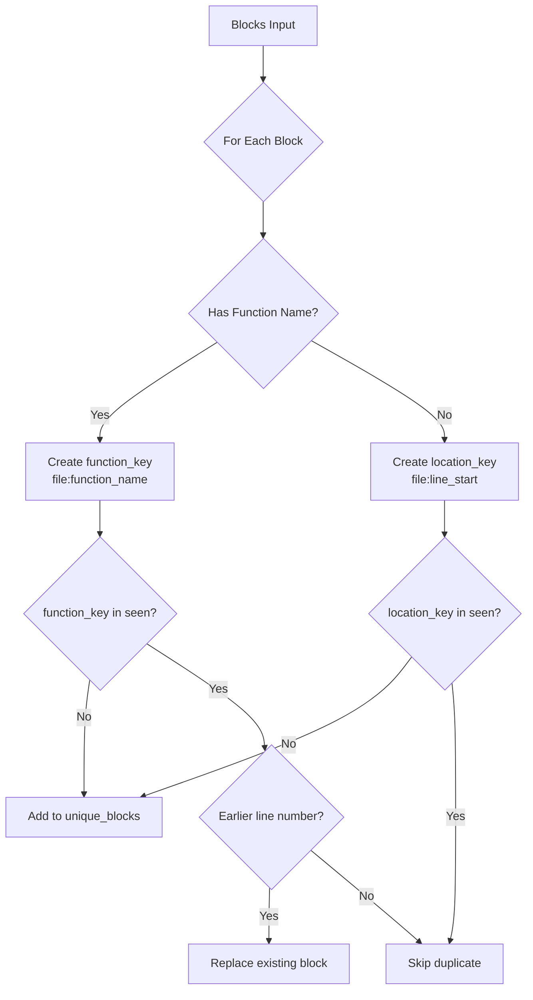
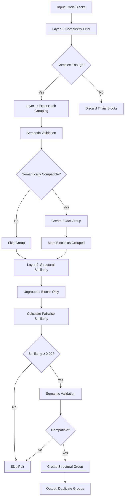
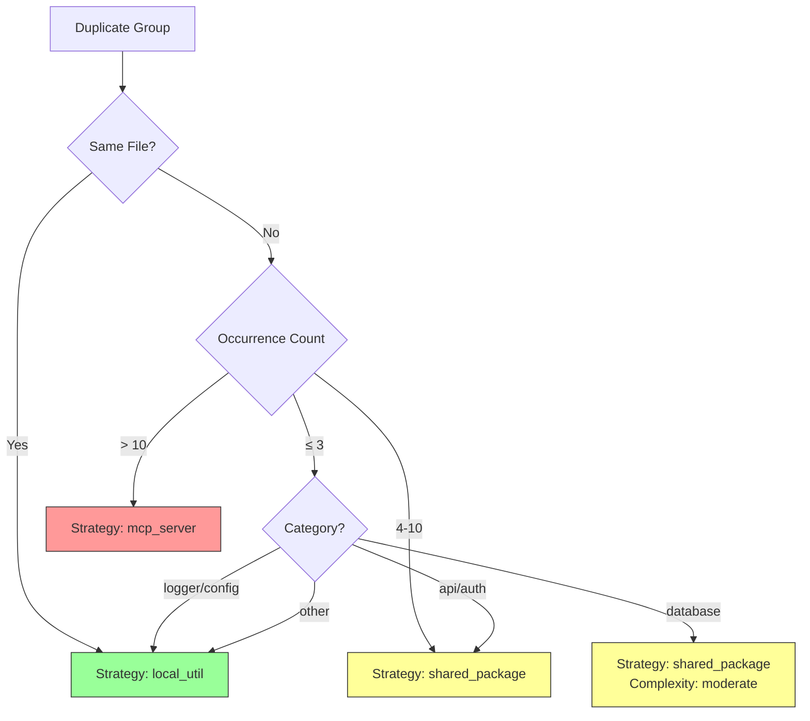

# Code Consolidation Pipeline - Data Flow Documentation

**Last Updated:** 2025-11-17
**Version:** 1.0
**Author:** System Architecture Documentation

## Table of Contents

1. [Overview](#overview)
2. [Pipeline Architecture](#pipeline-architecture)
3. [Stage-by-Stage Data Flow](#stage-by-stage-data-flow)
4. [Data Format Specifications](#data-format-specifications)
5. [Component Interactions](#component-interactions)
6. [Error Handling](#error-handling)
7. [Performance Considerations](#performance-considerations)

---

## Overview

The Code Consolidation Pipeline is a 7-stage duplicate detection system that analyzes codebases to identify and group duplicate code blocks. It bridges JavaScript and Python ecosystems, using AST-based pattern detection and multi-layer similarity algorithms.

### High-Level Architecture

```
JavaScript (Stages 1-2)          Python (Stages 3-7)
┌──────────────────────┐        ┌─────────────────────────────┐
│                      │        │                             │
│  Repository Scanner  │ ────▶  │  Code Block Extraction      │
│  AST-Grep Detector   │  JSON  │  Semantic Annotation        │
│                      │ stdin/ │  Duplicate Grouping         │
│                      │ stdout │  Suggestion Generation      │
│                      │        │  Report Generation          │
└──────────────────────┘        └─────────────────────────────┘
```

**Key Characteristics:**
- **Language Bridge:** JavaScript → Python via JSON over stdin/stdout
- **Processing Time:** ~2-10 seconds for medium repositories (100-500 files)
- **Concurrency:** Configurable (default: 3 concurrent scans)
- **Memory Usage:** ~100-300MB per repository scan

---

## Pipeline Architecture

### Complete 7-Stage Flow



### Component Locations

| Component | File Path | Language | Lines of Code |
|-----------|-----------|----------|---------------|
| **Orchestrator** | `lib/scan-orchestrator.js` | JavaScript | ~302 |
| **Repository Scanner** | `lib/scanners/repository-scanner.js` | JavaScript | ~344 |
| **AST-Grep Detector** | `lib/scanners/ast-grep-detector.js` | JavaScript | ~218 |
| **Block Extractor** | `lib/extractors/extract_blocks.py` | Python | ~671 |
| **Similarity Algorithm** | `lib/similarity/structural.py` | Python | ~493 |
| **Grouping Logic** | `lib/similarity/grouping.py` | Python | ~431 |
| **AST-Grep Rules** | `.ast-grep/rules/*` | YAML | 18 rules |

---

## Stage-by-Stage Data Flow

### Stage 1: Repository Scanner

**File:** `lib/scanners/repository-scanner.js`
**Duration:** ~500ms - 2s
**Purpose:** Validate repository, extract metadata, run repomix

#### Input
```javascript
{
  repoPath: "/absolute/path/to/repository",
  scanConfig: {
    // Optional configuration
  }
}
```

#### Process Flow


#### Output
```javascript
{
  repository_info: {
    path: "/absolute/path/to/repository",
    name: "repository",
    git_remote: "https://github.com/user/repo.git",
    git_branch: "main",
    git_commit: "abc123...",
    total_files: 150,
    total_lines: 12500,
    languages: ["javascript", "typescript", "python"]
  },
  file_metadata: [],
  scan_metadata: {
    duration_seconds: 1.234,
    repomix_output: "/path/to/repomix-output.xml",
    timestamp: "2025-11-17T12:00:00.000Z",
    used_repomix: true
  }
}
```

#### Key Operations

1. **Path Validation**
   ```javascript
   const stats = await fs.stat(repoPath);
   if (!stats.isDirectory()) {
     throw new Error('Path is not a directory');
   }
   ```

2. **Git Information Extraction**
   ```javascript
   git_remote = execSync('git config --get remote.origin.url', { cwd: repoPath })
   git_branch = execSync('git rev-parse --abbrev-ref HEAD', { cwd: repoPath })
   git_commit = execSync('git rev-parse HEAD', { cwd: repoPath })
   ```

3. **Repomix Integration**
   - Executes `repomix` CLI
   - Parses XML output for file counts
   - Detects languages from file extensions
   - Fallback to manual file listing if repomix fails

---

### Stage 2: AST-Grep Pattern Detector

**File:** `lib/scanners/ast-grep-detector.js`
**Duration:** ~1-5s (depends on codebase size)
**Purpose:** Detect code patterns using AST-based matching

#### Input
```javascript
{
  repoPath: "/absolute/path/to/repository",
  detectConfig: {
    // Optional pattern filtering
  }
}
```

#### Process Flow


#### AST-Grep Execution
```bash
sg scan --json --config .ast-grep/sgconfig.yml
```

#### Output
```javascript
{
  matches: [
    {
      rule_id: "array-map-filter",
      file_path: "src/utils/array-helpers.js",
      line_start: 15,
      line_end: 17,
      column_start: 0,
      column_end: 45,
      matched_text: "const result = arr.filter(x => x > 0).map(x => x * 2);",
      message: "Array transformation pattern detected",
      severity: "info",
      ast_node: {},
      meta_variables: {},
      _repoPath: "/absolute/path/to/repository"
    }
    // ... more matches
  ],
  statistics: {
    total_matches: 247,
    rules_applied: 18,
    files_scanned: 42,
    scan_duration_ms: 1234
  }
}
```

#### Pattern Detection Rules

The system includes 18 AST-grep rules organized into categories:

| Category | Rules | Example Patterns |
|----------|-------|------------------|
| **Utilities** | 4 rules | Object manipulation, array operations, string methods |
| **API** | 4 rules | Express routes, auth checks, error responses, validation |
| **Database** | 3 rules | Prisma operations, query builders, connections |
| **Async** | 2 rules | Await patterns, promise chains |
| **Config** | 2 rules | Environment variables, config objects |
| **Logging** | 2 rules | Console statements, logger patterns |

**Example Rule:** `.ast-grep/rules/utilities/array-map-filter.yml`
```yaml
id: array-map-filter
language: javascript
rule:
  any:
    - pattern: $ARR.filter($PRED).map($TRANSFORM)
    - pattern: $ARR.map($TRANSFORM).filter($PRED)
message: Array functional transformation pattern
severity: info
```

---

### Stage 3: Code Block Extraction

**File:** `lib/extractors/extract_blocks.py`
**Duration:** ~100-500ms
**Purpose:** Convert pattern matches into structured CodeBlock models

#### Input (via stdin)
```json
{
  "repository_info": {
    "path": "/absolute/path/to/repository",
    "name": "repository",
    "total_files": 150,
    "languages": ["javascript"]
  },
  "pattern_matches": [
    {
      "rule_id": "array-map-filter",
      "file_path": "src/utils/array-helpers.js",
      "line_start": 15,
      "line_end": 17,
      "matched_text": "const result = arr.filter(x => x > 0).map(x => x * 2);"
    }
  ],
  "scan_config": {}
}
```

#### Process Flow


#### Function Name Extraction

**Critical Pattern:** Searches **backwards** from match line to find closest function declaration.

```python
def extract_function_name(source_code, file_path, line_start, repo_path):
    # Try extracting from matched text first
    patterns = [
        r'function\s+(\w+)\s*\(',          # function name(
        r'const\s+(\w+)\s*=\s*(?:async\s+)?function',
        r'const\s+(\w+)\s*=\s*(?:async\s+)?\(',
        r'async\s+function\s+(\w+)\s*\(',
        # ... more patterns
    ]

    for pattern in patterns:
        match = re.search(pattern, source_code)
        if match:
            return match.group(1)

    # If not found, read file and search backwards
    with open(full_file_path, 'r') as f:
        lines = f.readlines()

    # Search BACKWARDS from match line (prevents finding previous functions)
    search_start = max(0, line_start - 11)
    for i in range(line_start - 1, search_start - 1, -1):
        for pattern in patterns:
            match = re.search(pattern, lines[i])
            if match:
                return match.group(1)
```

#### Output (CodeBlock Model)
```python
CodeBlock(
    block_id="cb_a1b2c3d4e5f6",
    pattern_id="array-map-filter",
    location=SourceLocation(
        file_path="src/utils/array-helpers.js",
        line_start=15,
        line_end=17
    ),
    relative_path="src/utils/array-helpers.js",
    source_code="const result = arr.filter(x => x > 0).map(x => x * 2);",
    language="javascript",
    category="utility",
    repository_path="/absolute/path/to/repository",
    line_count=3,
    tags=["function:processArray"]  # ⚠️ CRITICAL: Uses 'tags', not 'semantic_tags'
)
```

#### Category Mapping

```python
category_map = {
    'object-manipulation': 'utility',
    'array-map-filter': 'utility',
    'express-route-handlers': 'api_handler',
    'auth-checks': 'auth_check',
    'error-responses': 'error_handler',
    'prisma-operations': 'database_operation',
    'await-patterns': 'async_pattern',
    'env-variables': 'config_access',
    'console-statements': 'logger',
    # ... complete mapping
}
```

---

### Stage 3.5: Block Deduplication

**File:** `lib/extractors/extract_blocks.py` (lines 108-163)
**Duration:** ~10-50ms
**Purpose:** Remove duplicate blocks from same function/location

#### Deduplication Strategy

**Priority 4:** Deduplicate by `file:function_name`, not by line number.



#### Code Implementation
```python
def deduplicate_blocks(blocks: List[CodeBlock]) -> List[CodeBlock]:
    seen_functions = {}  # file:function -> earliest block
    seen_locations = set()
    unique_blocks = []

    for block in blocks:
        # Extract function name from tags
        function_name = None
        for tag in block.tags:
            if tag.startswith('function:'):
                function_name = tag[9:]  # Remove 'function:' prefix
                break

        # Strategy 1: Deduplicate by function name (preferred)
        if function_name:
            function_key = f"{block.location.file_path}:{function_name}"

            if function_key not in seen_functions:
                seen_functions[function_key] = block
                unique_blocks.append(block)
            else:
                existing = seen_functions[function_key]
                if block.location.line_start < existing.location.line_start:
                    # This is earlier - replace
                    unique_blocks.remove(existing)
                    seen_functions[function_key] = block
                    unique_blocks.append(block)
        else:
            # Strategy 2: Fallback to line-based deduplication
            location_key = f"{block.location.file_path}:{block.location.line_start}"
            if location_key not in seen_locations:
                seen_locations.add(location_key)
                unique_blocks.append(block)

    return unique_blocks
```

**Example:** If `ast-grep` matches the same function 3 times at lines 10, 15, 20, only the block at line 10 is kept.

---

### Stage 4: Semantic Annotation

**File:** `lib/extractors/extract_blocks.py`
**Duration:** Negligible (currently basic implementation)
**Purpose:** Add semantic metadata to code blocks

#### Current Implementation

Blocks already have basic category from extraction (Stage 3). Full semantic annotation is planned for future enhancement.

**Planned Enhancements:**
- Complexity scoring
- Dependency analysis
- Call graph mapping
- Import/export tracking

---

### Stage 5: Duplicate Grouping

**File:** `lib/similarity/grouping.py`
**Duration:** ~200ms - 2s (depends on block count)
**Purpose:** Group similar blocks using multi-layer similarity

#### Multi-Layer Algorithm



#### Layer 0: Complexity Filtering

Filters out trivial code before grouping:

```python
MIN_COMPLEXITY_THRESHOLD = {
    'min_line_count': 1,
    'min_unique_tokens': 3,
}

def is_complex_enough(block: CodeBlock) -> bool:
    complexity = calculate_code_complexity(block.source_code)

    if complexity['line_count'] < 1:
        return False

    if complexity['unique_tokens'] < 3:
        if not complexity['has_control_flow']:
            return False

    return True
```

#### Layer 1: Exact Hash Matching

```python
def _group_by_exact_hash(blocks: List[CodeBlock]) -> Dict[str, List[CodeBlock]]:
    hash_groups = defaultdict(list)

    for block in blocks:
        hash_val = block.content_hash  # SHA-256 of source code
        hash_groups[hash_val].append(block)

    return hash_groups
```

**Critical Enhancement:** Semantic validation prevents false positives:

```python
def validate_exact_group_semantics(group_blocks: List[CodeBlock]) -> tuple:
    # Check for semantic differences that hash matching misses:
    for i in range(len(group_blocks)):
        for j in range(i + 1, len(group_blocks)):
            code1 = group_blocks[i].source_code
            code2 = group_blocks[j].source_code

            # Check 1: Method chain differences
            chain1 = extract_method_chain(code1)
            chain2 = extract_method_chain(code2)
            if chain1 != chain2:
                return False, f"method_chain_mismatch: {chain1} vs {chain2}"

            # Check 2: HTTP status codes
            status1 = extract_http_status_codes(code1)
            status2 = extract_http_status_codes(code2)
            if status1 and status2 and status1 != status2:
                return False, f"status_code_mismatch: {status1} vs {status2}"

            # Check 3: Logical operators
            ops1 = extract_logical_operators(code1)
            ops2 = extract_logical_operators(code2)
            if opposite_operators(ops1, ops2):
                return False, f"opposite_logic: {ops1} vs {ops2}"

            # Check 4: Semantic methods (Math.max vs Math.min)
            methods1 = extract_semantic_methods(code1)
            methods2 = extract_semantic_methods(code2)
            if methods1 != methods2:
                return False, f"semantic_method_mismatch: {methods1} vs {methods2}"

    return True, "semantically_compatible"
```

#### Layer 2: Structural Similarity

Uses the two-phase algorithm (see [Similarity Algorithm Documentation](./similarity-algorithm.md)):

```python
def _group_by_structural_similarity(
    blocks: List[CodeBlock],
    threshold: float = 0.90
) -> List[tuple[List[CodeBlock], float]]:
    groups = []
    used = set()

    for i, block1 in enumerate(blocks):
        if i in used:
            continue

        group = [block1]
        similarities = []

        for j in range(i + 1, len(blocks)):
            if j in used:
                continue

            block2 = blocks[j]

            # Pre-check semantic compatibility
            if not are_semantically_compatible(block1, block2):
                continue

            # Calculate structural similarity
            similarity, method = calculate_structural_similarity(
                block1.source_code,
                block2.source_code,
                threshold
            )

            if similarity >= threshold:
                group.append(block2)
                similarities.append(similarity)
                used.add(j)

        if len(group) >= 2:
            if validate_duplicate_group(group):
                used.add(i)
                avg_similarity = sum(similarities) / len(similarities)
                groups.append((group, avg_similarity))

    return groups
```

#### Output (DuplicateGroup Model)
```python
DuplicateGroup(
    group_id="dg_a1b2c3d4e5f6",
    pattern_id="array-map-filter",
    member_block_ids=["cb_abc123", "cb_def456", "cb_ghi789"],
    similarity_score=0.95,
    similarity_method="structural",  # or "exact_match"
    category="utility",
    language="javascript",
    occurrence_count=3,
    total_lines=9,
    affected_files=["src/utils/array-helpers.js", "src/lib/transforms.js"],
    affected_repositories=["/path/to/repository"]
)
```

---

### Stage 6: Suggestion Generation

**File:** `lib/extractors/extract_blocks.py` (lines 265-609)
**Duration:** ~50-200ms
**Purpose:** Generate consolidation suggestions with migration steps

#### Strategy Determination



#### Strategy Matrix

| Occurrences | Files | Category | Strategy | Complexity | Risk |
|------------|-------|----------|----------|------------|------|
| Any | 1 | Any | `local_util` | Trivial | Minimal |
| ≤ 5 | Multiple | logger/config | `local_util` | Trivial | Minimal |
| ≤ 3 | Multiple | api/auth/error | `local_util` | Simple | Low |
| 4-10 | Multiple | api/auth/error | `shared_package` | Moderate | Medium |
| > 10 | Multiple | api/auth/error | `mcp_server` | Complex | High |
| ≤ 3 | Multiple | database | `local_util` | Moderate | Medium |
| > 3 | Multiple | database | `shared_package` | Complex | High |
| ≤ 8 | Multiple | utility | `shared_package` | Simple | Low |
| > 8 | Multiple | utility | `mcp_server` | Moderate | Medium |

#### Migration Steps Generation

Each strategy has predefined migration steps:

**Example: `shared_package` Strategy**
```python
steps = [
    MigrationStep(
        step_number=1,
        description="Create shared package/module for utility",
        automated=False,
        estimated_time="1h"
    ),
    MigrationStep(
        step_number=2,
        description="Extract and parameterize common logic",
        automated=False,
        estimated_time="1h"
    ),
    MigrationStep(
        step_number=3,
        description="Add comprehensive tests to shared package",
        automated=False,
        estimated_time="45min"
    ),
    MigrationStep(
        step_number=4,
        description="Update each file to import from shared package",
        automated=True,
        estimated_time="30min"
    ),
    # ... more steps
]
```

#### ROI Calculation

```python
def _calculate_roi(group: DuplicateGroup, complexity: str, risk: str) -> float:
    roi = group.impact_score  # Base: 0-100

    # Adjust for complexity (simpler = higher ROI)
    complexity_multipliers = {
        'trivial': 1.3,
        'simple': 1.1,
        'moderate': 0.9,
        'complex': 0.7
    }
    roi *= complexity_multipliers.get(complexity, 1.0)

    # Adjust for risk (lower risk = higher ROI)
    risk_multipliers = {
        'minimal': 1.2,
        'low': 1.1,
        'medium': 0.9,
        'high': 0.7
    }
    roi *= risk_multipliers.get(risk, 1.0)

    return min(roi, 100.0)
```

#### Output (ConsolidationSuggestion Model)
```python
ConsolidationSuggestion(
    suggestion_id="cs_dg_a1b2c3d4e5f6",
    duplicate_group_id="dg_a1b2c3d4e5f6",
    strategy="shared_package",
    strategy_rationale="Utility pattern used 5 times across 3 files - create shared utility",
    target_location="shared/utils/array-transforms.js",
    migration_steps=[...],  # List of MigrationStep objects
    code_example="// Before: ...\n// After: import { transform } from '@shared/utils';",
    impact_score=75.5,
    complexity="simple",
    migration_risk="low",
    estimated_effort_hours=3.5,
    breaking_changes=False,
    affected_files_count=3,
    affected_repositories_count=1,
    confidence=0.9,
    roi_score=91.3
)
```

---

### Stage 7: Metrics & Reporting

**File:** `lib/extractors/extract_blocks.py` (lines 637-661)
**Duration:** ~10-50ms
**Purpose:** Calculate statistics and prepare final output

#### Metrics Calculation

```python
metrics = {
    'total_code_blocks': len(blocks),
    'total_duplicate_groups': len(groups),
    'exact_duplicates': len([g for g in groups if g.similarity_method == 'exact']),
    'structural_duplicates': len([g for g in groups if g.similarity_method == 'structural']),
    'semantic_duplicates': 0,  # TODO: Implement semantic grouping
    'total_duplicated_lines': sum(g.total_lines for g in groups),
    'potential_loc_reduction': sum(
        g.total_lines - g.total_lines // g.occurrence_count
        for g in groups
    ),
    'duplication_percentage': 0.0,  # TODO: Calculate properly
    'total_suggestions': len(suggestions),
    'quick_wins': len([s for s in suggestions if s.complexity == 'trivial']),
    'high_priority_suggestions': len([s for s in suggestions if s.impact_score >= 75])
}
```

#### Final Output (via stdout to JavaScript)

```json
{
  "code_blocks": [
    {
      "block_id": "cb_a1b2c3d4e5f6",
      "pattern_id": "array-map-filter",
      "location": {
        "file_path": "src/utils/array-helpers.js",
        "line_start": 15,
        "line_end": 17
      },
      "source_code": "const result = arr.filter(x => x > 0).map(x => x * 2);",
      "category": "utility",
      "tags": ["function:processArray"]
    }
  ],
  "duplicate_groups": [
    {
      "group_id": "dg_a1b2c3d4e5f6",
      "pattern_id": "array-map-filter",
      "member_block_ids": ["cb_abc123", "cb_def456"],
      "similarity_score": 0.95,
      "similarity_method": "structural",
      "occurrence_count": 2,
      "affected_files": ["src/utils/array-helpers.js", "src/lib/transforms.js"]
    }
  ],
  "suggestions": [
    {
      "suggestion_id": "cs_dg_a1b2c3d4e5f6",
      "strategy": "local_util",
      "impact_score": 65.0,
      "roi_score": 78.5,
      "estimated_effort_hours": 1.5
    }
  ],
  "metrics": {
    "total_code_blocks": 247,
    "total_duplicate_groups": 12,
    "exact_duplicates": 5,
    "structural_duplicates": 7,
    "total_suggestions": 12,
    "quick_wins": 4,
    "high_priority_suggestions": 3
  }
}
```

---

## Data Format Specifications

### CodeBlock Model (Pydantic)

```python
from pydantic import BaseModel, Field
from typing import List, Optional
from datetime import datetime

class SourceLocation(BaseModel):
    file_path: str
    line_start: int
    line_end: int

class CodeBlock(BaseModel):
    block_id: str
    pattern_id: str
    location: SourceLocation
    relative_path: str
    source_code: str
    language: str
    category: str  # SemanticCategory enum
    repository_path: str
    line_count: int
    tags: List[str] = Field(default_factory=list)  # ⚠️ NOT semantic_tags
    content_hash: str = Field(default="")

    def model_post_init(self, __context):
        # Auto-calculate content hash
        if not self.content_hash:
            self.content_hash = hashlib.sha256(
                self.source_code.encode()
            ).hexdigest()
```

### DuplicateGroup Model (Pydantic)

```python
class DuplicateGroup(BaseModel):
    group_id: str
    pattern_id: str
    member_block_ids: List[str]
    similarity_score: float  # 0.0 to 1.0
    similarity_method: str  # 'exact_match', 'structural', 'semantic'
    category: str
    language: str
    occurrence_count: int
    total_lines: int
    affected_files: List[str]
    affected_repositories: List[str]
    impact_score: float = Field(default=0.0)

    def model_post_init(self, __context):
        # Auto-calculate impact score
        if self.impact_score == 0.0:
            self.impact_score = min(
                (self.occurrence_count * 10) +
                (self.total_lines * 0.5) +
                (len(self.affected_files) * 5),
                100.0
            )
```

### ConsolidationSuggestion Model (Pydantic)

```python
class MigrationStep(BaseModel):
    step_number: int
    description: str
    automated: bool
    estimated_time: str

class ConsolidationSuggestion(BaseModel):
    suggestion_id: str
    duplicate_group_id: str
    strategy: str  # 'local_util', 'shared_package', 'mcp_server', 'autonomous_agent'
    strategy_rationale: str
    target_location: str
    migration_steps: List[MigrationStep]
    code_example: str
    impact_score: float
    complexity: str  # 'trivial', 'simple', 'moderate', 'complex'
    migration_risk: str  # 'minimal', 'low', 'medium', 'high'
    estimated_effort_hours: float
    breaking_changes: bool
    affected_files_count: int
    affected_repositories_count: int
    confidence: float
    roi_score: float
```

---

## Component Interactions

### Orchestrator → Scanner

```javascript
// lib/scan-orchestrator.js
const repoScan = await this.repositoryScanner.scanRepository(
  repoPath,
  scanConfig.scan_config || {}
);
```

### Orchestrator → AST-Grep

```javascript
// lib/scan-orchestrator.js
const patterns = await this.patternDetector.detectPatterns(
  repoPath,
  scanConfig.pattern_config || {}
);
```

### Orchestrator → Python Pipeline

```javascript
// lib/scan-orchestrator.js
async runPythonPipeline(data) {
  return new Promise((resolve, reject) => {
    const proc = spawn(this.pythonPath, [this.extractorScript], {
      timeout: 600000, // 10 minutes
    });

    // Send data via stdin
    const jsonData = JSON.stringify(data);
    proc.stdin.write(jsonData);
    proc.stdin.end();

    // Collect output
    let stdout = '';
    proc.stdout.on('data', (data) => {
      stdout += data.toString();
    });

    // Parse result
    proc.on('close', (code) => {
      if (code === 0) {
        const result = JSON.parse(stdout);
        resolve(result);
      } else {
        reject(new Error(`Python pipeline exited with code ${code}`));
      }
    });
  });
}
```

### Python Pipeline Components

```python
# lib/extractors/extract_blocks.py

# Stage 3: Extract blocks
blocks = extract_code_blocks(pattern_matches, repository_info)

# Stage 3.5: Deduplicate
blocks = deduplicate_blocks(blocks)

# Stage 5: Group duplicates
groups = group_duplicates(blocks)

# Stage 6: Generate suggestions
suggestions = generate_suggestions(groups)

# Stage 7: Calculate metrics
metrics = {
    'total_code_blocks': len(blocks),
    'total_duplicate_groups': len(groups),
    # ...
}
```

---

## Error Handling

### JavaScript Error Handling

```javascript
// lib/scan-orchestrator.js
try {
  const scanResult = await this.scanRepository(repoPath, scanConfig);
  return scanResult;
} catch (error) {
  logger.error({ repoPath, error }, 'Repository scan failed');
  throw new ScanError(`Scan failed for ${repoPath}: ${error.message}`, {
    cause: error
  });
}
```

### Python Error Handling

```python
# lib/extractors/extract_blocks.py
try:
    # Read input
    input_data = json.load(sys.stdin)

    # Process pipeline
    blocks = extract_code_blocks(...)
    groups = group_duplicates(...)
    suggestions = generate_suggestions(...)

    # Output result
    json.dump(result, sys.stdout, indent=2)

except Exception as e:
    print(f"Error in extraction pipeline: {e}", file=sys.stderr)
    import traceback
    traceback.print_exc(file=sys.stderr)
    sys.exit(1)
```

### Common Error Types

| Error Type | Stage | Cause | Recovery |
|------------|-------|-------|----------|
| `RepositoryScanError` | 1 | Invalid path, permission denied | Validate path before scan |
| `PatternDetectionError` | 2 | ast-grep not installed, timeout | Install `sg`, increase timeout |
| `ValidationError` (Pydantic) | 3 | Invalid CodeBlock data | Fix pattern match normalization |
| `JSONDecodeError` | Bridge | Malformed JSON output | Check Python stdout |
| `TimeoutError` | Pipeline | Long-running Python script | Increase timeout to 600s |

---

## Performance Considerations

### Bottlenecks

1. **AST-Grep Scanning (Stage 2):** ~60% of total time
   - **Optimization:** Use file filtering, limit rules

2. **Structural Similarity (Stage 5):** ~25% of total time
   - **Optimization:** Early semantic filtering, Layer 0 complexity filter

3. **Python Startup (Bridge):** ~5% of total time
   - **Optimization:** Use venv for faster imports

### Memory Usage

- **JavaScript:** ~50-100MB base
- **Python:** ~100-300MB during grouping
- **Peak:** ~400MB for large repositories (1000+ files)

### Optimization Strategies

1. **Parallel Processing:** Process multiple repositories concurrently (default: 3)
2. **Incremental Scanning:** Cache repomix results
3. **Rule Filtering:** Disable unused AST-grep rules
4. **Complexity Filtering:** Skip trivial code blocks early (Layer 0)

### Benchmarks

| Repository Size | Total Time | Blocks Found | Groups Found |
|----------------|------------|--------------|--------------|
| Small (50 files) | ~2s | 30-50 | 5-10 |
| Medium (200 files) | ~6s | 100-200 | 15-30 |
| Large (500 files) | ~15s | 300-600 | 40-80 |
| Extra Large (1000+ files) | ~30s | 600-1200 | 80-150 |

---

## Appendix: Complete Example

### Input Repository Structure
```
my-app/
├── src/
│   ├── utils/
│   │   ├── array-helpers.js
│   │   └── transforms.js
│   └── api/
│       └── handlers.js
└── package.json
```

### Example Code Blocks
**File:** `src/utils/array-helpers.js`
```javascript
// Line 15-17
export function processPositive(arr) {
  return arr.filter(x => x > 0).map(x => x * 2);
}
```

**File:** `src/utils/transforms.js`
```javascript
// Line 22-24
export function doublePositive(numbers) {
  return numbers.filter(x => x > 0).map(x => x * 2);
}
```

### Pipeline Output

**CodeBlocks (2):**
```json
[
  {
    "block_id": "cb_abc123",
    "pattern_id": "array-map-filter",
    "location": {"file_path": "src/utils/array-helpers.js", "line_start": 15},
    "source_code": "return arr.filter(x => x > 0).map(x => x * 2);",
    "tags": ["function:processPositive"]
  },
  {
    "block_id": "cb_def456",
    "pattern_id": "array-map-filter",
    "location": {"file_path": "src/utils/transforms.js", "line_start": 22},
    "source_code": "return numbers.filter(x => x > 0).map(x => x * 2);",
    "tags": ["function:doublePositive"]
  }
]
```

**DuplicateGroup (1):**
```json
{
  "group_id": "dg_abc123",
  "pattern_id": "array-map-filter",
  "member_block_ids": ["cb_abc123", "cb_def456"],
  "similarity_score": 0.95,
  "similarity_method": "structural",
  "occurrence_count": 2,
  "affected_files": ["src/utils/array-helpers.js", "src/utils/transforms.js"]
}
```

**Suggestion (1):**
```json
{
  "suggestion_id": "cs_abc123",
  "strategy": "local_util",
  "strategy_rationale": "Utility pattern used 2 times in 2 files - extract to local util",
  "target_location": "src/utils/array-utils.js",
  "impact_score": 45.0,
  "complexity": "trivial",
  "roi_score": 58.5,
  "estimated_effort_hours": 0.75
}
```

---

## Related Documentation

- [Similarity Algorithm Documentation](./similarity-algorithm.md)
- [AST-Grep Rules Guide](../../.ast-grep/README.md) (TODO)
- [Pydantic Models Reference](../../lib/models/README.md) (TODO)

---

**Document Version:** 1.0
**Last Updated:** 2025-11-17
**Maintainer:** Architecture Team
