# AlephAuto Pipeline Data Flow Documentation

**Last Updated:** 2026-02-25
**Version:** 2.3
**Author:** System Architecture Documentation

## Table of Contents

1. [Overview](#overview)
2. [AlephAuto Framework Architecture](#alephauto-framework-architecture)
3. [Pipeline Catalog](#pipeline-catalog)
4. [Pipeline Data Flows](#pipeline-data-flows)
   - [Duplicate Detection Pipeline](#1-duplicate-detection-pipeline)
   - [Schema Enhancement Pipeline](#2-schema-enhancement-pipeline)
   - [Git Activity Reporter Pipeline](#3-git-activity-reporter-pipeline)
   - [Gitignore Manager Pipeline](#4-gitignore-manager-pipeline)
   - [Repomix Automation Pipeline](#5-repomix-automation-pipeline)
   - [Plugin Manager Pipeline](#6-plugin-manager-pipeline)
   - [Claude Health Monitor Pipeline](#7-claude-health-monitor-pipeline)
   - [Test Refactor Pipeline](#8-test-refactor-pipeline)
   - [Repository Cleanup Pipeline](#9-repository-cleanup-pipeline)
   - [Bugfix Audit Pipeline](#10-bugfix-audit-pipeline)
   - [Dashboard Populate Pipeline](#11-dashboard-populate-pipeline)
5. [Git Workflow Integration](#git-workflow-integration)
6. [Common Patterns](#common-patterns)
7. [Error Handling & Resilience](#error-handling--resilience)

---

## Overview

The AlephAuto automation system consists of 11 specialized pipelines built on a unified job queue framework. Each pipeline follows event-driven architecture with automatic retry logic, Sentry error tracking, and real-time dashboard updates via WebSocket.

### System Characteristics

- **Framework:** AlephAuto (SidequestServer base class)
- **Job Queue:** In-memory with configurable concurrency (default: 5, via `CONCURRENCY.DEFAULT_MAX_JOBS`)
- **Event System:** EventEmitter-based job lifecycle tracking
- **Error Tracking:** Sentry v8 with automatic classification
- **Dashboard:** Real-time WebSocket + REST API (port 8080)
- **Deployment:** PM2 + Doppler + traditional server stack

### Pipeline Categories

| Category | Pipelines | Language Stack |
|----------|-----------|----------------|
| **Code Analysis** | Duplicate Detection, Test Refactor | JavaScript + Python + TypeScript |
| **Code Quality** | Bugfix Audit | JavaScript + Shell |
| **Documentation** | Schema Enhancement | JavaScript |
| **Operations** | Repomix, Gitignore, Repository Cleanup | JavaScript + Shell |
| **Observability** | Dashboard Populate | TypeScript (external) |
| **Reporting** | Git Activity, Plugin Manager, Claude Health | JavaScript + Python + Shell |

---

## AlephAuto Framework Architecture

### Job Lifecycle


### SidequestServer Base Class

**File:** `sidequest/core/server.ts`

All workers extend this base class which provides:

```typescript
class SidequestServer extends EventEmitter {
  constructor(options: SidequestServerOptions) {
    this.maxConcurrent = options.maxConcurrent ?? CONCURRENCY.DEFAULT_MAX_JOBS;
    this.jobs = new Map<string, Job>();
    this.queue: string[] = [];
    this.activeJobs = 0;
    this.gitWorkflowEnabled = options.gitWorkflowEnabled ?? false;
    // ... circuit breaker, retry logic, Sentry integration
  }

  // Job management
  createJob(jobId: string, data: Record<string, unknown>): Job { /* ... */ }
  async runJobHandler(job: Job): Promise<unknown> { /* Override in subclass */ }
  getStats(): JobStats { /* ... */ }

  // Git workflow (if enabled via GitWorkflowManager)
  async _setupGitBranchIfEnabled(job: Job): Promise<boolean> { /* ... */ }
  async _handleGitWorkflowSuccess(job: Job): Promise<void> { /* ... */ }

  // Retry logic with error classification
  // Auto-retry for retryable errors (ETIMEDOUT, 5xx) up to maxRetries

  // Event emitters
  emit('job:created', job);
  emit('job:started', job);
  emit('job:completed', job);
  emit('job:failed', job, error);
}
```

### BasePipeline Abstract Class

**File:** `sidequest/pipeline-runners/base-pipeline.ts`

Class-based pipeline runners extend `BasePipeline<TWorker>`, which provides shared scheduling, polling, and stats:

```typescript
abstract class BasePipeline<TWorker extends SidequestServer> {
  protected worker: TWorker;

  waitForCompletion(): Promise<void>;    // Poll getStats() until queue drains
  protected scheduleCron(                // Validate + schedule + log + error-wrap
    logger, name, cronSchedule, runFn
  ): cron.ScheduledTask;
  getStats(): JobStats;                  // Delegate to worker.getStats()
}
```

**Pipelines extending BasePipeline:** BugfixAuditPipeline, ClaudeHealthPipeline, GitActivityPipeline, PluginManagementPipeline, SchemaEnhancementPipeline.

**Pipelines using functional pattern (no base class):** DashboardPopulatePipeline, DuplicateDetectionPipeline, GitignorePipeline, RepoCleanupPipeline, TestRefactorPipeline.

### Class Hierarchy


### Common Data Flow Pattern


---

## Pipeline Catalog

| # | Pipeline | Job Type | Runner File | Worker File | Base Class | Git Workflow | Languages |
|---|----------|----------|-------------|-------------|------------|--------------|-----------|
| 1 | Duplicate Detection | `duplicate-detection` | `duplicate-detection-pipeline.ts` | `duplicate-detection-worker.ts` | functional | ⚠️ Custom | JS + Python |
| 2 | Schema Enhancement | `schema-enhancement` | `schema-enhancement-pipeline.ts` | `schema-enhancement-worker.ts` | BasePipeline | ✅ Yes | JavaScript |
| 3 | Git Activity | `git-activity-report` | `git-activity-pipeline.ts` | `git-activity-worker.ts` | BasePipeline | ❌ No | JS + Python |
| 4 | Gitignore Manager | `gitignore-update` | `gitignore-pipeline.ts` | `gitignore-worker.ts` | functional | ⚠️ Batch N/A | JavaScript |
| 5 | Repomix | `repomix-scan` | N/A (cron server) | `repomix-worker.ts` | — | ❌ No | JavaScript |
| 6 | Plugin Manager | `plugin-audit` | `plugin-management-pipeline.ts` | (embedded in utils) | BasePipeline | ❌ No | JavaScript |
| 7 | Claude Health | `claude-health-check` | `claude-health-pipeline.ts` | `claude-health-worker.ts` | BasePipeline | ❌ No | JS + Shell |
| 8 | Test Refactor | `test-refactor` | `test-refactor-pipeline.ts` | `test-refactor-worker.ts` | functional | ✅ Optional | TypeScript |
| 9 | Repository Cleanup | `repo-cleanup` | `repo-cleanup-pipeline.ts` | `repo-cleanup-worker.ts` | functional | ❌ No | JS + Shell |
| 10 | Bugfix Audit | `bugfix-audit` | `bugfix-audit-pipeline.ts` | `bugfix-audit-worker.ts` | BasePipeline | ✅ Multi-commit | JS + Shell |
| 11 | Dashboard Populate | `dashboard-populate` | `dashboard-populate-pipeline.ts` | `dashboard-populate-worker.ts` | functional | ❌ No | TypeScript |

---

## Pipeline Data Flows

### 1. Duplicate Detection Pipeline

**Purpose:** 7-stage AST-based duplicate code detection with consolidation suggestions
**Job Type:** `duplicate-detection`
**Languages:** JavaScript (stages 1-2) → Python (stages 3-7)

#### Complete Data Flow


#### Stage Details

**Stage 1: Repository Scanner** (`sidequest/pipeline-core/scanners/repository-scanner.js`)
- Duration: ~500ms - 2s
- Input: `{ repoPath: "/path/to/repo" }`
- Process: Git validation → repomix scan → metadata extraction
- Output: Repository info (files, lines, languages)

**Stage 2: AST-Grep Pattern Detector** (`sidequest/pipeline-core/scanners/ast-grep-detector.js`)
- Duration: ~1-5s
- Input: Repository path
- Process: Execute `sg scan --json` with 18 AST-grep rules
- Output: Pattern matches (array-map-filter, express routes, etc.)

**Stage 3: Code Block Extraction** (`sidequest/pipeline-core/extractors/extract_blocks.py`)
- Duration: ~100-500ms
- Input: JSON via stdin (repository info + pattern matches)
- Process: Convert matches to CodeBlock Pydantic models
- Output: List of CodeBlock objects with tags

**Stage 3.5: Block Deduplication**
- Duration: ~10-50ms
- Process: Remove duplicate blocks by `file:function_name` key
- Output: Unique code blocks only

**Stage 4: Semantic Annotation**
- Duration: Negligible (basic implementation)
- Process: Category mapping (utility, api_handler, database_operation)
- Output: Blocks with semantic categories

**Stage 5: Duplicate Grouping** (`sidequest/pipeline-core/similarity/grouping.py`)
- Duration: ~200ms - 2s
- Process: Multi-layer algorithm (exact hash → structural similarity)
- Output: DuplicateGroup objects with similarity scores

**Stage 6: Suggestion Generation** (`sidequest/pipeline-core/extractors/extract_blocks.py`)
- Duration: ~50-200ms
- Process: Strategy determination (local_util, shared_package, mcp_server)
- Output: ConsolidationSuggestion objects with migration steps

**Stage 7: Metrics & Reporting**
- Duration: ~10-50ms
- Process: Calculate statistics and prepare final JSON
- Output: Complete scan report with blocks, groups, suggestions, metrics

#### Data Format Examples

**CodeBlock (Python → JSON)**
```json
{
  "block_id": "cb_a1b2c3d4",
  "pattern_id": "array-map-filter",
  "location": {
    "file_path": "src/utils/helpers.js",
    "line_start": 15,
    "line_end": 17
  },
  "source_code": "return arr.filter(x => x > 0).map(x => x * 2);",
  "category": "utility",
  "tags": ["function:processArray"]
}
```

**DuplicateGroup**
```json
{
  "group_id": "dg_xyz789",
  "member_block_ids": ["cb_abc", "cb_def"],
  "similarity_score": 0.95,
  "similarity_method": "structural",
  "occurrence_count": 2,
  "affected_files": ["src/utils/helpers.js", "src/lib/transforms.js"]
}
```

**ConsolidationSuggestion**
```json
{
  "suggestion_id": "cs_dg_xyz789",
  "strategy": "local_util",
  "impact_score": 75.0,
  "roi_score": 91.3,
  "estimated_effort_hours": 1.5,
  "migration_steps": [
    {
      "step_number": 1,
      "description": "Extract to shared utility function",
      "automated": false,
      "estimated_time": "30min"
    }
  ]
}
```

#### Performance Benchmarks

| Repository Size | Total Time | Blocks Found | Groups Found |
|----------------|------------|--------------|--------------|
| Small (50 files) | ~2s | 30-50 | 5-10 |
| Medium (200 files) | ~6s | 100-200 | 15-30 |
| Large (500 files) | ~15s | 300-600 | 40-80 |

---

### 2. Schema Enhancement Pipeline

**Purpose:** Add Schema.org JSON-LD structured data to README files
**Job Type:** `schema-enhancement`
**Languages:** JavaScript
**Git Workflow:** ✅ Enabled (creates PRs with `docs/` prefix)

#### Data Flow


#### Stage Breakdown

**1. Schema Type Detection**
- Input: README content + file path + context
- Process: MCP tools analyze content to determine best schema type
- Output: Schema type (SoftwareSourceCode, Article, TechArticle, etc.)

**2. Schema Generation**
- Input: README content + schema type
- Process: Extract metadata (name, description, author, dependencies)
- Output: Schema.org JSON-LD object

**3. Schema Validation**
- Input: Generated schema object
- Process: Validate against Schema.org specifications
- Output: `{ valid: boolean, errors: [], warnings: [] }`

**4. Schema Injection**
- Input: Original README + schema object
- Process: Insert `<script type="application/ld+json">` block at top
- Output: Enhanced README content

**5. Impact Analysis**
- Input: Original + enhanced content
- Process: Calculate SEO improvements, rich results eligibility
- Output: Impact report with score (0-100)

**6. Git Workflow** (if enabled)
- Branch: `docs/schema-README-1234567890`
- Commit: `"docs: add Schema.org structured data to README.md"`
- PR labels: `documentation`, `seo`, `schema-org`, `automated`

#### Job Data Format

```javascript
// Input
{
  readmePath: "/path/to/README.md",
  relativePath: "project/README.md",
  repositoryPath: "/path/to/repo",
  repository: "repo-name",
  context: { /* additional context */ }
}

// Output
{
  status: "enhanced",
  readmePath: "/path/to/README.md",
  schemaType: "SoftwareSourceCode",
  schema: {
    "@context": "https://schema.org",
    "@type": "SoftwareSourceCode",
    "name": "Project Name",
    "description": "Project description",
    // ... full schema
  },
  impact: {
    impactScore: 85,
    rating: "high",
    seoImprovements: [
      "Enhanced search result appearance",
      "Structured data for rich results"
    ],
    richResultsEligibility: ["Software", "Article"]
  },
  validation: {
    valid: true,
    errors: [],
    warnings: []
  },
  timestamp: "2025-11-24T12:00:00.000Z"
}
```

#### File Locations

| Component | Path |
|-----------|------|
| Worker | `sidequest/workers/schema-enhancement-worker.js` |
| Runner | `sidequest/pipeline-runners/schema-enhancement-pipeline.js` |
| MCP Tools | `sidequest/utils/schema-mcp-tools.js` |
| Output | `./document-enhancement-impact-measurement/` |

---

### 3. Git Activity Reporter Pipeline

**Purpose:** Generate weekly/monthly git activity reports with visualizations
**Job Type:** `git-activity-report`
**Languages:** JavaScript → Python
**Git Workflow:** ❌ No (generates reports only)

#### Data Flow


#### Python Script Flow

**File:** `sidequest/pipeline-runners/collect_git_activity.py`

```python
# 1. Parse command-line arguments
args = parse_args()  # --weekly, --monthly, --since, --until

# 2. Find git repositories
repos = find_git_repositories(base_dir="~/code")

# 3. Collect commit data per repository
for repo in repos:
    commits = git log --since={date} --until={date} --all
    parse_commit_data(commits)

# 4. Aggregate statistics
total_commits = sum(repo.commits for repo in repos)
total_additions = sum(repo.additions for repo in repos)
total_deletions = sum(repo.deletions for repo in repos)

# 5. Generate visualizations (optional)
if --no-visualizations not set:
    generate_commit_timeline_svg()
    generate_repository_heatmap_svg()

# 6. Save JSON report
save_json_report({
    "total_commits": total_commits,
    "repositories": [...],
    "time_period": {...}
})
```

#### Job Data Format

```javascript
// Input
{
  reportType: "weekly" | "monthly" | "custom",
  days: 7 | 30 | null,
  sinceDate: "2025-11-17" | null,
  untilDate: "2025-11-24" | null,
  outputFormat: "json",
  generateVisualizations: true
}

// Output
{
  reportType: "weekly",
  days: 7,
  sinceDate: "2025-11-17",
  untilDate: "2025-11-24",
  stats: {
    totalCommits: 142,
    totalRepositories: 12,
    linesAdded: 3421,
    linesDeleted: 1876
  },
  outputFiles: [
    { path: "/tmp/git-activity-report.json", size: 45678, exists: true },
    { path: "/tmp/commit-timeline.svg", size: 12345, exists: true }
  ],
  timestamp: "2025-11-24T12:00:00.000Z"
}
```

#### Output Files

| File Type | Description | Format |
|-----------|-------------|--------|
| JSON Report | Aggregated statistics | `/tmp/git-activity-report.json` |
| Timeline SVG | Commit timeline visualization | `/tmp/commit-timeline.svg` |
| Heatmap SVG | Repository activity heatmap | `/tmp/repository-heatmap.svg` |

---

### 4. Gitignore Manager Pipeline

**Purpose:** Batch update `.gitignore` files across multiple repositories
**Job Type:** `gitignore-update`
**Languages:** JavaScript
**Git Workflow:** ⚠️ Not supported (processes multiple repos per job)

#### Data Flow


#### Update Logic

**File:** `sidequest/workers/gitignore-repomix-updater.js`

```javascript
async addToGitignore(repoPath) {
  // 1. Check if .gitignore exists
  const gitignorePath = path.join(repoPath, '.gitignore');
  if (!await exists(gitignorePath)) {
    return { action: 'error', reason: 'no_gitignore' };
  }

  // 2. Read existing content
  const content = await fs.readFile(gitignorePath, 'utf-8');

  // 3. Check if entry already present
  if (content.includes(this.gitignoreEntry)) {
    return { action: 'skipped', reason: 'already_present' };
  }

  // 4. Dry run check
  if (this.dryRun) {
    return { action: 'would_add', entry: this.gitignoreEntry };
  }

  // 5. Append entry
  const newContent = content + '\n' + this.gitignoreEntry + '\n';
  await fs.writeFile(gitignorePath, newContent);

  return { action: 'added', entry: this.gitignoreEntry };
}
```

#### Job Data Format

```javascript
// Input
{
  baseDir: "~/code",
  excludeDirs: ["node_modules", ".git", "dist"],
  maxDepth: 10,
  gitignoreEntry: "repomix-output.xml",
  dryRun: false,
  repositories: null  // or ["~/code/repo1", "~/code/repo2"]
}

// Output
{
  totalRepositories: 47,
  results: [
    { repository: "~/code/repo1", action: "added", entry: "repomix-output.xml" },
    { repository: "~/code/repo2", action: "skipped", reason: "already_present" },
    { repository: "~/code/repo3", action: "error", reason: "no_gitignore" }
  ],
  summary: {
    added: 23,
    skipped: 21,
    would_add: 0,
    error: 3
  },
  timestamp: "2025-11-24T12:00:00.000Z",
  dryRun: false,
  gitignoreEntry: "repomix-output.xml"
}
```

---

### 5. Repomix Automation Pipeline

**Purpose:** Automated repomix scan scheduling and execution
**Job Type:** `repomix-scan`
**Languages:** JavaScript
**Git Workflow:** ❌ No (cron-based execution)

#### Data Flow


#### Repomix Command Construction

**File:** `sidequest/workers/repomix-worker.js`

```javascript
#runRepomixCommand(cwd) {
  const args = ['repomix'];

  // Respect .gitignore by default
  if (!this.respectGitignore) {
    args.push('--no-gitignore');
  }

  // Add additional ignore patterns (e.g., README.md)
  if (this.additionalIgnorePatterns.length > 0) {
    args.push('--ignore', this.additionalIgnorePatterns.join(','));
  }

  // Execute: npx repomix [--no-gitignore] [--ignore patterns]
  const proc = spawn('npx', args, {
    cwd,
    timeout: 300000,  // 5 minutes
    maxBuffer: 10 * 1024 * 1024  // 10MB
  });

  // Capture output and save to file
}
```

#### Configuration

**Environment Variables (Doppler):**
```bash
REPOMIX_IGNORE_PATTERNS="README.md,*.md"  # Comma-separated patterns
REPOMIX_RESPECT_GITIGNORE="true"          # Default: true
```

#### Job Data Format

```javascript
// Input
{
  sourceDir: "/path/to/repository",
  relativePath: "projects/myapp"
}

// Output
{
  sourceDir: "/path/to/repository",
  outputFile: "./condense/projects/myapp/repomix-output.txt",
  relativePath: "projects/myapp",
  size: 456789,
  timestamp: "2025-11-24T12:00:00.000Z"
}
```

#### Output Structure

```
condense/
├── project-a/
│   └── repomix-output.txt
├── project-b/
│   └── repomix-output.txt
└── project-c/
    └── repomix-output.txt
```

---

### 6. Plugin Manager Pipeline

**Purpose:** Audit Claude Code plugins for duplicates and issues
**Job Type:** `plugin-audit`
**Languages:** JavaScript
**Git Workflow:** ❌ No (analysis only)

#### Data Flow



```mermaid
graph TB
    A[Audit Request] --> B[PluginManagerWorker]
    B --> C[Read settings.json]
    C --> D[Parse enabled plugins]
    D --> E[Group by category]
    E --> F{Detect Duplicates?}
    F -->|Yes| G[Identify duplicate categories]
    F -->|No| H[Continue analysis]
    G --> I[Generate recommendations]
    H --> I
    I --> J{Priority Level?}
    J -->|High| K[⚠️ Duplicate functionality]
    J -->|Medium| L[💡 Consolidation opportunity]
    J -->|Info| M[✅ Configuration OK]
    K --> N[Return audit results]
    L --> N
    M --> N

    style C fill:#bbf,stroke:#333
    style E fill:#bfb,stroke:#333
    style G fill:#ff9,stroke:#333
    style I fill:#9f9,stroke:#333
```

#### Audit Logic

**File:** `sidequest/utils/plugin-manager.js`

```javascript
async auditPlugins() {
  // 1. Read settings.json
  const settings = await this.readSettings();
  const enabledPlugins = settings.plugins || [];

  // 2. Categorize plugins
  const categorized = this.categorizePlugins(enabledPlugins);

  // 3. Detect duplicates
  const duplicates = [];
  for (const [category, plugins] of Object.entries(categorized)) {
    if (plugins.length > 1) {
      duplicates.push({
        category,
        plugins,
        suggestion: this.getSuggestion(category, plugins)
      });
    }
  }

  // 4. Generate recommendations
  const recommendations = [];

  if (enabledPlugins.length > 30) {
    recommendations.push({
      priority: 'high',
      type: 'plugin_count',
      message: `${enabledPlugins.length} plugins enabled (threshold: 30)`,
      action: 'Review and disable unused plugins'
    });
  }

  if (duplicates.length > 0) {
    recommendations.push({
      priority: 'medium',
      type: 'duplicate_functionality',
      message: `${duplicates.length} categories with duplicate plugins`,
      action: 'Consider consolidating similar plugins',
      details: duplicates
    });
  }

  return {
    totalPlugins: enabledPlugins.length,
    categorized,
    duplicateCategories: duplicates,
    recommendations
  };
}
```

#### Job Data Format

```javascript
// Input
{
  detailed: true  // Include full plugin listing
}

// Output
{
  totalPlugins: 62,
  categorized: {
    "git": ["git@fradser-dotagent", "github@fradser-dotagent"],
    "documentation": ["update-claudemd@marketplace", "document-skills:pdf"],
    "refactoring": ["refractor@marketplace"]
  },
  duplicateCategories: [
    {
      category: "git",
      plugins: ["git@fradser-dotagent", "github@fradser-dotagent"],
      suggestion: "Review if both git plugins are necessary"
    }
  ],
  recommendations: [
    {
      priority: "high",
      type: "plugin_count",
      message: "62 plugins enabled (threshold: 30)",
      action: "Review and disable unused plugins"
    },
    {
      priority: "medium",
      type: "duplicate_functionality",
      message: "1 categories with duplicate plugins",
      action: "Consider consolidating similar plugins",
      details: [...]
    }
  ],
  timestamp: "2025-11-24T12:00:00.000Z"
}
```

---

### 7. Claude Health Monitor Pipeline

**Purpose:** Comprehensive health check for Claude Code environment
**Job Type:** `claude-health-check`
**Languages:** JavaScript + Shell
**Git Workflow:** ❌ No (monitoring only)

#### Data Flow


#### Check Categories

**1. Environment Check**
```javascript
{
  direnv: true,
  direnvConfigured: true,
  direnvAllowed: true,
  nodeVersion: "v20.10.0",
  npmVersion: "10.2.3",
  envVars: {
    CLAUDE_CONFIG_DIR: "~/.claude",
    CLAUDE_PROJECT_DIR: "~/dev"
  }
}
```

**2. Directory Check**
```javascript
{
  claudeDir: {
    exists: true,
    permissions: "drwxr-xr-x"
  },
  agentsDir: {
    exists: true,
    count: 10
  },
  skillsDir: {
    exists: true,
    count: 10
  },
  hooksDir: {
    exists: true,
    count: 7
  }
}
```

**3. Configuration Check**
```javascript
{
  settingsJson: {
    valid: true,
    schema: "valid",
    hooks: 7,
    plugins: 62
  },
  skillRulesJson: {
    valid: true,
    schema: "valid",
    skills: 10
  }
}
```

**4. Hook Check**
```javascript
{
  registered: 7,
  executable: 7,
  issues: [
    {
      hook: "session-start.sh",
      issue: "slow_execution",
      executionTime: 1234
    }
  ]
}
```

**5. Component Check**
```javascript
{
  agents: {
    total: 10,
    files: ["auth-route-manager.md", "code-refactor-agent.md", ...]
  },
  skills: {
    total: 10,
    directories: ["backend-dev-guidelines", "frontend-dev-guidelines", ...]
  },
  hooks: {
    total: 7,
    scripts: ["session-start.sh", "post-tool-use-tracker.sh", ...]
  }
}
```

**6. Performance Check**
```javascript
{
  hookPerformance: {
    averageExecutionTime: 234,
    slowHooks: [
      { name: "stop-build-check-enhanced.sh", time: 1234 }
    ]
  },
  logSize: 234567,
  diskSpace: 102400000
}
```

#### Recommendations

```javascript
[
  {
    priority: "high",
    category: "performance",
    message: "Hook execution time exceeds threshold",
    action: "Optimize stop-build-check-enhanced.sh hook",
    details: { executionTime: 1234, threshold: 1000 }
  },
  {
    priority: "medium",
    category: "configuration",
    message: "Large number of enabled plugins",
    action: "Review and disable unused plugins",
    details: { totalPlugins: 62, threshold: 30 }
  }
]
```

---

### 8. Test Refactor Pipeline

**Purpose:** Automated test suite modularization and utility generation
**Job Type:** `test-refactor`
**Languages:** TypeScript
**Git Workflow:** ✅ Optional

#### Data Flow


#### Pattern Detection

**File:** `sidequest/workers/test-refactor-worker.ts`

```typescript
async analyzeTestFiles(projectPath: string, testFiles: string[]): Promise<Analysis> {
  const patterns: AnalysisPatterns = {
    renderWaitFor: 0,
    linkValidation: 0,
    semanticChecks: 0,
    formInteractions: 0,
    hardcodedStrings: [],
    duplicateAssertions: []
  };

  for (const testFile of testFiles) {
    const content = await fs.readFile(testFile, 'utf-8');

    // Pattern: render + waitFor
    if (/render\(.*?\)[\s\S]*?waitFor\(/g.test(content)) {
      patterns.renderWaitFor++;
    }

    // Pattern: Link validation
    if (/expect\(.*?link\)\.toHaveAttribute\(['"]href['"]/g.test(content)) {
      patterns.linkValidation++;
    }

    // Pattern: Semantic checks
    if (/expect\(.*?\)\.toHaveAttribute\(['"]role['"]/g.test(content)) {
      patterns.semanticChecks++;
    }

    // Extract hardcoded strings
    const stringMatches = content.match(/['"]([A-Z_]{3,})['"]/g);
    if (stringMatches) {
      patterns.hardcodedStrings.push(...stringMatches);
    }
  }

  return {
    testFiles,
    patterns,
    recommendations: this.generateRecommendations(patterns)
  };
}
```

#### Generated Files

**1. `tests/utils/assertions.ts`**
```typescript
import { expect } from '@playwright/test';

export async function expectRenderAndWait(
  component: React.ReactElement,
  selector: string
) {
  const { container } = render(component);
  await waitFor(() => {
    expect(container.querySelector(selector)).toBeInTheDocument();
  });
  return container;
}

export function expectLinkHasValidHref(
  link: HTMLElement,
  expectedHref: string
) {
  expect(link).toHaveAttribute('href', expectedHref);
}
```

**2. `tests/utils/validators.ts`**
```typescript
export function validateSemanticRole(
  element: HTMLElement,
  expectedRole: string
) {
  expect(element).toHaveAttribute('role', expectedRole);
}

export function validateFormField(
  field: HTMLInputElement,
  options: { label?: string; required?: boolean }
) {
  if (options.label) {
    expect(field).toHaveAccessibleName(options.label);
  }
  if (options.required) {
    expect(field).toBeRequired();
  }
}
```

**3. `tests/utils/constants.ts`**
```typescript
export const TEST_ROUTES = {
  HOME: '/',
  LOGIN: '/login',
  DASHBOARD: '/dashboard'
};

export const TEST_LABELS = {
  SUBMIT_BUTTON: 'Submit',
  CANCEL_BUTTON: 'Cancel'
};
```

#### Job Data Format

```javascript
// Input
{
  repositoryPath: "/path/to/project",
  repository: "my-app",
  testsDir: "tests",
  utilsDir: "tests/utils",
  e2eDir: "tests/e2e",
  framework: "vitest",
  dryRun: false
}

// Output
{
  status: "success",
  analysis: {
    testFiles: ["tests/Home.test.tsx", "tests/Login.test.tsx"],
    patterns: {
      renderWaitFor: 12,
      linkValidation: 8,
      semanticChecks: 15,
      formInteractions: 6,
      hardcodedStrings: ["SUBMIT", "CANCEL", "HOME_ROUTE"],
      duplicateAssertions: [...]
    },
    recommendations: [
      "Extract renderWaitFor pattern to shared utility",
      "Create constants file for hardcoded strings"
    ]
  },
  generatedFiles: [
    "tests/utils/assertions.ts",
    "tests/utils/validators.ts",
    "tests/utils/constants.ts"
  ],
  testFiles: 47,
  timestamp: "2025-11-24T12:00:00.000Z"
}
```

---

### 9. Repository Cleanup Pipeline

**Purpose:** Automated cleanup of Python venvs, build artifacts, temp files
**Job Type:** `repo-cleanup`
**Languages:** JavaScript + Shell
**Git Workflow:** ❌ No (destructive operations)

#### Data Flow


#### Cleanup Targets

**File:** `sidequest/pipeline-runners/universal-repo-cleanup.sh`

**1. Python Virtual Environments**
```bash
# Patterns: venv, .venv, env, virtualenv
find $TARGET_DIR -maxdepth 3 -type d \( \
  -name "venv" -o \
  -name ".venv" -o \
  -name "env" -o \
  -name "virtualenv" \
\) -exec rm -rf {} +
```

**2. Temporary/Cache Files**
```bash
# Patterns: .DS_Store, __pycache__, *.pyc, *.swp
find $TARGET_DIR \( \
  -name ".DS_Store" -o \
  -name "__pycache__" -o \
  -name "*.pyc" -o \
  -name "*.swp" \
\) -delete
```

**3. Build Artifacts**
```bash
# Patterns: .jekyll-cache, dist, build, node_modules/.cache
find $TARGET_DIR -type d \( \
  -name ".jekyll-cache" -o \
  -path "*/node_modules/.cache" -o \
  -name "dist" -o \
  -name "build" \
\) -exec rm -rf {} +
```

**4. Output Files**
```bash
# Patterns: repomix-output.xml, *.log
find $TARGET_DIR \( \
  -name "repomix-output.xml" -o \
  -name "*.log" \
\) -delete
```

**5. Redundant Directories**
```bash
# Patterns: drafts, temp, tmp, backup
find $TARGET_DIR -maxdepth 2 -type d \( \
  -name "drafts" -o \
  -name "temp" -o \
  -name "tmp" -o \
  -name "backup" \
\) -exec rm -rf {} +
```

#### Job Data Format

```javascript
// Input
{
  targetDir: "~/code",
  dryRun: false
}

// Output
{
  targetDir: "~/code",
  dryRun: false,
  initialSize: 15728640000,  // bytes
  finalSize: 14680064000,
  savedSpace: "1 GB",
  totalItems: 342,
  categories: {
    venvs: {
      count: 12,
      items: ["~/code/project1/venv", "~/code/project2/.venv"]
    },
    tempFiles: {
      count: 156,
      items: ["~/code/project1/.DS_Store", "~/code/project2/__pycache__"]
    },
    buildArtifacts: {
      count: 34,
      items: ["~/code/project1/dist", "~/code/project2/build"]
    },
    outputFiles: {
      count: 89,
      items: ["~/code/project1/repomix-output.xml"]
    },
    redundantDirs: {
      count: 51,
      items: ["~/code/project1/temp", "~/code/project2/backup"]
    }
  },
  timestamp: "2025-11-24T12:00:00.000Z"
}
```

#### Scheduling

**Cron Schedule (Doppler):**
```bash
CLEANUP_CRON_SCHEDULE="0 3 * * 0"  # Weekly, Sunday 3 AM
```

**Manual Execution:**
```bash
npm run cleanup:once      # Run now
npm run cleanup:dryrun    # Preview without deletion
```

---

### 10. Bugfix Audit Pipeline

**Purpose:** Automated 5-stage bug detection, security audit, and fix workflow
**Job Type:** `bugfix-audit`
**Languages:** JavaScript + Shell (Claude Code CLI)
**Git Workflow:** ✅ Multi-commit (manual GitWorkflowManager, not base-class single-commit)

#### Data Flow


#### Stage Breakdown

**Stage 1: bugfix-planner agent**
- Input: Markdown content from `~/dev/active/<project>/`
- Process: Claude Code agent analyzes markdown and creates bug fix plan
- Output: `01-bugfix-plan.md`

**Stage 2: bug-detective plugin**
- Input: Repository path
- Process: Systematic debugging via `/bug-detective:bug-detective` slash command
- Output: `02-bug-detective-report.md`

**Stage 3: audit plugin**
- Input: Repository path
- Process: Security audit via `/audit:audit` slash command
- Output: `03-security-audit.md`
- **Commit:** audit results (plan + detective + audit)

**Stage 4: ceo-quality-controller agent**
- Input: Repository path (with audit reports present)
- Process: Claude Code agent validates quality standards
- Output: `04-quality-control.md`
- **Commit:** quality control validation

**Stage 5: refractor plugin**
- Input: Repository path
- Process: Implement fixes via `/refractor:refractor` slash command
- Output: `05-refactor-implementation.md`
- **Commit:** bug fixes implemented
- **Push + PR:** Branch pushed, PR created against base branch

#### Git Workflow (Multi-Commit)

Unlike pipelines that use `gitWorkflowEnabled: true` (single commit at end), bugfix-audit manages git operations directly via `GitWorkflowManager`:

```
createJobBranch()     → bugfix/bugfix-audit-<project>-<timestamp>
commitChanges() ×3    → after stages 3, 4, and 5
pushBranch()          → push to remote
createPullRequest()   → PR to main with stage summary
```

This pattern is documented in [Adding New Pipelines](../ADDING_PIPELINES.md) as "Option B — Manual multi-commit."

#### Job Data Format

```javascript
// Input
{
  markdownFile: "/Users/dev/active/my-project/context.md",
  projectName: "my-project",
  repoPath: "/Users/code/my-project"
}

// Output
{
  markdownFile: "/Users/dev/active/my-project/context.md",
  projectName: "my-project",
  repoPath: "/Users/code/my-project",
  branchName: "bugfix/bugfix-audit-my-project-1707500000",
  stages: [
    { name: "bugfix-planner", status: "completed" },
    { name: "bug-detective", status: "completed" },
    { name: "audit", status: "completed" },
    { name: "ceo-quality-controller", status: "completed" },
    { name: "refractor", status: "completed" }
  ],
  pullRequestUrl: "https://github.com/user/my-project/pull/42",
  timestamp: "2026-02-09T01:00:00.000Z"
}
```

#### File Locations

| Component | Path |
|-----------|------|
| Worker | `sidequest/workers/bugfix-audit-worker.js` |
| Runner | `sidequest/pipeline-runners/bugfix-audit-pipeline.js` |
| Output | `~/code/jobs/sidequest/bug-fixes/output/<project>/<date>/` |
| Logs | `~/code/jobs/sidequest/bug-fixes/logs/` |

#### Scheduling

```bash
npm run bugfix:once       # Run immediately
npm run bugfix:tonight    # One-time at 1 AM
npm run bugfix:schedule   # Recurring daily at 1 AM
```

---

### 11. Dashboard Populate Pipeline

**Purpose:** Populate quality-metrics-dashboard with 7 metrics from Claude Code session telemetry
**Job Type:** `dashboard-populate`
**Languages:** JavaScript (worker) → TypeScript (external scripts)
**Git Workflow:** ❌ No (data pipeline only)

#### Data Flow


#### Metrics Produced

| Step | Metrics | Method |
|------|---------|--------|
| derive-evaluations | tool_correctness, evaluation_latency, task_completion | Rule-based (trace analysis) |
| judge-evaluations | relevance, coherence, faithfulness, hallucination | LLM-as-Judge (or `--seed` for synthetic) |
| sync-to-kv | Aggregated summaries per period (24h, 7d, 30d) + role views | Cloudflare KV upload |

#### External Script Locations

| Script | Path |
|--------|------|
| Orchestrator | `~/.claude/mcp-servers/observability-toolkit/dashboard/scripts/populate-dashboard.ts` |
| Derive | `~/.claude/mcp-servers/observability-toolkit/dashboard/scripts/derive-evaluations.ts` |
| Judge | `~/.claude/mcp-servers/observability-toolkit/dashboard/scripts/judge-evaluations.ts` |
| Sync | `~/.claude/mcp-servers/observability-toolkit/dashboard/scripts/sync-to-kv.ts` |

#### Job Data Format

```javascript
// Input
{
  type: "populate",
  seed: true,           // Use synthetic judge scores (offline)
  dryRun: false,        // Preview only, no writes
  skipJudge: false,     // Skip LLM-based metrics
  skipSync: false,      // Skip KV upload
  limit: undefined      // Max turns to judge
}

// Output
{
  seed: true,
  dryRun: false,
  skipJudge: false,
  skipSync: false,
  steps: [
    { name: "derive-evaluations", ms: 1234 },
    { name: "judge-evaluations", ms: 5678 },
    { name: "sync-to-kv", ms: 2345 }
  ],
  durationMs: 9257,
  stdout: "...",        // last 2KB
  timestamp: "2026-02-13T06:00:00.000Z"
}
```

#### Scheduling

**Cron Schedule (twice daily):**
```bash
DASHBOARD_CRON_SCHEDULE="0 6,18 * * *"  # 6 AM and 6 PM
```

**Manual Execution:**
```bash
npm run dashboard:populate        # Run once with --seed (offline)
npm run dashboard:populate:full   # Run once with real LLM judge
npm run dashboard:populate:dry    # Dry run preview
npm run dashboard:populate:schedule  # Start cron scheduler
```

#### File Locations

| Component | Path |
|-----------|------|
| Worker | `sidequest/workers/dashboard-populate-worker.js` |
| Runner | `sidequest/pipeline-runners/dashboard-populate-pipeline.js` |
| External | `~/.claude/mcp-servers/observability-toolkit/dashboard/` |

---

## Git Workflow Integration

### Overview

The AlephAuto framework supports automated branch creation and PR generation for workers that modify code. This is implemented in the `SidequestServer` base class and can be enabled per worker.

### Workflow Sequence


### Configuration

**Environment Variables (Doppler):**
```bash
ENABLE_GIT_WORKFLOW=true                 # Enable/disable globally
GIT_BASE_BRANCH=main                     # Base branch for PRs
GIT_BRANCH_PREFIX=automated              # Branch prefix
GIT_DRY_RUN=false                        # Skip push/PR creation
```

**Worker-Specific Configuration:**
```javascript
export class MyWorker extends SidequestServer {
  constructor(options = {}) {
    super({
      ...options,
      jobType: 'my-worker',
      gitWorkflowEnabled: config.enableGitWorkflow,
      gitBranchPrefix: 'feature',
      gitBaseBranch: config.gitBaseBranch,
      gitDryRun: config.gitDryRun
    });
  }
}
```

### Branch Naming

**Pattern:** `{prefix}/{job-type}/{description}-{timestamp}`

**Examples:**
- `docs/schema-enhancement-README-1732464000`
- `test-refactor/my-app-1732464000`
- `automated/gitignore-update-1732464000`

### Commit Message Generation

**Override in worker:**
```javascript
async _generateCommitMessage(job) {
  return {
    title: 'feat: automated improvements',
    body: 'Detailed description of changes'
  };
}
```

**Default Format:**
```
{title}

{body}

🤖 Generated with [Claude Code](https://claude.com/claude-code)

Co-Authored-By: Claude <noreply@anthropic.com>
```

### PR Context Generation

**Override in worker:**
```javascript
async _generatePRContext(job) {
  return {
    branchName: job.git.branchName,
    title: 'PR title',
    body: '## Summary\n\nDetailed PR description',
    labels: ['automated', 'enhancement']
  };
}
```

### Job Metadata

**job.git object:**
```javascript
{
  branchName: 'docs/schema-enhancement-README-1732464000',
  originalBranch: 'main',
  commitSha: 'abc123def456...',
  prUrl: 'https://github.com/user/repo/pull/42',
  changedFiles: ['README.md', 'package.json']
}
```

### Workers with Git Workflow

| Worker | Enabled | Branch Prefix | PR Labels |
|--------|---------|---------------|-----------|
| Schema Enhancement | ✅ Yes | `docs` | `documentation`, `seo`, `schema-org`, `automated` |
| Bugfix Audit | ✅ Multi-commit | `bugfix` | `automated`, `bugfix` |
| Test Refactor | ✅ Optional | `test-refactor` | `testing`, `refactoring`, `automated` |
| Duplicate Detection | ⚠️ Custom | N/A | Custom PRCreator implementation |
| Gitignore | ❌ No | N/A | Batch operations, not supported |

---

## Common Patterns

### 1. Language Boundaries (JavaScript ↔ Python)

**Pattern:** JSON over stdin/stdout

```javascript
// JavaScript caller
const proc = spawn('python3', ['script.py']);
proc.stdin.write(JSON.stringify(data));
proc.stdin.end();

let stdout = '';
proc.stdout.on('data', (chunk) => {
  stdout += chunk.toString();
});

proc.on('close', (code) => {
  if (code === 0) {
    const result = JSON.parse(stdout);
    resolve(result);
  }
});
```

```python
# Python receiver
import sys
import json

input_data = json.load(sys.stdin)
# ... process data
result = {"output": "data"}
json.dump(result, sys.stdout, indent=2)
```

### 2. Event-Driven Job Lifecycle

**All workers emit standard events (SidequestServer base):**
```typescript
// Pipeline runners register listeners in setupEventListeners()
this.worker.on('job:created', (job: Job) => {
  logger.info({ jobId: job.id }, 'Job created');
});

this.worker.on('job:started', (job: Job) => {
  logger.info({ jobId: job.id }, 'Job started');
});

this.worker.on('job:completed', (job: Job) => {
  logger.info({ jobId: job.id, result: job.result }, 'Job completed');
});

this.worker.on('job:failed', (job: Job) => {
  logError(logger, job.error as unknown as Error, 'Job failed', { jobId: job.id });
});
```

### 3. Configuration via Doppler

**All pipelines use centralized config (`sidequest/core/config.ts`):**
```typescript
import { config } from './sidequest/core/config.ts';
const port = config.jobsApiPort;    // Correct — typed access
// NEVER use process.env directly (see CLAUDE.md)
```

### 4. Retry Logic with Error Classification

**Automatic retry for transient errors (handled by `SidequestServer._finalizeJobFailure`):**

```typescript
// sidequest/core/server.ts — retry is built into the job lifecycle
// Uses error-classifier.ts: isRetryable() + classifyError()
//
// Retryable: ETIMEDOUT, ECONNRESET, ENOTFOUND, 5xx
// Non-retryable: ENOENT, EACCES, EPERM, 4xx
//
// On retry: status → queued, retryCount++, delay via setTimeout
// On final failure: status → failed, Sentry capture, persist to SQLite
```

### 5. WebSocket Broadcasting

**Real-time dashboard updates (`api/websocket.ts`):**

```
Worker emits event → EventBroadcaster → WebSocket → Dashboard UI
```

Workers emit `job:completed`/`job:failed` → `EventBroadcaster` serializes and broadcasts to all connected WebSocket clients → React dashboard updates in real-time.

---

## Error Handling & Resilience

### Error Classification

**File:** `sidequest/pipeline-core/errors/error-classifier.js`

```javascript
export function classifyError(error) {
  // Network errors (retryable)
  if (['ETIMEDOUT', 'ECONNRESET', 'ENOTFOUND'].includes(error.code)) {
    return {
      category: 'network',
      retryable: true,
      severity: 'warning'
    };
  }

  // File system errors (non-retryable)
  if (['ENOENT', 'EACCES', 'EPERM'].includes(error.code)) {
    return {
      category: 'filesystem',
      retryable: false,
      severity: 'error'
    };
  }

  // Validation errors (non-retryable)
  if (error.name === 'ValidationError') {
    return {
      category: 'validation',
      retryable: false,
      severity: 'error'
    };
  }

  // Unknown errors (retryable with caution)
  return {
    category: 'unknown',
    retryable: true,
    severity: 'error'
  };
}
```

### Sentry Integration

**Three severity levels:**
```javascript
import * as Sentry from '@sentry/node';

// Level 1: Warning (retryable errors)
Sentry.captureMessage('Job retry attempt', {
  level: 'warning',
  tags: { job_id: job.id },
  extra: { attempt: 1, error: error.message }
});

// Level 2: Error (non-retryable errors)
Sentry.captureException(error, {
  level: 'error',
  tags: { component: 'worker', job_id: job.id },
  extra: { job_data: job.data }
});

// Level 3: Fatal (system failures)
Sentry.captureException(error, {
  level: 'fatal',
  tags: { component: 'system' },
  extra: { context: 'worker_initialization' }
});
```

### Doppler Health Monitor

**Circuit breaker for stale cache:**
```javascript
// sidequest/pipeline-core/doppler-health-monitor.js
class DopplerHealthMonitor {
  constructor() {
    this.warningThreshold = 12 * 60 * 60 * 1000;  // 12 hours
    this.criticalThreshold = 24 * 60 * 60 * 1000; // 24 hours

    // Check cache staleness every 15 minutes
    setInterval(() => this.checkHealth(), 15 * 60 * 1000);
  }

  checkHealth() {
    const cacheAge = Date.now() - this.lastCacheUpdate;

    if (cacheAge > this.criticalThreshold) {
      Sentry.captureMessage('Doppler cache critically stale', {
        level: 'fatal',
        extra: { cacheAge, threshold: this.criticalThreshold }
      });
    } else if (cacheAge > this.warningThreshold) {
      Sentry.captureMessage('Doppler cache stale', {
        level: 'warning',
        extra: { cacheAge, threshold: this.warningThreshold }
      });
    }

    return {
      healthy: cacheAge < this.criticalThreshold,
      cacheAge,
      status: cacheAge > this.criticalThreshold ? 'critical' :
              cacheAge > this.warningThreshold ? 'warning' : 'ok'
    };
  }
}
```

### Port Conflict Resolution

**Automatic fallback:**
```javascript
// api/utils/port-manager.js
export async function setupServerWithPortFallback(httpServer, options) {
  const { preferredPort, maxPort } = options;

  for (let port = preferredPort; port <= maxPort; port++) {
    try {
      await new Promise((resolve, reject) => {
        httpServer.listen(port, () => resolve());
        httpServer.on('error', reject);
      });

      logger.info({ port }, 'Server listening on port');
      return port;
    } catch (error) {
      if (error.code === 'EADDRINUSE') {
        logger.warn({ port }, 'Port in use, trying next');
        continue;
      }
      throw error;
    }
  }

  throw new Error(`No available ports between ${preferredPort}-${maxPort}`);
}
```

### Graceful Shutdown

**Cleanup on process termination:**
```javascript
// api/server.js
const signals = ['SIGTERM', 'SIGINT', 'SIGHUP'];

signals.forEach((signal) => {
  process.on(signal, async () => {
    logger.info({ signal }, 'Received shutdown signal');

    // 1. Stop accepting new connections
    httpServer.close();

    // 2. Wait for active jobs to complete
    await waitForActiveJobs();

    // 3. Close WebSocket connections
    websocket.close();

    // 4. Close database connections
    await redis.quit();

    // 5. Exit
    process.exit(0);
  });
});
```

---

## Related Documentation

- [Adding New Pipelines](../ADDING_PIPELINES.md)
- [Similarity Algorithm Documentation](./similarity-algorithm.md)
- [Error Handling Architecture](./ERROR_HANDLING.md)
- [Type System Documentation](./TYPE_SYSTEM.md)
- [API Reference](../API_REFERENCE.md)
- [Dashboard UI Guide](../dashboard_ui/DASHBOARD.md)
- [Deployment Guide](../deployment/TRADITIONAL_SERVER_DEPLOYMENT.md)

---

**Document Version:** 2.2
**Last Updated:** 2026-02-13
**Maintainer:** Architecture Team
