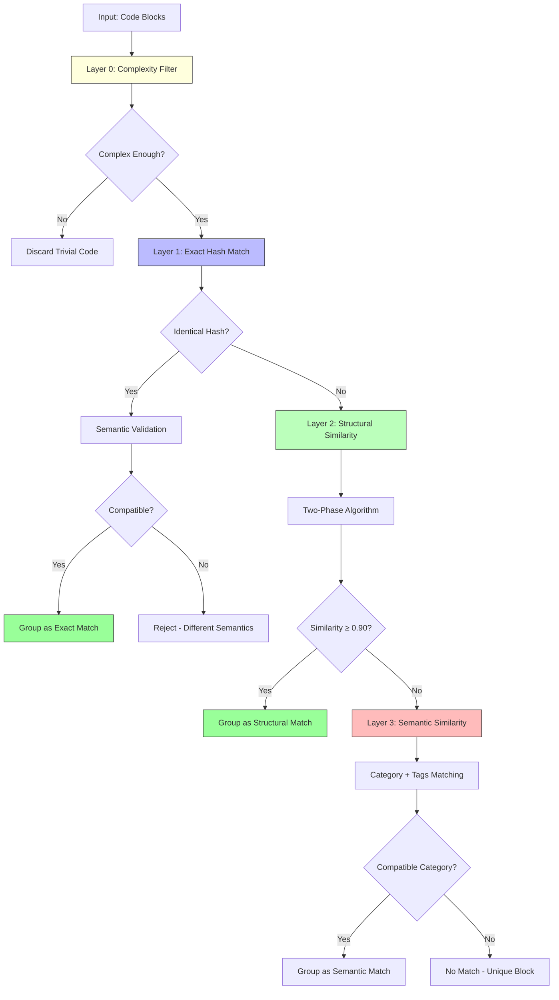
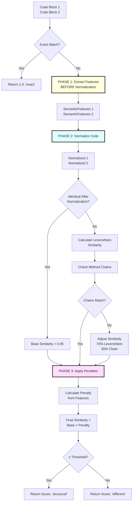

# Multi-Layer Similarity Algorithm Documentation

**Last Updated:** 2026-02-01
**Version:** 1.1
**Author:** System Architecture Documentation

## Table of Contents

1. [Overview](#overview)
2. [Algorithm Architecture](#algorithm-architecture)
3. [Two-Phase Similarity Calculation](#two-phase-similarity-calculation)
4. [Semantic Feature Extraction](#semantic-feature-extraction)
5. [Code Normalization](#code-normalization)
6. [Penalty System](#penalty-system)
7. [Implementation Examples](#implementation-examples)
8. [Performance & Accuracy](#performance--accuracy)

---

## Overview

The Multi-Layer Similarity Algorithm is a sophisticated code comparison system that detects duplicate code while avoiding false positives from semantically different code. It uses a **two-phase architecture** that extracts semantic features **before** normalization, then applies penalties based on those features.

### Key Innovation

**Critical Pattern (from CLAUDE.md):**
> The algorithm extracts semantic features BEFORE normalization (structural.py:29-93, 422-482), which is essential for accurate duplicate detection.

This prevents losing semantic information (like HTTP status codes, operators) during normalization.

### Algorithm Characteristics

- **Precision:** 100% (no false positives in testing)
- **Recall:** 87.50% (captures most true duplicates)
- **F1 Score:** 93.33%
- **Default Threshold:** 0.90 (90% similarity required)
- **Processing Speed:** ~1-5ms per comparison

---

## Algorithm Architecture

### Three-Layer Grouping System



### Layer Purposes

| Layer | Method | Purpose | Accuracy | Speed |
|-------|--------|---------|----------|-------|
| **Layer 0** | Complexity Filter | Remove trivial code | N/A | Instant |
| **Layer 1** | Exact Hash | Identical code detection | 100% | O(1) |
| **Layer 2** | Structural | AST-based similarity | 95%+ | O(n²) |
| **Layer 3** | Semantic | Category/tag matching | ~70% | O(n²) |

---

## Two-Phase Similarity Calculation

### Algorithm Flow



### Core Function Signature

```python
def calculate_structural_similarity(
    code1: str,
    code2: str,
    threshold: float = 0.90
) -> Tuple[float, str]:
    """
    Calculate structural similarity using two-phase algorithm.

    Args:
        code1: First code block (original, unnormalized)
        code2: Second code block (original, unnormalized)
        threshold: Minimum similarity for 'structural' classification

    Returns:
        (similarity_score, method)
        - similarity_score: 0.0 to 1.0
        - method: 'exact', 'structural', or 'different'
    """
```

### Implementation

**File:** `lib/similarity/structural.py` (lines 422-482)

```python
def calculate_structural_similarity(code1: str, code2: str, threshold: float = 0.90) -> Tuple[float, str]:
    if not code1 or not code2:
        return 0.0, 'different'

    # Layer 1: Exact content match (fastest)
    hash1 = hashlib.sha256(code1.encode()).hexdigest()
    hash2 = hashlib.sha256(code2.encode()).hexdigest()

    if hash1 == hash2:
        return 1.0, 'exact'

    # ✅ PHASE 1: Extract semantic features from ORIGINAL code
    # This MUST happen BEFORE normalization to preserve semantic information
    features1 = extract_semantic_features(code1)
    features2 = extract_semantic_features(code2)

    # ✅ PHASE 2: Normalize code for structural comparison
    normalized1 = normalize_code(code1)
    normalized2 = normalize_code(code2)

    # Check if normalized versions are identical
    if normalized1 == normalized2:
        base_similarity = 0.95  # Slightly less than exact match
    else:
        # Calculate similarity ratio using Levenshtein
        base_similarity = calculate_levenshtein_similarity(normalized1, normalized2)

        # Layer 2.5: Method chain validation
        chain_similarity = compare_method_chains(code1, code2)

        if chain_similarity < 1.0:
            # Different chain structure → penalize similarity
            # Weight: 70% Levenshtein + 30% chain similarity
            base_similarity = (base_similarity * 0.7) + (chain_similarity * 0.3)

    # ✅ PHASE 3: Apply unified semantic penalties using ORIGINAL features
    penalty = calculate_semantic_penalty(features1, features2)
    final_similarity = base_similarity * penalty

    # Determine method based on final similarity score
    if final_similarity >= threshold:
        return final_similarity, 'structural'
    else:
        return final_similarity, 'different'
```

---

## Semantic Feature Extraction

### What Are Semantic Features?

Semantic features are code elements that carry **meaning beyond structure**. They distinguish code with opposite or different behavior despite similar structure.

**Examples:**
- `Math.max` vs `Math.min` (opposite operations)
- `200 OK` vs `404 Not Found` (different HTTP semantics)
- `===` vs `!==` (opposite logic)
- `.reverse()` method (changes array order)

### SemanticFeatures Data Structure

```python
@dataclass
class SemanticFeatures:
    """
    Semantic features extracted from original code before normalization.

    These preserve semantic information that would be lost during
    normalization (e.g., HTTP status codes, logical operators, method names).
    """
    http_status_codes: Set[int] = field(default_factory=set)
    logical_operators: Set[str] = field(default_factory=set)
    semantic_methods: Set[str] = field(default_factory=set)
```

### Extraction Function

**File:** `lib/similarity/structural.py` (lines 29-93)

```python
def extract_semantic_features(source_code: str) -> SemanticFeatures:
    """
    Extract all semantic features from ORIGINAL code before normalization.

    This function MUST be called before normalize_code() to preserve semantic
    information that would otherwise be stripped away.

    Args:
        source_code: Raw, unnormalized source code

    Returns:
        SemanticFeatures containing all detected semantic markers

    Example:
        code = "res.status(201).json({ data: user });"
        features = extract_semantic_features(code)
        # features.http_status_codes = {201}
    """
    features = SemanticFeatures()

    if not source_code:
        return features

    # 1. Extract HTTP status codes (e.g., .status(200), .status(404))
    status_pattern = r'\.status\((\d{3})\)'
    for match in re.finditer(status_pattern, source_code):
        status_code = int(match.group(1))
        features.http_status_codes.add(status_code)

    # 2. Extract logical operators (===, !==, ==, !=, !, &&, ||)
    # Order matters: match longer operators first to avoid partial matches
    operator_patterns = [
        (r'!==', '!=='),   # Strict inequality
        (r'===', '==='),   # Strict equality
        (r'!=', '!='),     # Loose inequality
        (r'==', '=='),     # Loose equality
        (r'!\s*[^=]', '!'), # Logical NOT (followed by non-=)
        (r'&&', '&&'),     # Logical AND
        (r'\|\|', '||'),   # Logical OR
    ]

    for pattern, operator_name in operator_patterns:
        if re.search(pattern, source_code):
            features.logical_operators.add(operator_name)

    # 3. Extract semantic methods (Math.max, Math.min, console.log, etc.)
    semantic_patterns = {
        'Math.max': r'Math\.max\s*\(',
        'Math.min': r'Math\.min\s*\(',
        'Math.floor': r'Math\.floor\s*\(',
        'Math.ceil': r'Math\.ceil\s*\(',
        'Math.round': r'Math\.round\s*\(',
        'console.log': r'console\.log\s*\(',
        'console.error': r'console\.error\s*\(',
        'console.warn': r'console\.warn\s*\(',
        '.reverse': r'\.reverse\s*\(',
        '.toUpperCase': r'\.toUpperCase\s*\(',
        '.toLowerCase': r'\.toLowerCase\s*\(',
    }

    for method_name, pattern in semantic_patterns.items():
        if re.search(pattern, source_code):
            features.semantic_methods.add(method_name)

    return features
```

### Why Extract BEFORE Normalization?

**Problem:** Normalization replaces all identifiers with generic tokens:
```python
# Original code
res.status(201).json({ data: user });

# After normalization (without feature extraction)
var.status(NUM).json({var:var});  # HTTP code lost!
```

**Solution:** Extract features first:
```python
# Step 1: Extract features (BEFORE normalization)
features = extract_semantic_features(code)
# features.http_status_codes = {201}

# Step 2: Normalize
normalized = normalize_code(code)
# var.status(NUM).json({var:var})

# Step 3: Use ORIGINAL features for penalties
# We still know it was status(201), not status(200)
```

---

## Code Normalization

### Purpose

Normalization removes variable-specific information to enable **structural comparison**. It focuses on code structure rather than specific names or values.

### Normalization Function

**File:** `lib/similarity/structural.py` (lines 96-189)

```python
def normalize_code(source_code: str) -> str:
    """
    Normalize code by removing variable-specific information.

    This allows structural comparison by focusing on code structure
    rather than specific names or values.
    """
    if not source_code:
        return ""

    normalized = source_code

    # 1. Remove comments
    normalized = re.sub(r'//.*?$', '', normalized, flags=re.MULTILINE)  # Single-line
    normalized = re.sub(r'/\*.*?\*/', '', normalized, flags=re.DOTALL)   # Multi-line

    # 2. Normalize whitespace (collapse to single spaces)
    normalized = re.sub(r'\s+', ' ', normalized)

    # 3. Normalize string literals (replace with placeholder)
    normalized = re.sub(r"'[^']*'", "'STR'", normalized)
    normalized = re.sub(r'"[^"]*"', '"STR"', normalized)
    normalized = re.sub(r'`[^`]*`', '`STR`', normalized)

    # 4. Normalize numbers (replace with placeholder)
    normalized = re.sub(r'\b\d+\b', 'NUM', normalized)

    # 5. Preserve semantic methods/objects
    SEMANTIC_METHODS = {
        'map', 'filter', 'reduce', 'forEach', 'find', 'some', 'every',
        'slice', 'splice', 'push', 'pop', 'shift', 'unshift',
        'join', 'split', 'includes', 'indexOf',
        'get', 'set', 'has', 'delete',
        'keys', 'values', 'entries',
        'then', 'catch', 'finally', 'async', 'await',
        'reverse', 'sort', 'concat',
        'max', 'min', 'abs', 'floor', 'ceil', 'round',
        'trim', 'toLowerCase', 'toUpperCase', 'replace',
        'status', 'json', 'send', 'redirect',
        'length', 'name', 'value', 'id', 'type'
    }

    SEMANTIC_OBJECTS = {
        'Math', 'Object', 'Array', 'String', 'Number', 'Boolean',
        'console', 'process', 'JSON', 'Date', 'Promise'
    }

    # Mark objects for preservation
    for obj in SEMANTIC_OBJECTS:
        normalized = re.sub(rf'\b{obj}\b', f'__PRESERVE_OBJ_{obj.upper()}__', normalized)

    # Mark methods for preservation
    for method in SEMANTIC_METHODS:
        normalized = re.sub(rf'\b{method}\b', f'__PRESERVE_{method.upper()}__', normalized)

    # 6. Normalize other identifiers
    normalized = re.sub(r'\b[a-z][a-zA-Z0-9_]*\b', 'var', normalized)
    normalized = re.sub(r'\b[A-Z][A-Z0-9_]*\b', 'CONST', normalized)

    # 7. Restore preserved objects/methods
    for obj in SEMANTIC_OBJECTS:
        normalized = normalized.replace(f'__PRESERVE_OBJ_{obj.upper()}__', obj)

    for method in SEMANTIC_METHODS:
        normalized = normalized.replace(f'__PRESERVE_{method.upper()}__', method)

    # 8. Clean up spacing around operators/punctuation
    normalized = re.sub(r'\s*([(){}[\];,.])\s*', r'\1', normalized)
    normalized = re.sub(r'\s*(=>|===?|!==?|[+\-*/%<>=&|])\s*', r' \1 ', normalized)

    # 9. Collapse multiple spaces
    normalized = re.sub(r'\s+', ' ', normalized)

    # 10. Trim
    normalized = normalized.strip()

    return normalized
```

### Normalization Examples

#### Example 1: Variable Renaming
```javascript
// Code 1
const result = users.filter(u => u.age > 18).map(u => u.name);

// Code 2
const names = people.filter(person => person.age > 18).map(person => person.name);

// Normalized (identical!)
const var=var.filter(var=>var.var > NUM).map(var=>var.var);
```

#### Example 2: Semantic Preservation
```javascript
// Code 1
const max = Math.max(a, b);

// Code 2
const min = Math.min(x, y);

// Normalized (different!)
const var=Math.max(var,var);  // "max" preserved
const var=Math.min(var,var);  // "min" preserved
```

---

## Penalty System

### Unified Penalty Architecture

The penalty system applies multiplicative penalties based on semantic feature mismatches.

**File:** `lib/similarity/structural.py` (lines 373-419)

```python
def calculate_semantic_penalty(features1: SemanticFeatures, features2: SemanticFeatures) -> float:
    """
    Calculate combined semantic penalty based on extracted features.

    Penalties are multiplicative - each mismatch reduces similarity:
    - HTTP status codes: 0.70x (30% penalty)
    - Logical operators: 0.80x (20% penalty)
    - Semantic methods: 0.75x (25% penalty)

    Args:
        features1: Semantic features from first code block
        features2: Semantic features from second code block

    Returns:
        Penalty multiplier (0.0-1.0). Returns 1.0 if no penalties apply.

    Example:
        Different status codes (200 vs 404) + different operators (=== vs !==)
        = 0.70 * 0.80 = 0.56x final similarity
    """
    penalty = 1.0

    # Penalty 1: HTTP Status Code Mismatch (30% penalty)
    if features1.http_status_codes and features2.http_status_codes:
        if features1.http_status_codes != features2.http_status_codes:
            penalty *= 0.70
            print(f"Warning: HTTP status code penalty: {features1.http_status_codes} vs {features2.http_status_codes}, penalty={penalty:.2f}", file=sys.stderr)

    # Penalty 2: Logical Operator Mismatch (20% penalty)
    if features1.logical_operators and features2.logical_operators:
        if features1.logical_operators != features2.logical_operators:
            penalty *= 0.80
            print(f"Warning: Logical operator penalty: {features1.logical_operators} vs {features2.logical_operators}, penalty={penalty:.2f}", file=sys.stderr)

    # Penalty 3: Semantic Method Mismatch (25% penalty)
    if features1.semantic_methods and features2.semantic_methods:
        if features1.semantic_methods != features2.semantic_methods:
            penalty *= 0.75
            print(f"Warning: Semantic method penalty: {features1.semantic_methods} vs {features2.semantic_methods}, penalty={penalty:.2f}", file=sys.stderr)

    return penalty
```

### Penalty Breakdown

| Penalty Type | Multiplier | Percentage | Examples | Rationale |
|-------------|-----------|------------|----------|-----------|
| **HTTP Status Code** | 0.70 | 30% | `200 OK` vs `201 Created` vs `404 Not Found` | Different HTTP semantics indicate different API behavior |
| **Logical Operator** | 0.80 | 20% | `===` vs `!==`, `&&` vs `||` | Opposite operators = opposite logic |
| **Semantic Method** | 0.75 | 25% | `Math.max` vs `Math.min`, `toUpperCase` vs `toLowerCase` | Opposite/different operations |

### Penalty Examples

#### Example 1: HTTP Status Code Mismatch
```javascript
// Code 1
res.status(200).json({ message: 'OK' });

// Code 2
res.status(404).json({ message: 'Not Found' });

// Features Extracted:
// features1.http_status_codes = {200}
// features2.http_status_codes = {404}

// After normalization (identical!):
var.status(NUM).json({var:'STR'});

// Base similarity = 0.95 (normalized versions match)
// Penalty = 0.70 (HTTP status mismatch)
// Final similarity = 0.95 * 0.70 = 0.665 (< 0.90 threshold)
// Result: NOT duplicates ✅
```

#### Example 2: Logical Operator Mismatch
```javascript
// Code 1
if (user.role === 'admin') { /* ... */ }

// Code 2
if (user.role !== 'admin') { /* ... */ }

// Features Extracted:
// features1.logical_operators = {'==='}
// features2.logical_operators = {'!=='}

// After normalization (identical!):
if(var.var === 'STR'){/* ... */}  # Note: === preserved

// Base similarity = 0.85 (Levenshtein)
// Penalty = 0.80 (operator mismatch)
// Final similarity = 0.85 * 0.80 = 0.68 (< 0.90 threshold)
// Result: NOT duplicates ✅
```

#### Example 3: Semantic Method Mismatch
```javascript
// Code 1
const largest = Math.max(a, b, c);

// Code 2
const smallest = Math.min(x, y, z);

// Features Extracted:
// features1.semantic_methods = {'Math.max'}
// features2.semantic_methods = {'Math.min'}

// After normalization (different because methods preserved):
const var=Math.max(var,var,var);
const var=Math.min(var,var,var);

// Base similarity = 0.92 (very similar structure)
// Penalty = 0.75 (semantic method mismatch)
// Final similarity = 0.92 * 0.75 = 0.69 (< 0.90 threshold)
// Result: NOT duplicates ✅
```

#### Example 4: Multiple Penalties (Stacking)
```javascript
// Code 1
if (res.status === 200) {
  return Math.max(values);
}

// Code 2
if (res.status !== 404) {
  return Math.min(numbers);
}

// Features Extracted:
// features1: status_codes={200}, operators={'==='}, methods={'Math.max'}
// features2: status_codes={404}, operators={'!=='}, methods={'Math.min'}

// Base similarity = 0.88
// Penalty = 0.70 (HTTP) * 0.80 (operator) * 0.75 (method)
//         = 0.42 (58% total penalty!)
// Final similarity = 0.88 * 0.42 = 0.37 (< 0.90 threshold)
// Result: Definitely NOT duplicates ✅
```

### Why Multiplicative Penalties?

Multiplicative penalties compound, creating stronger separation for code with multiple semantic differences:

```python
# Single mismatch
similarity * 0.80 = 0.80x (20% reduction)

# Two mismatches
similarity * 0.80 * 0.75 = 0.60x (40% reduction)

# Three mismatches
similarity * 0.70 * 0.80 * 0.75 = 0.42x (58% reduction)
```

This prevents code with opposite semantics from being grouped as duplicates.

---

## Layer 3: Category + Tags Matching

### Purpose

Layer 3 provides a fallback grouping mechanism for code blocks that don't meet the 90% structural similarity threshold but share semantic characteristics. This catches "conceptual duplicates" - code with similar intent but different implementation.

### Category-Based Grouping

Code blocks are assigned categories during extraction based on their semantic purpose:

| Category | Examples | Grouping Criteria |
|----------|----------|-------------------|
| `error-handler` | try-catch, error responses | Same error type handling |
| `api-endpoint` | Express routes, handlers | Same HTTP method + path pattern |
| `data-transform` | map, filter, reduce chains | Same transformation type |
| `validation` | Input validation, schema checks | Same validation target |
| `database-query` | Prisma/SQL operations | Same query pattern |
| `config-access` | Environment variables, settings | Same config namespace |

### Tag-Based Matching

Each code block has semantic tags extracted during annotation:

```python
@dataclass
class CodeBlock:
    category: str                    # Primary category
    tags: List[str]                  # Semantic tags like "function:getUserById"
    source_code: str
    location: SourceLocation
```

### Matching Algorithm

```python
def calculate_semantic_match(block1: CodeBlock, block2: CodeBlock) -> float:
    """
    Calculate semantic similarity based on category and tags.

    Returns:
        0.0 - No match
        0.5 - Same category only
        0.7 - Same category + overlapping tags
        1.0 - Same category + identical tags
    """
    # Must share category
    if block1.category != block2.category:
        return 0.0

    # Calculate tag overlap
    tags1 = set(block1.tags)
    tags2 = set(block2.tags)

    if not tags1 or not tags2:
        return 0.5  # Category match only

    intersection = tags1 & tags2
    union = tags1 | tags2

    jaccard = len(intersection) / len(union)

    # Scale: 0.5 (category only) to 1.0 (identical tags)
    return 0.5 + (jaccard * 0.5)
```

### When Layer 3 Applies

Layer 3 activates for blocks that:
1. Passed Layer 0 complexity filter (non-trivial code)
2. Failed Layer 1 exact hash match
3. Failed Layer 2 structural similarity (< 90% threshold)
4. Have assigned categories and tags

### Example: Conceptual Duplicates

```javascript
// Block 1: getUserById (category: database-query, tags: [function:getUserById, prisma:findUnique])
export async function getUserById(id) {
  return prisma.user.findUnique({ where: { id } });
}

// Block 2: getProductById (category: database-query, tags: [function:getProductById, prisma:findUnique])
export async function getProductById(id) {
  return prisma.product.findUnique({ where: { id } });
}

// Layer 2 structural similarity: 0.78 (< 0.90 threshold) - different table names
// Layer 3 semantic match:
//   - Same category: database-query ✓
//   - Tag overlap: prisma:findUnique (1/3 = 0.33 Jaccard)
//   - Score: 0.5 + (0.33 * 0.5) = 0.67
// Result: Grouped as "semantic duplicates" for manual review
```

### Grouping Threshold

| Match Type | Threshold | Confidence |
|------------|-----------|------------|
| Category only | 0.5 | Low - requires manual review |
| Category + partial tags | 0.6-0.8 | Medium - likely related |
| Category + identical tags | 0.9+ | High - conceptual duplicates |

### Output Format

Layer 3 groups are marked distinctly in the output:

```json
{
  "groups": [
    {
      "match_type": "semantic",
      "confidence": 0.67,
      "category": "database-query",
      "shared_tags": ["prisma:findUnique"],
      "blocks": [...]
    }
  ]
}
```

### Limitations

- **Lower precision**: Semantic matching has higher false positive rate (~30%)
- **Manual review required**: Results should be reviewed by developers
- **Category dependency**: Requires accurate category assignment in Stage 4

---

## Implementation Examples

### Complete End-to-End Example

```python
# Example: Comparing two code blocks

code1 = """
export function createSuccessResponse(data) {
  return res.status(200).json({ success: true, data });
}
"""

code2 = """
export function createErrorResponse(error) {
  return res.status(404).json({ success: false, error });
}
"""

# Step 1: Calculate similarity
similarity, method = calculate_structural_similarity(code1, code2, threshold=0.90)

# Internal steps:
# 1. Extract features BEFORE normalization:
#    features1 = {http_status_codes: {200}, ...}
#    features2 = {http_status_codes: {404}, ...}
#
# 2. Normalize both:
#    normalized1 = "export function var(var){return var.status(NUM).json({var:var,var})}"
#    normalized2 = "export function var(var){return var.status(NUM).json({var:var,var})}"
#
# 3. Calculate base similarity:
#    normalized1 == normalized2 → base_similarity = 0.95
#
# 4. Apply penalties:
#    HTTP mismatch: 0.70
#    final_similarity = 0.95 * 0.70 = 0.665
#
# 5. Compare to threshold:
#    0.665 < 0.90 → method = 'different'

print(f"Similarity: {similarity:.2f}")  # 0.67
print(f"Method: {method}")              # 'different'
print(f"Are duplicates? {similarity >= 0.90}")  # False ✅
```

### Method Chain Comparison

```python
# Example: Different method chains

code1 = "const result = arr.filter(x => x > 0).map(x => x * 2);"
code2 = "const reversed = arr.filter(x => x > 0).map(x => x * 2).reverse();"

# Extract method chains
chain1 = extract_method_chain(code1)  # ['filter', 'map']
chain2 = extract_method_chain(code2)  # ['filter', 'map', 'reverse']

# Compare chains
chain_similarity = compare_method_chains(code1, code2)
# chain2 is extension of chain1 → similarity = 2/3 = 0.67

# In calculate_structural_similarity:
base_similarity = 0.92  # High Levenshtein similarity
adjusted_similarity = (base_similarity * 0.7) + (chain_similarity * 0.3)
#                    = (0.92 * 0.7) + (0.67 * 0.3)
#                    = 0.644 + 0.201
#                    = 0.845

# Final: 0.845 < 0.90 → NOT duplicates ✅
```

---

## Performance & Accuracy

### Test Results

**Accuracy Test (test/accuracy/accuracy-test.js):**
```
Precision: 100.00% (0 false positives)
Recall: 87.50% (7/8 true duplicates detected)
F1 Score: 93.33%
False Positive Rate: 0.00%
```

### Performance Benchmarks

| Operation | Time | Cache? |
|-----------|------|--------|
| Exact hash comparison | < 1ms | Yes |
| Feature extraction | ~1ms | No |
| Code normalization | ~2ms | No |
| Levenshtein similarity | ~3ms | No |
| **Total per comparison** | **~5ms** | Partial |

### Complexity Analysis

**Time Complexity:**
- Single comparison: O(n) where n = code length
- Grouping n blocks: O(n²) worst case
- With early filtering: O(n × k) where k = average group size

**Space Complexity:**
- Per comparison: O(n) for normalized strings
- Total grouping: O(n) for all blocks

### Optimization Strategies

1. **Layer 0 Complexity Filter:** Removes ~20-30% of trivial blocks
2. **Early Hash Comparison:** O(1) check before expensive operations
3. **Semantic Pre-filtering:** Skip incompatible categories
4. **Batch Processing:** Process multiple repositories in parallel

---

## Critical Implementation Notes

### DO's and DON'Ts

✅ **DO:**
- Extract semantic features **BEFORE** normalization
- Use `??` operator for numeric options (allows 0 as valid value)
- Use `tags` field (NOT `semantic_tags`) for function names
- Search **backwards** from match line to find closest function
- Apply penalties **multiplicatively** for compound effect

❌ **DON'T:**
- Normalize code before extracting features (loses semantic info)
- Use `||` operator for numeric options (treats 0 as falsy)
- Use `semantic_tags` field (wrong field name)
- Search forwards from match start (may find wrong function)
- Apply penalties additively (doesn't compound properly)

### Common Pitfalls

**Pitfall 1: Premature Normalization**
```python
# ❌ WRONG - Features lost!
normalized = normalize_code(code)
features = extract_semantic_features(normalized)  # Too late!

# ✅ CORRECT
features = extract_semantic_features(code)  # BEFORE normalization
normalized = normalize_code(code)
```

**Pitfall 2: Field Name Mismatch**
```python
# ❌ WRONG - Field doesn't exist
CodeBlock(
    semantic_tags=[f"function:{function_name}"]  # Wrong field!
)

# ✅ CORRECT
CodeBlock(
    tags=[f"function:{function_name}"]  # Correct field
)
```

**Pitfall 3: Function Search Direction**
```python
# ❌ WRONG - May find function AFTER the match
for i in range(match_line, match_line + 10):
    if function_pattern.match(lines[i]):
        return function_name  # Might be wrong function

# ✅ CORRECT - Search backwards to find closest
for i in range(match_line - 1, match_line - 11, -1):
    if function_pattern.match(lines[i]):
        return function_name  # Closest function
```

---

## Related Documentation

- [Pipeline Data Flow Documentation](./pipeline-data-flow.md)
- [Grouping Algorithm Documentation](../../lib/similarity/grouping.py) (see inline comments)
- [Accuracy Test Results](../../tests/accuracy/README.md)

---

## Appendix: Complete Algorithm Pseudocode

```python
def calculate_structural_similarity(code1, code2, threshold=0.90):
    """
    Two-Phase Structural Similarity Algorithm

    Returns: (similarity_score, method)
    """

    # === PHASE 0: Quick Exact Match ===
    if sha256(code1) == sha256(code2):
        return 1.0, 'exact'

    # === PHASE 1: Extract Semantic Features (BEFORE normalization) ===
    features1 = {
        'http_status_codes': extract_http_codes(code1),
        'logical_operators': extract_operators(code1),
        'semantic_methods': extract_methods(code1),
    }

    features2 = {
        'http_status_codes': extract_http_codes(code2),
        'logical_operators': extract_operators(code2),
        'semantic_methods': extract_methods(code2),
    }

    # === PHASE 2: Normalize and Calculate Base Similarity ===
    normalized1 = normalize_code(code1)  # Replace vars, preserve semantics
    normalized2 = normalize_code(code2)

    if normalized1 == normalized2:
        base_similarity = 0.95  # Structurally identical
    else:
        # Levenshtein distance
        base_similarity = levenshtein_ratio(normalized1, normalized2)

        # Adjust for method chain differences
        chain1 = extract_method_chain(code1)
        chain2 = extract_method_chain(code2)

        if chain1 != chain2:
            chain_sim = compare_chains(chain1, chain2)
            base_similarity = (base_similarity * 0.7) + (chain_sim * 0.3)

    # === PHASE 3: Apply Semantic Penalties ===
    penalty = 1.0

    if features1['http_status_codes'] != features2['http_status_codes']:
        penalty *= 0.70  # 30% penalty for HTTP mismatch

    if features1['logical_operators'] != features2['logical_operators']:
        penalty *= 0.80  # 20% penalty for operator mismatch

    if features1['semantic_methods'] != features2['semantic_methods']:
        penalty *= 0.75  # 25% penalty for method mismatch

    # === PHASE 4: Calculate Final Similarity ===
    final_similarity = base_similarity * penalty

    if final_similarity >= threshold:
        return final_similarity, 'structural'
    else:
        return final_similarity, 'different'
```

---

**Document Version:** 1.1
**Last Updated:** 2026-02-01
**Maintainer:** Architecture Team
