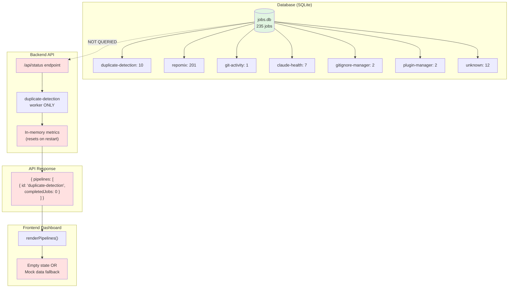
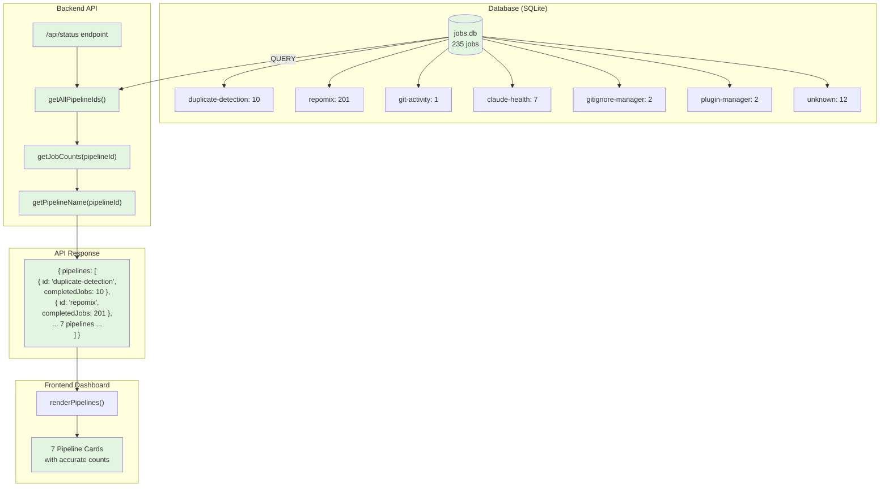
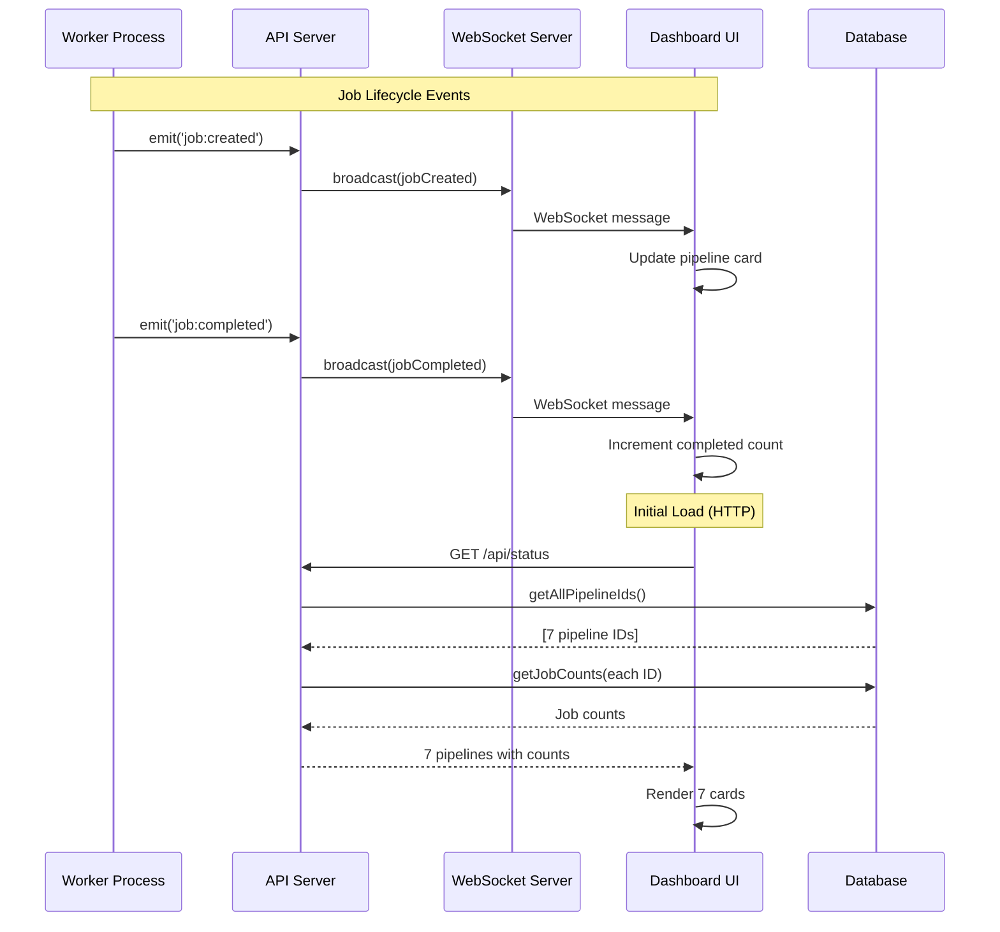

# Dashboard Data Integrity - Architecture Analysis

**Visual diagrams showing current vs. fixed data flow architecture.**

---

## Current (Broken) Architecture



### Problem Flow

1. **Database has 235 jobs across 7 pipelines** ✅
2. **`/api/status` only queries duplicate-detection worker** ❌
3. **Worker uses in-memory metrics (resets on restart)** ❌
4. **API returns 1 pipeline with 0 jobs** ❌
5. **Frontend shows empty state or mock data** ❌

---

## Fixed Architecture



### Fixed Flow

1. **Database has 235 jobs across 7 pipelines** ✅
2. **`/api/status` queries database for ALL pipeline IDs** ✅
3. **Gets accurate job counts from database** ✅
4. **Maps pipeline IDs to human names** ✅
5. **API returns 7 pipelines with accurate counts** ✅
6. **Frontend shows 7 pipeline cards** ✅

---

## Data Flow Comparison

### Current (Broken) Data Path

```
┌─────────────┐
│ Database    │
│ 235 jobs    │  (IGNORED)
└─────────────┘

       ↓ (NO CONNECTION)

┌─────────────────────────────────┐
│ /api/status Endpoint            │
│                                 │
│ const metrics = worker          │
│   .getScanMetrics()  ← MEMORY  │
│                                 │
│ pipelines: [{                   │
│   id: 'duplicate-detection',    │
│   completedJobs: metrics        │
│     .totalScans || 0  ← WRONG  │
│ }]                              │
└─────────────────────────────────┘

       ↓

┌─────────────────────────────────┐
│ Frontend                        │
│ renderPipelines([1 pipeline])  │
│ "No pipelines configured"       │
└─────────────────────────────────┘
```

### Fixed Data Path

```
┌─────────────────────────────────┐
│ Database                        │
│ 235 jobs across 7 pipelines     │
└─────────────────────────────────┘

       ↓ QUERY

┌─────────────────────────────────┐
│ /api/status Endpoint            │
│                                 │
│ const pipelineIds =             │
│   getAllPipelineIds()  ← DB    │
│                                 │
│ pipelines = pipelineIds.map(   │
│   id => {                       │
│     const counts =              │
│       getJobCounts(id)  ← DB   │
│     return {                    │
│       id,                       │
│       name: getPipelineName(id),│
│       completedJobs:            │
│         counts.completed        │
│     }                           │
│   }                             │
│ )                               │
└─────────────────────────────────┘

       ↓

┌─────────────────────────────────┐
│ Frontend                        │
│ renderPipelines([7 pipelines])  │
│ 7 cards with accurate counts    │
└─────────────────────────────────┘
```

---

## API Endpoint Evolution

### Before (v1.6.2 - Broken)

```javascript
// api/server.js:98-139
app.get('/api/status', (req, res) => {
  // ❌ Only queries ONE worker (duplicate-detection)
  const scanMetrics = worker.getScanMetrics();
  const queueStats = worker.getStats();
  
  res.json({
    pipelines: [
      {
        id: 'duplicate-detection',
        name: 'Duplicate Detection',
        // ❌ Uses in-memory metrics (resets on restart)
        completedJobs: scanMetrics.totalScans || 0,
        failedJobs: scanMetrics.failedScans || 0,
        // ❌ No database query
      }
    ]
  });
});
```

**Problems:**
- ❌ Hardcoded to single pipeline
- ❌ No database queries
- ❌ In-memory metrics reset on restart
- ❌ No visibility into other pipelines
- ❌ Wrong job counts

### After (v1.6.3 - Fixed)

```javascript
// api/server.js:98-139 (rewritten)
app.get('/api/status', async (req, res) => {
  try {
    // ✅ Query database for ALL pipelines
    const pipelineIds = getAllPipelineIds();
    
    // ✅ Get accurate counts from database
    const pipelines = pipelineIds.map(pipelineId => {
      const counts = getJobCounts(pipelineId);
      const lastJob = getLastJob(pipelineId);
      
      return {
        id: pipelineId,
        name: getPipelineName(pipelineId), // Human name
        status: determineStatus(lastJob),
        completedJobs: counts.completed || 0,
        failedJobs: counts.failed || 0,
        lastRun: lastJob?.completedAt || null,
        nextRun: null
      };
    });
    
    res.json({
      timestamp: new Date().toISOString(),
      pipelines, // ✅ All pipelines with accurate counts
      queue: { ... },
      retryMetrics: { ... }
    });
  } catch (error) {
    // Error handling
  }
});
```

**Improvements:**
- ✅ Queries database for all pipelines
- ✅ Accurate job counts from persistent storage
- ✅ Survives server restarts
- ✅ Shows all 7+ pipelines
- ✅ Correct job counts

---

## Database Schema & Queries

### Schema

```sql
CREATE TABLE jobs (
  id TEXT PRIMARY KEY,
  pipeline_id TEXT NOT NULL,  -- ← Key field for grouping
  status TEXT NOT NULL DEFAULT 'queued',
  created_at TEXT NOT NULL,
  started_at TEXT,
  completed_at TEXT,
  data TEXT,
  result TEXT,
  error TEXT,
  git TEXT
);

CREATE INDEX idx_jobs_pipeline_id ON jobs(pipeline_id);
CREATE INDEX idx_jobs_status ON jobs(status);
CREATE INDEX idx_jobs_created_at ON jobs(created_at DESC);
```

### Key Queries (Added)

```javascript
// sidequest/core/database.js

// ✅ NEW: Get all unique pipeline IDs
export function getAllPipelineIds() {
  const db = getDatabase();
  const stmt = db.prepare(
    'SELECT DISTINCT pipeline_id FROM jobs ORDER BY pipeline_id'
  );
  const rows = stmt.all();
  return rows.map(row => row.pipeline_id);
}
// Result: ['claude-health', 'duplicate-detection', 'git-activity', ...]

// ✅ EXISTING: Get job counts for a pipeline
export function getJobCounts(pipelineId) {
  const db = getDatabase();
  const stmt = db.prepare(`
    SELECT
      COUNT(*) as total,
      SUM(CASE WHEN status = 'completed' THEN 1 ELSE 0 END) as completed,
      SUM(CASE WHEN status = 'failed' THEN 1 ELSE 0 END) as failed,
      SUM(CASE WHEN status = 'running' THEN 1 ELSE 0 END) as running,
      SUM(CASE WHEN status = 'queued' THEN 1 ELSE 0 END) as queued
    FROM jobs
    WHERE pipeline_id = ?
  `);
  return stmt.get(pipelineId);
}
// Result: { total: 201, completed: 201, failed: 0, running: 0, queued: 0 }
```

---

## Frontend Rendering Logic

### Before (Broken)

```javascript
// public/dashboard.js

async fetchInitialStatus() {
  const response = await fetch('/api/status');
  const data = await response.json();
  
  // ❌ Receives 1 pipeline with 0 jobs
  console.log('Pipelines:', data.pipelines.length); // 1
  
  if (!data.pipelines || data.pipelines.length === 0) {
    // ❌ Shows "No pipelines configured"
    container.innerHTML = '<p class="empty-state">No pipelines configured</p>';
    return;
  }
  
  this.renderPipelines(data.pipelines); // 1 card
}
```

### After (Fixed)

```javascript
// public/dashboard.js

async fetchInitialStatus() {
  const response = await fetch('/api/status');
  const data = await response.json();
  
  // ✅ Receives 7 pipelines with accurate counts
  console.log('Pipelines:', data.pipelines.length); // 7
  console.table(data.pipelines); // Shows all 7 with counts
  
  // ✅ Validation
  if (!data.pipelines || data.pipelines.length === 0) {
    console.warn('No pipelines - falling back to mock data');
    this.showMockData();
    return;
  }
  
  // ✅ Render all 7 pipeline cards
  this.renderPipelines(data.pipelines);
}
```

---

## Real-Time Update Flow (WebSocket)

### Architecture



**Key Points:**
1. Initial load uses HTTP GET (database query)
2. Real-time updates use WebSocket (event-driven)
3. Both show accurate data from database
4. No mock data fallback needed

---

## Pipeline Name Mapping

### Problem: Database has IDs, not human names

```sql
-- Database stores:
SELECT DISTINCT pipeline_id FROM jobs;

duplicate-detection
repomix
git-activity
claude-health
gitignore-manager
plugin-manager
unknown
```

### Solution: Static name mapper

```javascript
// api/utils/pipeline-names.js (NEW FILE)

export const PIPELINE_NAMES = {
  'duplicate-detection': 'Duplicate Detection',
  'repomix': 'Repomix Automation',
  'git-activity': 'Git Activity Reporter',
  'claude-health': 'Claude Health Monitor',
  'gitignore-manager': 'Gitignore Manager',
  'plugin-manager': 'Plugin Manager',
  'doc-enhancement': 'Doc Enhancement',
  'test-refactor': 'Test Refactor',
  'unknown': 'Unknown Pipeline'
};

export function getPipelineName(pipelineId) {
  return PIPELINE_NAMES[pipelineId] || pipelineId;
}
```

**Usage:**
```javascript
pipelines.map(id => ({
  id,
  name: getPipelineName(id) // 'repomix' → 'Repomix Automation'
}))
```

---

## Mock Data Fallback Strategy

### Before (Too Eager)

```javascript
// Showed mock data on ANY error or incomplete data
try {
  const response = await fetch('/api/status');
  if (!response.ok) {
    this.showMockData(); // ← Too eager
  }
  const data = await response.json();
  this.renderPipelines(data.pipelines);
} catch (err) {
  this.showMockData(); // ← Too eager
}
```

### After (Defensive)

```javascript
// Only show mock data if API truly unavailable
try {
  const response = await fetch('/api/status');
  
  if (!response.ok) {
    console.warn('API error:', response.status);
    this.showMockData();
    return;
  }
  
  const data = await response.json();
  
  // ✅ Validate data BEFORE rendering
  if (!data.pipelines || data.pipelines.length === 0) {
    console.warn('Empty pipelines array - showing mock data');
    this.showMockData();
    return;
  }
  
  // ✅ Data valid - render real data
  this.renderInitialStatus(data);
  
} catch (err) {
  console.error('Failed to fetch status:', err);
  this.showMockData(); // Only on network error
}
```

**Key Change:** Validate data structure before accepting as valid.

---

## Status Determination Logic

### Problem: How to show "running", "idle", "failing" status?

**Solution:** Derive from last job + job counts

```javascript
function determineStatus(lastJob, counts) {
  // If last job is running, pipeline is running
  if (lastJob?.status === 'running') {
    return 'running';
  }
  
  // If more failures than successes, pipeline is failing
  if (lastJob?.status === 'failed' && counts.failed > counts.completed) {
    return 'failing';
  }
  
  // Otherwise idle
  return 'idle';
}
```

**Example:**
```javascript
// repomix: last job completed, 201 completed, 0 failed
determineStatus(lastJob, { completed: 201, failed: 0 })
// → 'idle'

// duplicate-detection: last job running
determineStatus({ status: 'running' }, { ... })
// → 'running'

// gitignore-manager: last job failed, 0 completed, 2 failed
determineStatus({ status: 'failed' }, { completed: 0, failed: 2 })
// → 'failing'
```

---

## Performance Considerations

### Query Performance

```sql
-- Get all pipeline IDs
SELECT DISTINCT pipeline_id FROM jobs;
-- With 235 jobs: ~2ms

-- Get counts for one pipeline
SELECT COUNT(*), SUM(CASE ...) FROM jobs WHERE pipeline_id = 'repomix';
-- With 201 jobs: ~1ms

-- Total for 7 pipelines: ~10ms
```

**Optimization:** Database has index on `pipeline_id`:
```sql
CREATE INDEX idx_jobs_pipeline_id ON jobs(pipeline_id);
```

### API Response Size

**Before:**
```json
{
  "pipelines": [1 pipeline]
}
// ~200 bytes
```

**After:**
```json
{
  "pipelines": [7 pipelines]
}
// ~800 bytes
```

**Impact:** Negligible (< 1KB increase)

### Memory Usage

**Before:**
- In-memory job metrics: ~100KB per worker
- Only 1 worker tracked

**After:**
- Database queries: No additional memory
- 7 pipelines tracked

**Impact:** None (actually reduces memory by using DB instead of in-memory)

---

## Testing Strategy

### Unit Tests (Database Functions)

```javascript
// sidequest/core/database.test.js

describe('getAllPipelineIds', () => {
  it('returns all unique pipeline IDs', () => {
    const ids = getAllPipelineIds();
    expect(ids).toEqual([
      'claude-health',
      'duplicate-detection',
      'git-activity',
      'gitignore-manager',
      'plugin-manager',
      'repomix',
      'unknown'
    ]);
  });
});

describe('getJobCounts', () => {
  it('returns accurate counts for repomix', () => {
    const counts = getJobCounts('repomix');
    expect(counts).toEqual({
      total: 201,
      completed: 201,
      failed: 0,
      running: 0,
      queued: 0
    });
  });
});
```

### Integration Tests (API Endpoint)

```javascript
// api/routes/status.test.js

describe('GET /api/status', () => {
  it('returns all pipelines from database', async () => {
    const response = await request(app)
      .get('/api/status')
      .expect(200);
    
    expect(response.body.pipelines).toHaveLength(7);
    expect(response.body.pipelines[0]).toMatchObject({
      id: expect.any(String),
      name: expect.any(String),
      completedJobs: expect.any(Number),
      failedJobs: expect.any(Number)
    });
  });
  
  it('matches database counts', async () => {
    const response = await request(app)
      .get('/api/status');
    
    const apiTotal = response.body.pipelines
      .reduce((sum, p) => sum + p.completedJobs, 0);
    
    const dbTotal = await getDatabase()
      .prepare("SELECT COUNT(*) as count FROM jobs WHERE status='completed'")
      .get().count;
    
    expect(apiTotal).toBe(dbTotal);
  });
});
```

### E2E Tests (Frontend)

```javascript
// tests/e2e/dashboard.test.js

describe('Dashboard pipeline cards', () => {
  it('shows 7 pipeline cards with accurate counts', async () => {
    await page.goto('http://localhost:8080');
    
    const cards = await page.$$('[data-pipeline-id]');
    expect(cards).toHaveLength(7);
    
    const repomixCard = await page.$('[data-pipeline-id="repomix"]');
    const completedText = await repomixCard.$eval(
      '.stat-value',
      el => el.textContent
    );
    expect(completedText).toBe('201');
  });
  
  it('does not show mock data', async () => {
    await page.goto('http://localhost:8080');
    
    const mockIndicator = await page.$('.mock-data-indicator');
    expect(mockIndicator).toBeNull();
  });
});
```

---

## Rollback Strategy

### If Fix Breaks Production

**Step 1: Verify Issue**
```bash
# Check Sentry for errors
# Check PM2 logs
pm2 logs alephalephauto-dashboard --err --lines 50

# Check API response
curl -s http://localhost:8080/api/status | jq .
```

**Step 2: Database Rollback (if needed)**
```bash
# Restore from backup
cp data/jobs.db.backup-TIMESTAMP data/jobs.db

# Verify integrity
sqlite3 data/jobs.db "PRAGMA integrity_check;"
```

**Step 3: Code Rollback**
```bash
# Reset to pre-fix tag
git reset --hard v1.6.2-pre-fix

# Restart server
pm2 restart alephalephauto-dashboard alephalephauto-worker
```

**Step 4: Verify Rollback**
```bash
# Check API response
curl -s http://localhost:8080/api/status | jq '.pipelines | length'
# Expected: 1 (back to broken state, but stable)

# Check dashboard loads
curl -s http://localhost:8080/ -o /dev/null -w '%{http_code}\n'
# Expected: 200
```

---

**Last Updated:** 2025-11-24  
**Version:** 1.0.0  
**Status:** Architecture Analysis Complete
