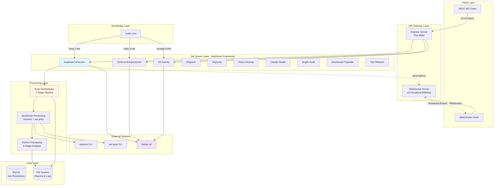
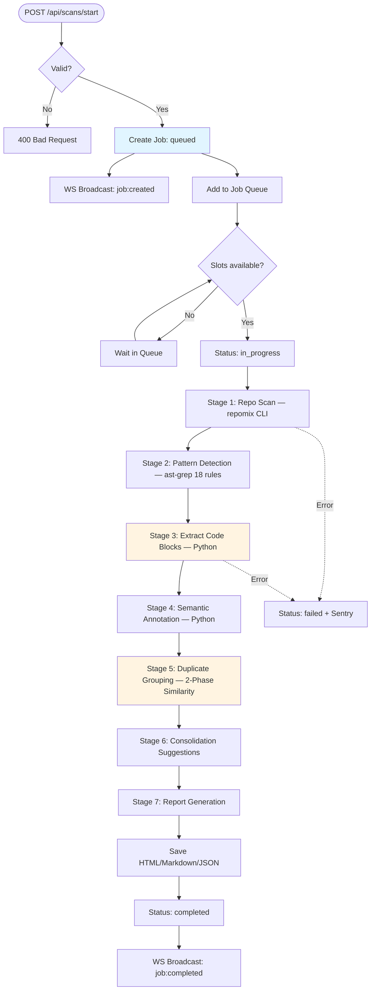
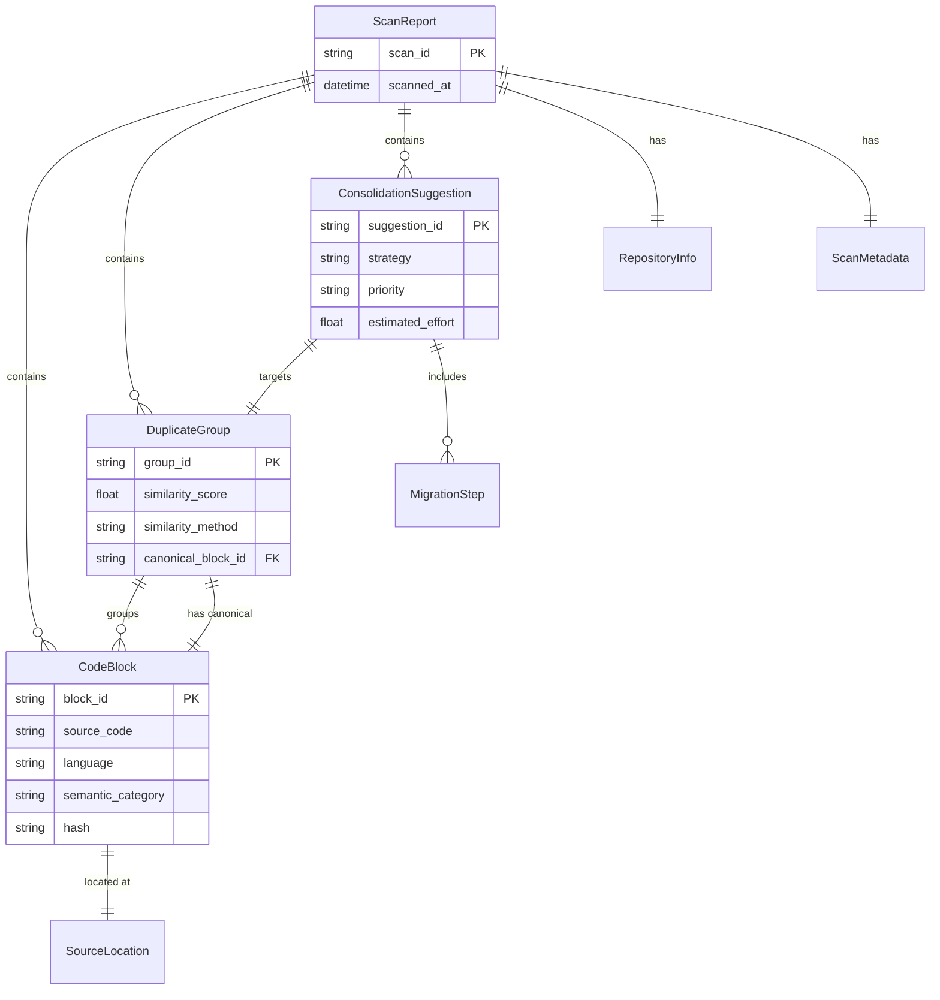
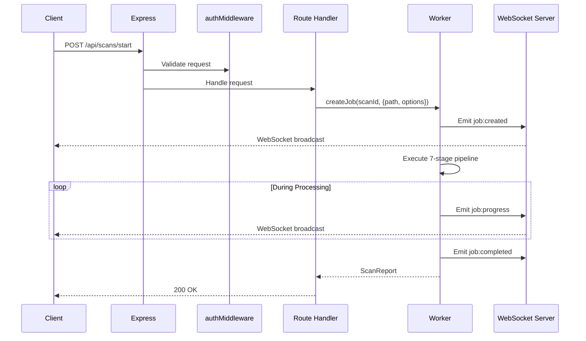
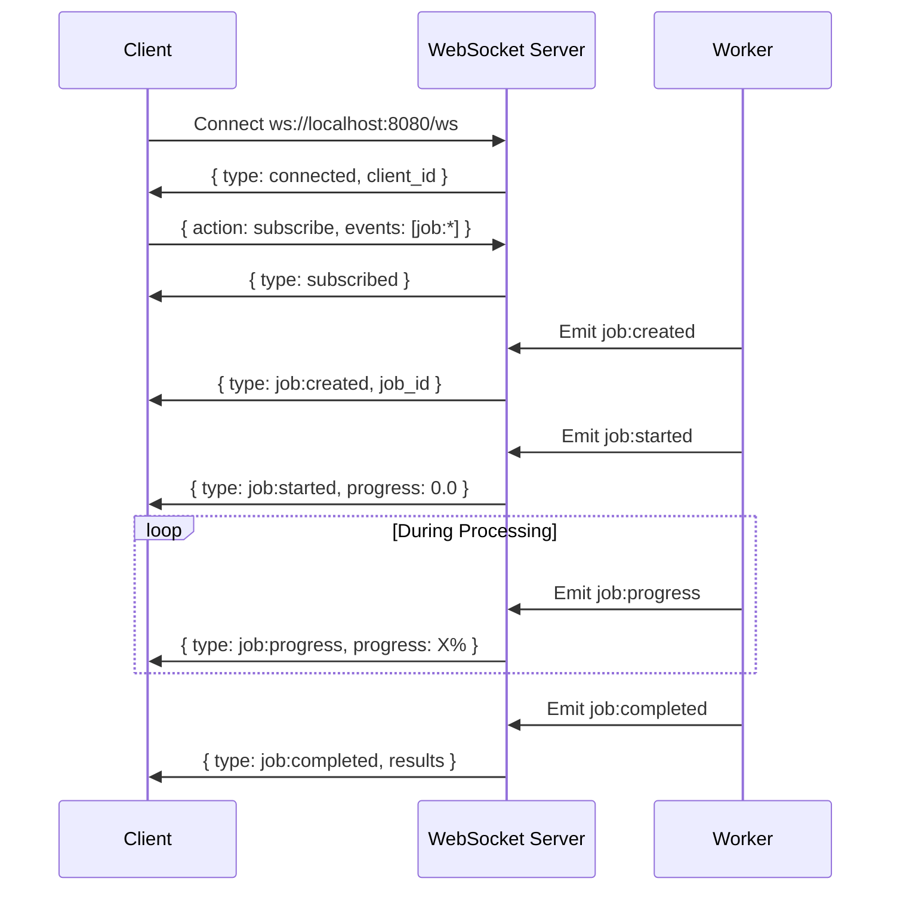
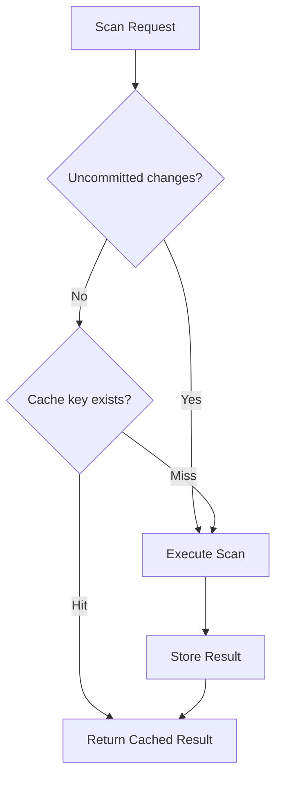
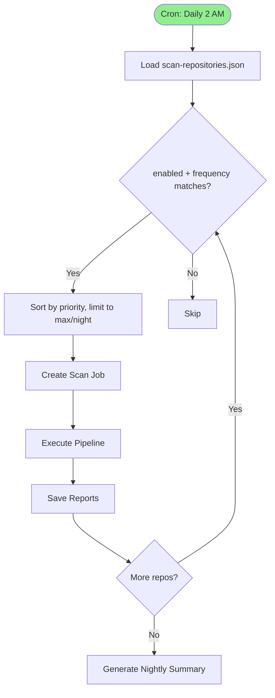

# AlephAuto - Data Flow Diagrams

**Updated**: 2026-03-14

---

## Table of Contents

1. [System Architecture Overview](#1-system-architecture-overview)
2. [Duplicate Detection Pipeline](#2-duplicate-detection-pipeline)
3. [Data Entity Models](#3-data-entity-models)
4. [API Communication Flows](#4-api-communication-flows)
5. [Caching & Storage Layer](#5-caching--storage-layer)
6. [External Integration Flows](#6-external-integration-flows)
7. [Scheduled Job Flows](#7-scheduled-job-flows)

---

## 1. System Architecture Overview


```mermaid
graph TB
    subgraph "Client Layer"
        API[REST API Client]
        WS[WebSocket Client]
    end

    subgraph "API Gateway Layer"
        EXPRESS[Express Server<br/>Port 8080]
        WSSERVER[WebSocket Server<br/>ws://localhost:8080/ws]
    end

    subgraph "Job Queue Layer - AlephAuto Framework"
        DUPWORKER[Duplicate Detection]
        DOCWORKER[Schema Enhancement]
        GITWORKER[Git Activity]
        GIWORKER[Gitignore]
        REPOMIXWORKER[Repomix]
        CLEANUPWORKER[Repo Cleanup]
        HEALTHWORKER[Claude Health]
        BUGFIXWORKER[Bugfix Audit]
        DASHWORKER[Dashboard Populate]
        TESTWORKER[Test Refactor]
    end

    subgraph "Processing Layer"
        ORCHESTRATOR[Scan Orchestrator<br/>7-Stage Pipeline]
        JSPROCESSOR[JavaScript Processing<br/>repomix + ast-grep]
        PYPROCESSOR[Python Processing<br/>5-Stage Analysis]
    end

    subgraph "Data Layer"
        SQLITE[(SQLite<br/>Job Persistence)]
        FILESYSTEM[(File System<br/>Reports & Logs)]
    end

    subgraph "External Systems"
        SENTRY[Sentry v8]
        REPOMIX[repomix CLI]
        ASTGREP[ast-grep CLI]
    end

    subgraph "Scheduling Layer"
        CRON[node-cron]
    end

    API -->|HTTP REST| EXPRESS
    WS -->|WebSocket| WSSERVER

    EXPRESS --> DUPWORKER
    EXPRESS --> DOCWORKER
    EXPRESS --> GITWORKER

    CRON -->|Daily 2 AM| DUPWORKER
    CRON -->|Daily 3 AM| DOCWORKER
    CRON -->|Sunday 8 PM| GITWORKER

    DUPWORKER --> ORCHESTRATOR
    ORCHESTRATOR --> JSPROCESSOR
    JSPROCESSOR --> PYPROCESSOR
    JSPROCESSOR --> REPOMIX
    JSPROCESSOR --> ASTGREP

    ORCHESTRATOR --> FILESYSTEM
    PYPROCESSOR --> FILESYSTEM

    DUPWORKER --> SENTRY
    DOCWORKER --> SENTRY
    GITWORKER --> SENTRY

    WSSERVER -.->|Broadcast Events| WS
    DUPWORKER -.->|job:progress| WSSERVER

    style DUPWORKER fill:#e1f5ff
    style ORCHESTRATOR fill:#fff4e1
    style SENTRY fill:#f0e1ff
```

| Layer | Components | Purpose |
|-------|-----------|---------|
| **Client** | REST API, WebSocket | User/system interaction |
| **API Gateway** | Express.js, WebSocket Server | Request routing, real-time updates |
| **Job Queue** | 10 Worker Types | Job management & execution |
| **Processing** | Orchestrator, JS/Python Processors | Code analysis pipeline |
| **Data** | SQLite, File System | Persistence & reports |
| **External** | Sentry, repomix, ast-grep | Monitoring & tools |
| **Scheduling** | node-cron | Automated job triggering |

---

## 2. Duplicate Detection Pipeline

### End-to-End Flow


```mermaid
flowchart TD
    START([POST /api/scans/start]) --> VALIDATE{Valid?}
    VALIDATE -->|No| ERROR1[400 Bad Request]
    VALIDATE -->|Yes| CREATEJOB[Create Job: queued]

    CREATEJOB --> EMIT1[WS Broadcast: job:created]
    CREATEJOB --> QUEUE[Add to Job Queue]
    QUEUE --> CONCURRENT{Slots available?}
    CONCURRENT -->|No| WAIT[Wait in Queue]
    WAIT --> CONCURRENT
    CONCURRENT -->|Yes| START_PROCESS[Status: in_progress]

    START_PROCESS --> STAGE1[Stage 1: Repo Scan — repomix CLI]
    STAGE1 --> STAGE2[Stage 2: Pattern Detection — ast-grep 18 rules]
    STAGE2 --> STAGE3[Stage 3: Extract Code Blocks — Python]
    STAGE3 --> STAGE4[Stage 4: Semantic Annotation — Python]
    STAGE4 --> STAGE5[Stage 5: Duplicate Grouping — 2-Phase Similarity]
    STAGE5 --> STAGE6[Stage 6: Consolidation Suggestions]
    STAGE6 --> STAGE7[Stage 7: Report Generation]

    STAGE7 --> GENREPORTS[Save HTML/Markdown/JSON]
    GENREPORTS --> COMPLETE[Status: completed]
    COMPLETE --> EMIT4[WS Broadcast: job:completed]

    STAGE1 -.->|Error| FAIL[Status: failed + Sentry]
    STAGE3 -.->|Error| FAIL

    style CREATEJOB fill:#e1f5ff
    style STAGE3 fill:#fff4e1
    style STAGE5 fill:#fff4e1
```

### Stage 5: Two-Phase Similarity Algorithm

1. **Extract semantic features** — HTTP codes, operators, methods, keywords, patterns
2. **Normalize code** — strip comments/whitespace, rename variables to `var1`/`var2`, remove string literals
3. **Base similarity** — Levenshtein on normalized code: `1 - (distance / max_length)`
4. **Semantic penalties** — mismatched features reduce score (e.g., `===` vs `!==` = 0.80x)
5. **Group by threshold** — pairs >= 0.90 grouped; transitive merging (A~B, B~C -> {A,B,C})
6. **Impact metrics** — duplicated lines, potential savings, consolidation effort, priority

### JavaScript <-> Python IPC

Communication via `child_process.spawn` with JSON over stdin/stdout:

- **JS sends**: `{ repository_info, pattern_matches, scan_config }` via stdin
- **Python receives**: parses JSON, runs Stages 3-7, writes result to stdout
- **JS receives**: `{ code_blocks, duplicate_groups, suggestions, metrics }`
- **Errors**: stderr captured and sent to Sentry

---

## 3. Data Entity Models


```mermaid
erDiagram
    ScanReport ||--o{ CodeBlock : contains
    ScanReport ||--o{ DuplicateGroup : contains
    ScanReport ||--o{ ConsolidationSuggestion : contains
    ScanReport ||--|| RepositoryInfo : has
    ScanReport ||--|| ScanMetadata : has

    DuplicateGroup ||--o{ CodeBlock : groups
    DuplicateGroup ||--|| CodeBlock : "has canonical"
    ConsolidationSuggestion ||--|| DuplicateGroup : targets
    ConsolidationSuggestion ||--o{ MigrationStep : includes
    CodeBlock ||--|| SourceLocation : "located at"

    ScanReport {
        string scan_id PK
        datetime scanned_at
    }
    CodeBlock {
        string block_id PK
        string source_code
        string language
        string semantic_category
        string hash
    }
    DuplicateGroup {
        string group_id PK
        float similarity_score
        string similarity_method
        string canonical_block_id FK
    }
    ConsolidationSuggestion {
        string suggestion_id PK
        string strategy
        string priority
        float estimated_effort
    }
```

### Key Enums

| Type | Values |
|------|--------|
| **SemanticCategory** | utility, handler, validator, database, api_client, middleware, configuration, error_handling, logging, authentication, authorization, data_transform, unknown |
| **SimilarityMethod** | exact, structural, semantic, hybrid |
| **ConsolidationStrategy** | extract_function, extract_module, use_existing, create_class, create_utility, parameterize, template |
| **Priority** | critical (>100 lines), high (50-100), medium (20-50), low (<20) |

Models are Pydantic v2 in `sidequest/pipeline-core/models/`.

---

## 4. API Communication Flows

### REST API Request Flow


```mermaid
sequenceDiagram
    participant Client
    participant Express
    participant Auth as authMiddleware
    participant Route as Route Handler
    participant Worker
    participant WS as WebSocket Server

    Client->>Express: POST /api/scans/start
    Express->>Auth: Validate request
    Express->>Route: Handle request
    Route->>Worker: createJob(scanId, {path, options})
    Worker->>WS: Emit job:created
    WS-->>Client: WebSocket broadcast

    Worker->>Worker: Execute 7-stage pipeline

    loop During Processing
        Worker->>WS: Emit job:progress
        WS-->>Client: WebSocket broadcast
    end

    Worker->>WS: Emit job:completed
    Worker-->>Route: ScanReport
    Route-->>Client: 200 OK
```

### WebSocket Event Flow


```mermaid
sequenceDiagram
    participant Client
    participant WSServer as WebSocket Server
    participant Worker

    Client->>WSServer: Connect ws://localhost:8080/ws
    WSServer->>Client: { type: connected, client_id }
    Client->>WSServer: { action: subscribe, events: [job:*] }
    WSServer->>Client: { type: subscribed }

    Worker->>WSServer: Emit job:created
    WSServer->>Client: { type: job:created, job_id }
    Worker->>WSServer: Emit job:started
    WSServer->>Client: { type: job:started, progress: 0.0 }

    loop During Processing
        Worker->>WSServer: Emit job:progress
        WSServer->>Client: { type: job:progress, progress: X% }
    end

    Worker->>WSServer: Emit job:completed
    WSServer->>Client: { type: job:completed, results }
```

### Job Queue Concurrency

- `maxConcurrent = 5` (configurable 1-50, via `CONCURRENCY.DEFAULT_MAX_JOBS`)
- Jobs enter `queued` state, shift to `in_progress` when slots open
- On completion/failure: `activeJobs--`, then `processQueue()` starts next queued job
- Errors: captured to Sentry with job context, then queue continues

---

## 5. Caching & Storage Layer

### Cache Flow


```mermaid
flowchart TB
    REQ[Scan Request] --> UNCOMMITTED{Uncommitted changes?}
    UNCOMMITTED -->|Yes| SCAN[Execute Scan]
    UNCOMMITTED -->|No| CHECK{Cache key exists?}
    CHECK -->|Hit| RETURN[Return Cached Result]
    CHECK -->|Miss| SCAN
    SCAN --> STORE[Store Result]
    STORE --> RETURN
```

**Cache key**: `scan:{SHA256(repo_path)}:{git_commit_hash}` — TTL 30 days

### File System Storage

```
sidequest/output/
├── condense/          # Duplicate detection reports (HTML/JSON/MD per repo)
├── git-activity/      # Weekly/monthly reports with SVG charts
├── doc-enhancement/   # Schema injection logs
└── repomix/           # Repomix consolidation outputs

logs/
├── duplicate-detection/   # Daily log files + errors.log
├── git-activity/
├── doc-enhancement/
└── combined.log
```

---

## 6. External Integration Flows

### Sentry Error Tracking

- Initialized at startup with `config.sentryDsn` and `config.nodeEnv`
- Breadcrumbs added at job start/complete for trail context (max 100)
- `captureException` on errors with tags (`job_id`, `component`, `stage`) and extra (`job_data`, `repository`)
- Development test errors filtered via `beforeSend`

### AST-Grep Pattern Detection (Stage 2)

1. Load 18 YAML pattern rules from `.ast-grep/rules/` (route handlers, DB ops, async patterns, validators, middleware, etc.)
2. Execute: `ast-grep scan --config .ast-grep/ --json /path/to/repo` (timeout 5 min, 10MB buffer)
3. Parse JSON output into `PatternMatch` objects: `{ pattern_id, file_path, line_start, line_end, code_snippet, language }`
4. Pass to Stage 3

---

## 7. Scheduled Job Flows

### Cron-Triggered Scanning


```mermaid
flowchart TB
    START([Cron: Daily 2 AM]) --> LOAD[Load scan-repositories.json]
    LOAD --> FILTER{enabled + frequency matches?}
    FILTER -->|Yes| PRIORITY[Sort by priority, limit to max/night]
    FILTER -->|No| SKIP[Skip]

    PRIORITY --> SCAN[Create Scan Job]
    SCAN --> RUN[Execute Pipeline]
    RUN --> SAVE[Save Reports]
    SAVE --> NEXT{More repos?}
    NEXT -->|Yes| FILTER
    NEXT -->|No| SUMMARY[Generate Nightly Summary]

    style START fill:#90EE90
```

### Repository Config Schema

Key fields in `config/scan-repositories.json`:

| Field | Type | Description |
|-------|------|-------------|
| `scanConfig.maxRepositoriesPerNight` | int (1-100) | Nightly limit |
| `scanConfig.maxConcurrentScans` | int (1-10) | Parallel scan slots |
| `scanConfig.scanTimeout` | int (60s-60min) | Per-scan timeout |
| `repositories[].priority` | critical/high/medium/low | Scan order |
| `repositories[].scanFrequency` | daily/weekly/monthly | Schedule |
| `repositories[].excludePatterns` | string[] | Glob exclusions |

Parallel execution: repos processed up to `maxConcurrentScans` at once, next repo starts when a slot frees.

---

## Summary

| Aspect | Detail |
|--------|--------|
| Architecture | Hybrid microservices + monolithic job processing |
| Pipelines | 11 logical pipelines, 10 worker types |
| Detection | 7-stage pipeline, 18 AST-grep rules, 2-phase similarity |
| IPC | JS <-> Python via JSON stdin/stdout |
| Caching | Git-aware, 30-day TTL |
| Monitoring | Sentry v8, WebSocket real-time updates |
| Scheduling | node-cron with configurable frequency/priority |
| Concurrency | 1-50 configurable concurrent jobs |
