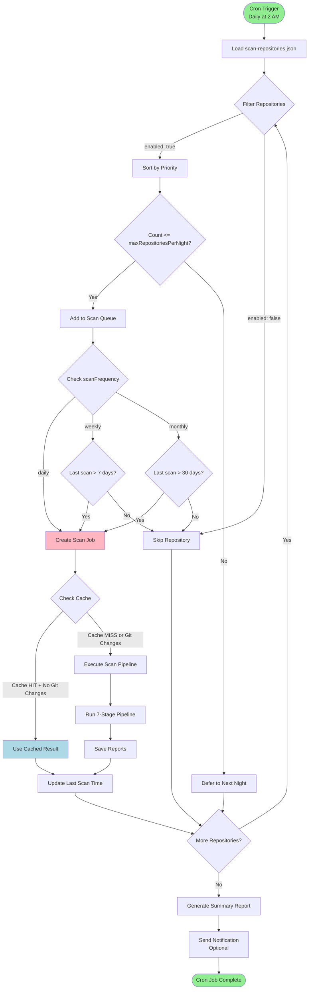

# Jobs Project - Data Flow Diagrams

> **Automated Job Management & Code Analysis System**
>
> A hybrid microservices architecture built on the AlephAuto job queue framework for automated code duplicate detection, documentation enhancement, and git activity reporting.

---

## Table of Contents

1. [System Architecture Overview](#1-system-architecture-overview)
2. [Duplicate Detection Pipeline](#2-duplicate-detection-pipeline)
3. [Data Entity Models](#3-data-entity-models)
4. [API Communication Flows](#4-api-communication-flows)
5. [Caching & Storage Layer](#5-caching--storage-layer)
6. [External Integration Flows](#6-external-integration-flows)
7. [Scheduled Job Flows](#7-scheduled-job-flows)

---

## 1. System Architecture Overview

### High-Level Component Diagram


### System Components Summary

| Layer | Components | Purpose |
|-------|-----------|---------|
| **Client** | REST API, WebSocket | User/system interaction |
| **API Gateway** | Express.js, WebSocket Server | Request routing, real-time updates |
| **Job Queue** | 4 Worker Types | Job management & execution |
| **Processing** | Orchestrator, JS/Python Processors | Code analysis pipeline |
| **Data** | Redis (optional), File System | Caching & persistence |
| **External** | Sentry, repomix, ast-grep, MCP | Monitoring & tools |
| **Scheduling** | node-cron | Automated job triggering |

---

## 2. Duplicate Detection Pipeline

### Complete Data Flow - End to End


### Stage 5: Two-Phase Similarity Algorithm Detail

```
┌─────────────────────────────────────────────────────────────────┐
│                    DUPLICATE GROUPING ALGORITHM                  │
│                        (Stage 5 Detail)                          │
└─────────────────────────────────────────────────────────────────┘

Input: List of CodeBlock objects from Stage 4

    ↓
┌────────────────────────────────────────────────────────┐
│ PHASE 1: Extract Semantic Features (BEFORE Normalize) │
│                                                        │
│  For each code block:                                 │
│    features = {                                       │
│      http_codes: [200, 404, 500, ...]               │
│      operators: [===, !==, &&, ||, ...]              │
│      methods: [Math.max, Array.map, ...]             │
│      keywords: [async, await, return, ...]           │
│      patterns: [try-catch, if-else, ...]             │
│    }                                                  │
└────────────────────────────────────────────────────────┘
    ↓
┌────────────────────────────────────────────────────────┐
│ PHASE 2: Code Normalization                           │
│                                                        │
│  normalize_code(block):                               │
│    - Remove comments                                  │
│    - Standardize whitespace                           │
│    - Normalize variable names (var1, var2, ...)       │
│    - Remove string literals                           │
│    - Standardize formatting                           │
│                                                        │
│  Example:                                             │
│    function getUserName(id) {                         │
│      return users.find(u => u.id === id).name;        │
│    }                                                  │
│    ↓ normalize ↓                                      │
│    function var1(var2){return var3.find(var4=>        │
│    var4.var5===var2).var6;}                           │
└────────────────────────────────────────────────────────┘
    ↓
┌────────────────────────────────────────────────────────┐
│ PHASE 3: Calculate Base Similarity                    │
│                                                        │
│  For each pair of normalized code blocks:            │
│    similarity = levenshtein_similarity(block1, block2)│
│                                                        │
│  Levenshtein distance measures character edits:      │
│    - Insertions                                       │
│    - Deletions                                        │
│    - Substitutions                                    │
│                                                        │
│  Formula:                                             │
│    similarity = 1 - (distance / max_length)           │
│    Range: 0.0 (completely different) to 1.0 (exact)   │
└────────────────────────────────────────────────────────┘
    ↓
┌────────────────────────────────────────────────────────┐
│ PHASE 4: Apply Semantic Penalties                     │
│                                                        │
│  Compare Phase 1 features between blocks:            │
│                                                        │
│  Penalty Examples:                                    │
│    HTTP codes (200 vs 201):    0.70x (30% penalty)   │
│    Operators (=== vs !==):     0.80x (20% penalty)   │
│    Methods (max vs min):       0.75x (25% penalty)   │
│    Keywords (await vs sync):   0.85x (15% penalty)   │
│                                                        │
│  final_similarity = base_similarity × penalty_factor  │
│                                                        │
│  Example:                                             │
│    base_similarity = 0.95                             │
│    penalty (=== vs !==) = 0.80                        │
│    final = 0.95 × 0.80 = 0.76                        │
└────────────────────────────────────────────────────────┘
    ↓
┌────────────────────────────────────────────────────────┐
│ PHASE 5: Group by Threshold                           │
│                                                        │
│  threshold = 0.90 (configurable)                      │
│                                                        │
│  For each pair with similarity >= threshold:         │
│    - Create or extend DuplicateGroup                  │
│    - Add both blocks to group                         │
│    - Record similarity score                          │
│    - Select canonical block (highest quality)         │
│                                                        │
│  Group merging:                                       │
│    If block A matches B and B matches C:             │
│    → Merge into single group {A, B, C}               │
└────────────────────────────────────────────────────────┘
    ↓
┌────────────────────────────────────────────────────────┐
│ PHASE 6: Calculate Impact Metrics                     │
│                                                        │
│  For each DuplicateGroup:                            │
│    total_duplicated_lines = sum(block.line_count)     │
│    potential_savings = total - canonical.line_count   │
│    consolidation_effort = group.member_count × weight │
│    priority = f(savings, similarity, effort)          │
└────────────────────────────────────────────────────────┘
    ↓

Output: List of DuplicateGroup objects → Stage 6
```

### JavaScript ↔ Python Communication

```
┌──────────────────────────────────────────────────────────┐
│         Inter-Process Communication (IPC)                │
│         JavaScript (Node.js) ↔ Python 3.14              │
└──────────────────────────────────────────────────────────┘

JavaScript Side (lib/scan-orchestrator.js):
━━━━━━━━━━━━━━━━━━━━━━━━━━━━━━━━━━━━━━━━━━━━━━━━━━━━━━━━

const { spawn } = require('child_process');

const pythonProcess = spawn('python3', [
  'lib/extract_blocks.py'
], {
  stdio: ['pipe', 'pipe', 'pipe']  // stdin, stdout, stderr
});

// Send data via stdin
const input = {
  repository_info: {
    path: "/Users/user/code/project",
    name: "project",
    total_files: 150,
    total_lines: 50000
  },
  pattern_matches: [
    {
      pattern_id: "express-route-handler",
      file_path: "api/routes/users.js",
      line_start: 15,
      line_end: 25,
      code_snippet: "router.post('/users', ...)"
    },
    // ... more matches
  ],
  scan_config: {
    threshold: 0.90,
    min_block_size: 5,
    exclude_patterns: ["*.test.js"]
  }
};

pythonProcess.stdin.write(JSON.stringify(input) + '\n');
pythonProcess.stdin.end();

// Read output from stdout
let outputBuffer = '';
pythonProcess.stdout.on('data', (data) => {
  outputBuffer += data.toString();
});

pythonProcess.on('close', (code) => {
  if (code === 0) {
    const result = JSON.parse(outputBuffer);
    // result contains CodeBlocks, DuplicateGroups, etc.
  }
});

━━━━━━━━━━━━━━━━━━━━━━━━━━━━━━━━━━━━━━━━━━━━━━━━━━━━━━━━

Python Side (lib/extract_blocks.py):
━━━━━━━━━━━━━━━━━━━━━━━━━━━━━━━━━━━━━━━━━━━━━━━━━━━━━━━━

import sys
import json
from models import CodeBlock, DuplicateGroup, ScanReport

# Read from stdin
input_data = json.loads(sys.stdin.readline())

repository_info = input_data['repository_info']
pattern_matches = input_data['pattern_matches']
scan_config = input_data['scan_config']

# Stage 3: Extract code blocks
code_blocks = extract_code_blocks(
  repository_info,
  pattern_matches
)

# Stage 4: Semantic annotation
annotated_blocks = annotate_semantics(code_blocks)

# Stage 5: Duplicate grouping
duplicate_groups = find_duplicates(
  annotated_blocks,
  threshold=scan_config['threshold']
)

# Stage 6: Generate suggestions
suggestions = generate_consolidation_suggestions(
  duplicate_groups
)

# Stage 7: Calculate metrics
metrics = calculate_metrics(
  code_blocks,
  duplicate_groups
)

# Build output
output = {
  "code_blocks": [block.model_dump() for block in code_blocks],
  "duplicate_groups": [group.model_dump() for group in duplicate_groups],
  "suggestions": [sugg.model_dump() for sugg in suggestions],
  "metrics": metrics
}

# Write to stdout (newline-delimited JSON)
print(json.dumps(output))
sys.exit(0)

━━━━━━━━━━━━━━━━━━━━━━━━━━━━━━━━━━━━━━━━━━━━━━━━━━━━━━━━

Error Handling:
━━━━━━━━━━━━━━━━━━━━━━━━━━━━━━━━━━━━━━━━━━━━━━━━━━━━━━━━

pythonProcess.stderr.on('data', (data) => {
  logger.error({ stderr: data.toString() }, 'Python error');
  Sentry.captureException(new Error(data.toString()));
});

pythonProcess.on('error', (error) => {
  logger.error({ error }, 'Failed to spawn Python process');
  Sentry.captureException(error);
});

pythonProcess.on('close', (code) => {
  if (code !== 0) {
    throw new Error(`Python process exited with code ${code}`);
  }
});
```

---

## 3. Data Entity Models

### Entity Relationship Diagram


### CodeBlock Model Detail

```python
# Pydantic v2 Model: lib/models/code_block.py

class SourceLocation(BaseModel):
    """Location of code within a file"""
    file_path: str                    # Relative to repository root
    line_start: int                   # 1-indexed line number
    line_end: int                     # Inclusive
    column_start: Optional[int] = None
    column_end: Optional[int] = None

    @computed_field
    def line_count(self) -> int:
        return self.line_end - self.line_start + 1


class CodeBlock(BaseModel):
    """Represents a single block of code detected by pattern matching"""

    block_id: str                     # UUID v4
    source_location: SourceLocation
    source_code: str                  # Actual code text
    language: LanguageType            # javascript, typescript, python, etc.
    semantic_category: SemanticCategory  # See enum below
    tags: List[str] = []              # ["function:getUserName", "api", "express"]
    ast_node: Optional[ASTNode] = None
    hash: str                         # SHA256 of normalized code
    detection_time: datetime = Field(default_factory=datetime.now)

    @computed_field
    def file_name(self) -> str:
        return os.path.basename(self.source_location.file_path)

    @computed_field
    def normalized_code(self) -> str:
        """Return normalized version for comparison"""
        return normalize_code(self.source_code)


class SemanticCategory(str, Enum):
    """Categories for code blocks based on purpose"""
    UTILITY = "utility"               # Helper functions, formatters
    HANDLER = "handler"               # Request handlers, event handlers
    VALIDATOR = "validator"           # Input validation, type checking
    DATABASE = "database"             # DB queries, ORM operations
    API_CLIENT = "api_client"         # External API calls
    MIDDLEWARE = "middleware"         # Express/Connect middleware
    CONFIGURATION = "configuration"   # Config loading, setup
    ERROR_HANDLING = "error_handling" # Error handlers, try-catch
    LOGGING = "logging"               # Logger calls, console logs
    AUTHENTICATION = "authentication" # Auth checks, token validation
    AUTHORIZATION = "authorization"   # Permission checks
    DATA_TRANSFORM = "data_transform" # Mapping, filtering, reducing
    UNKNOWN = "unknown"               # Unable to categorize
```

### DuplicateGroup Model Detail

```python
# lib/models/duplicate_group.py

class ImpactMetrics(BaseModel):
    """Metrics showing the impact of this duplicate group"""
    total_lines_duplicated: int       # Sum of all member block line counts
    potential_consolidation_savings: int  # Lines that could be eliminated
    estimated_effort_hours: float     # Based on group size & complexity
    affected_files: int               # Number of unique files


class DuplicateGroup(BaseModel):
    """A group of similar code blocks"""

    group_id: str                     # UUID v4
    pattern_id: str                   # Which ast-grep pattern detected this
    member_block_ids: List[str]       # List of CodeBlock IDs (min 2)
    similarity_score: float           # 0.0 to 1.0, average across all pairs
    similarity_method: SimilarityMethod  # exact, structural, semantic, hybrid
    canonical_block_id: Optional[str] = None  # "Best" representative block
    impact_metrics: ImpactMetrics
    detected_at: datetime = Field(default_factory=datetime.now)

    @validator('member_block_ids')
    def validate_member_count(cls, v):
        if len(v) < 2:
            raise ValueError('DuplicateGroup must have at least 2 members')
        return v

    @computed_field
    def member_count(self) -> int:
        return len(self.member_block_ids)


class SimilarityMethod(str, Enum):
    """Method used to calculate similarity"""
    EXACT = "exact"                   # Exact character match (100%)
    STRUCTURAL = "structural"         # Levenshtein on normalized code
    SEMANTIC = "semantic"             # Feature-based comparison
    HYBRID = "hybrid"                 # Combination of structural + semantic
```

### ConsolidationSuggestion Model Detail

```python
# lib/models/consolidation_suggestion.py

class MigrationStep(BaseModel):
    """A single step in the consolidation migration"""
    step_number: int
    action: str                       # "create", "move", "refactor", "test"
    description: str
    target_file: Optional[str] = None
    estimated_time_minutes: int
    automation_possible: bool = False
    risk_level: str                   # low, medium, high


class ConsolidationSuggestion(BaseModel):
    """A suggestion for consolidating duplicated code"""

    suggestion_id: str                # UUID v4
    duplicate_group_id: str           # FK to DuplicateGroup
    title: str                        # "Extract getUserById to shared utility"
    description: str                  # Detailed explanation
    strategy: ConsolidationStrategy   # See enum below
    priority: Priority                # critical, high, medium, low
    estimated_effort: float           # Hours
    expected_benefit: float           # Score 0-100
    migration_steps: List[MigrationStep]
    risks: List[str]                  # Potential issues
    created_at: datetime = Field(default_factory=datetime.now)

    @computed_field
    def total_steps(self) -> int:
        return len(self.migration_steps)

    @computed_field
    def roi_score(self) -> float:
        """Return on Investment: benefit / effort"""
        return self.expected_benefit / max(self.estimated_effort, 0.1)


class ConsolidationStrategy(str, Enum):
    """Strategy for consolidating duplicates"""
    EXTRACT_FUNCTION = "extract_function"       # Create shared function
    EXTRACT_MODULE = "extract_module"           # Create shared module
    USE_EXISTING = "use_existing"               # One already exists
    CREATE_CLASS = "create_class"               # OOP refactor
    CREATE_UTILITY = "create_utility"           # Utility function
    PARAMETERIZE = "parameterize"               # Add parameters to unify
    TEMPLATE = "template"                       # Use template pattern


class Priority(str, Enum):
    """Priority level for addressing suggestion"""
    CRITICAL = "critical"             # Immediate action (>100 duplicated lines)
    HIGH = "high"                     # Soon (50-100 lines)
    MEDIUM = "medium"                 # Plan for it (20-50 lines)
    LOW = "low"                       # Nice to have (<20 lines)
```

---

## 4. API Communication Flows

### REST API Request Flow


### WebSocket Event Flow


### Job Queue Concurrency Management

```
┌──────────────────────────────────────────────────────────┐
│           AlephAuto Job Queue Architecture               │
│              (sidequest/server.js)                       │
└──────────────────────────────────────────────────────────┘

Configuration:
  maxConcurrent = 5  (1-50 allowed)

Initial State:
  jobs = Map()
  queue = []
  activeJobs = 0

─────────────────────────────────────────────────────────────

Request 1 arrives → createJob(id1, data)
  ↓
  jobs.set(id1, {id: id1, status: 'queued', ...})
  queue.push(id1)  → queue = [id1]
  emit('job:created', job)
  processQueue()
    ↓
    activeJobs < maxConcurrent? YES (0 < 5)
    ↓
    jobId = queue.shift()  → queue = []
    activeJobs++  → activeJobs = 1
    executeJob(id1)
      ↓
      jobs.set(id1, {..., status: 'in_progress'})
      emit('job:started', job)
      runJobHandler(job)
        ↓ (async, takes 5 minutes)

Request 2-6 arrive in rapid succession
  ↓
  createJob(id2...id6) for each
  queue = [id2, id3, id4, id5, id6]
  processQueue() called 5 times
    ↓
    Loop 1: activeJobs = 1, maxConcurrent = 5
            Start id2, activeJobs = 2
    Loop 2: activeJobs = 2, maxConcurrent = 5
            Start id3, activeJobs = 3
    Loop 3: activeJobs = 3, maxConcurrent = 5
            Start id4, activeJobs = 4
    Loop 4: activeJobs = 4, maxConcurrent = 5
            Start id5, activeJobs = 5
    Loop 5: activeJobs = 5, maxConcurrent = 5
            Cannot start (5 >= 5)
            id6 remains in queue

  State now:
    queue = [id6]
    activeJobs = 5
    Running: id1, id2, id3, id4, id5
    Waiting: id6

Job id1 completes
  ↓
  jobs.set(id1, {..., status: 'completed', result: {...}})
  emit('job:completed', job)
  activeJobs--  → activeJobs = 4
  processQueue()
    ↓
    activeJobs < maxConcurrent? YES (4 < 5)
    jobId = queue.shift()  → id6
    queue = []
    activeJobs++  → activeJobs = 5
    executeJob(id6)

─────────────────────────────────────────────────────────────

Error Handling:

  If runJobHandler(job) throws error:
    ↓
    catch (error) {
      jobs.set(id, {..., status: 'failed', error})
      emit('job:failed', {job, error})
      Sentry.captureException(error, {
        tags: { job_id: id },
        extra: { job_data: job.data }
      })
      activeJobs--
      processQueue()  // Try to start next queued job
    }
```

---

## 5. Caching & Storage Layer

### Redis Cache Architecture


### Cache Invalidation Strategy

```python
# lib/cached-scanner.js

class CachedScanner {
    constructor(options = {}) {
        this.cache = options.cache;  // Redis client
        this.scanner = options.scanner;  // ScanOrchestrator
        this.trackGitCommits = options.trackGitCommits ?? true;
        this.trackUncommittedChanges = options.trackUncommittedChanges ?? true;
    }

    async scan(repositoryPath) {
        // Step 1: Generate cache key
        const cacheKey = await this.generateCacheKey(repositoryPath);

        // Step 2: Check for uncommitted changes (if enabled)
        if (this.trackUncommittedChanges) {
            const hasChanges = await this.hasUncommittedChanges(repositoryPath);
            if (hasChanges) {
                logger.info('Repository has uncommitted changes, bypassing cache');
                return await this.scanAndCache(repositoryPath, cacheKey);
            }
        }

        // Step 3: Try to get from cache
        const cached = await this.cache.get(cacheKey);

        if (cached) {
            logger.info({ cacheKey }, 'Cache HIT');
            return this.deserializeScanReport(cached);
        }

        // Step 4: Cache MISS - execute scan
        logger.info({ cacheKey }, 'Cache MISS');
        return await this.scanAndCache(repositoryPath, cacheKey);
    }

    async generateCacheKey(repositoryPath) {
        const repoHash = this.hashPath(repositoryPath);

        if (this.trackGitCommits) {
            const commitHash = await this.getGitCommitHash(repositoryPath);
            return `scan:${repoHash}:${commitHash}`;
        }

        return `scan:${repoHash}`;
    }

    async getGitCommitHash(repositoryPath) {
        // Execute: git rev-parse HEAD
        const { stdout } = await exec('git rev-parse HEAD', {
            cwd: repositoryPath
        });
        return stdout.trim();
    }

    async hasUncommittedChanges(repositoryPath) {
        // Execute: git status --porcelain
        const { stdout } = await exec('git status --porcelain', {
            cwd: repositoryPath
        });
        return stdout.length > 0;
    }

    async scanAndCache(repositoryPath, cacheKey) {
        const scanReport = await this.scanner.scanRepository(repositoryPath);

        // Store in cache with 30-day TTL
        await this.cache.set(
            cacheKey,
            this.serializeScanReport(scanReport),
            { ttl: 30 * 24 * 60 * 60 }  // 30 days in seconds
        );

        return scanReport;
    }
}
```

### File System Storage Structure

```
sidequest/output/
├── condense/                          # Duplicate detection reports
│   ├── ISInternal/
│   │   ├── scan_2024-01-15_143022.html
│   │   ├── scan_2024-01-15_143022.json
│   │   └── scan_2024-01-15_143022.md
│   ├── InventoryAI/
│   │   └── scan_2024-01-16_091505.html
│   └── ...
│
├── git-activity/                      # Git activity reports
│   ├── weekly/
│   │   ├── 2024-W03.json
│   │   ├── 2024-W03_commits.svg
│   │   └── 2024-W03_authors.svg
│   └── monthly/
│       ├── 2024-01.json
│       └── 2024-01_summary.svg
│
├── doc-enhancement/                   # Documentation enhancement logs
│   ├── ISInternal_2024-01-15.json
│   └── schema-injection-log.json
│
└── repomix/                          # Repomix consolidation outputs
    ├── ISInternal.md
    ├── InventoryAI.md
    └── ...

logs/
├── duplicate-detection/
│   ├── 2024-01-15.log                # Daily log files
│   ├── 2024-01-16.log
│   └── errors.log                    # Error-specific log
│
├── git-activity/
│   └── 2024-01.log
│
├── doc-enhancement/
│   └── 2024-01.log
│
└── combined.log                      # All logs combined
```

---

## 6. External Integration Flows

### Sentry Error Tracking Flow


### Sentry Integration Code

```javascript
// sidequest/logger.js

import * as Sentry from '@sentry/node';
import { config } from './config.js';

// Initialize Sentry when module loads
Sentry.init({
  dsn: config.sentryDsn,
  environment: config.nodeEnv,
  tracesSampleRate: 1.0,  // 100% of transactions for performance monitoring

  // Performance monitoring
  integrations: [
    new Sentry.Integrations.Http({ tracing: true }),
    new Sentry.Integrations.Express({ app }),
  ],

  // Error filtering
  beforeSend(event, hint) {
    // Don't send test errors in development
    if (config.nodeEnv === 'development' && event.tags?.test) {
      return null;
    }
    return event;
  }
});

// Usage in workers
class DuplicateDetectionWorker extends SidequestServer {
  async runJobHandler(job) {
    // Add breadcrumb for tracking
    Sentry.addBreadcrumb({
      category: 'job',
      message: `Job ${job.id} started`,
      level: 'info',
      data: {
        job_id: job.id,
        repository: job.data.repositoryPath
      }
    });

    try {
      const result = await this.orchestrator.scanRepository(job.data.repositoryPath);

      Sentry.addBreadcrumb({
        category: 'job',
        message: `Job ${job.id} completed successfully`,
        level: 'info',
        data: {
          job_id: job.id,
          blocks_found: result.code_blocks.length,
          duplicates_found: result.duplicate_groups.length
        }
      });

      return result;

    } catch (error) {
      // Capture exception with context
      Sentry.captureException(error, {
        tags: {
          job_id: job.id,
          component: 'duplicate-detection',
          stage: 'orchestrator'
        },
        extra: {
          job_data: job.data,
          repository: job.data.repositoryPath
        }
      });

      throw error;
    }
  }
}
```

### AST-Grep Pattern Detection Flow

```
┌──────────────────────────────────────────────────────────┐
│              AST-Grep Pattern Detection                  │
│                  (Stage 2 Detail)                        │
└──────────────────────────────────────────────────────────┘

Input: Repository path from Stage 1

    ↓
┌────────────────────────────────────────────────────────┐
│ Load Pattern Rules from .ast-grep/rules/              │
│                                                        │
│ 18 YAML files:                                        │
│   1. database-operations.yml                          │
│   2. express-route-handlers.yml                       │
│   3. async-patterns.yml                               │
│   4. utility-functions.yml                            │
│   5. validation-functions.yml                         │
│   6. logging-calls.yml                                │
│   7. config-access.yml                                │
│   8. error-handling.yml                               │
│   9. api-client-calls.yml                             │
│   10. middleware-functions.yml                        │
│   ... (8 more)                                        │
└────────────────────────────────────────────────────────┘
    ↓
┌────────────────────────────────────────────────────────┐
│ Example Pattern: express-route-handlers.yml           │
│                                                        │
│ id: express-route-handler                             │
│ language: javascript                                  │
│ rule:                                                 │
│   pattern: |                                          │
│     router.$METHOD($PATH, $$$HANDLERS)                │
│   where:                                              │
│     METHOD:                                           │
│       regex: ^(get|post|put|delete|patch)$            │
│                                                        │
│ This matches:                                         │
│   router.get('/users', getUsers)                      │
│   router.post('/users', validate, createUser)         │
│   router.delete('/users/:id', authenticate, deleteUser)│
└────────────────────────────────────────────────────────┘
    ↓
┌────────────────────────────────────────────────────────┐
│ Execute ast-grep CLI                                  │
│                                                        │
│ Command:                                              │
│   ast-grep scan                                       │
│     --config .ast-grep/                               │
│     --json                                            │
│     /path/to/repository                               │
│                                                        │
│ Timeout: 5 minutes                                    │
│ Max buffer: 10MB                                      │
└────────────────────────────────────────────────────────┘
    ↓
┌────────────────────────────────────────────────────────┐
│ Parse JSON Output                                     │
│                                                        │
│ {                                                     │
│   "matches": [                                        │
│     {                                                 │
│       "rule_id": "express-route-handler",             │
│       "file": "api/routes/users.js",                  │
│       "start_line": 15,                               │
│       "end_line": 25,                                 │
│       "start_column": 0,                              │
│       "end_column": 2,                                │
│       "text": "router.post('/users', ...)",           │
│       "language": "javascript"                        │
│     },                                                │
│     {                                                 │
│       "rule_id": "database-operations",               │
│       "file": "services/user-service.js",             │
│       "start_line": 42,                               │
│       "end_line": 47,                                 │
│       "text": "await prisma.user.create(...)",        │
│       "language": "javascript"                        │
│     },                                                │
│     ... (more matches)                                │
│   ],                                                  │
│   "total_matches": 247,                               │
│   "files_scanned": 89                                 │
│ }                                                     │
└────────────────────────────────────────────────────────┘
    ↓
┌────────────────────────────────────────────────────────┐
│ Transform to PatternMatch objects                     │
│                                                        │
│ class PatternMatch {                                  │
│   pattern_id: string;                                 │
│   file_path: string;                                  │
│   line_start: number;                                 │
│   line_end: number;                                   │
│   code_snippet: string;                               │
│   language: LanguageType;                             │
│ }                                                     │
└────────────────────────────────────────────────────────┘
    ↓

Output: Array of PatternMatch objects → Stage 3
```

---

## 7. Scheduled Job Flows

### Cron-Triggered Duplicate Detection



### Repository Configuration Schema

```json
{
  "$schema": "http://json-schema.org/draft-07/schema#",
  "type": "object",
  "required": ["scanConfig", "repositories"],
  "properties": {
    "scanConfig": {
      "type": "object",
      "properties": {
        "enabled": { "type": "boolean" },
        "schedule": { "type": "string", "pattern": "^[0-9 */,-]+$" },
        "maxRepositoriesPerNight": { "type": "integer", "minimum": 1, "maximum": 100 },
        "maxConcurrentScans": { "type": "integer", "minimum": 1, "maximum": 10 },
        "scanTimeout": { "type": "integer", "minimum": 60000, "maximum": 3600000 },
        "retryAttempts": { "type": "integer", "minimum": 0, "maximum": 5 },
        "retryDelay": { "type": "integer", "minimum": 1000, "maximum": 300000 }
      }
    },
    "cacheConfig": {
      "type": "object",
      "properties": {
        "enabled": { "type": "boolean" },
        "provider": { "enum": ["redis", "memory", "none"] },
        "ttl": { "type": "integer", "minimum": 3600, "maximum": 2592000 },
        "trackGitCommits": { "type": "boolean" },
        "trackUncommittedChanges": { "type": "boolean" }
      }
    },
    "repositories": {
      "type": "array",
      "items": {
        "type": "object",
        "required": ["name", "path"],
        "properties": {
          "name": { "type": "string" },
          "path": { "type": "string" },
          "priority": { "enum": ["critical", "high", "medium", "low"] },
          "scanFrequency": { "enum": ["daily", "weekly", "monthly"] },
          "enabled": { "type": "boolean" },
          "tags": { "type": "array", "items": { "type": "string" } },
          "excludePatterns": { "type": "array", "items": { "type": "string" } },
          "includePatterns": { "type": "array", "items": { "type": "string" } }
        }
      }
    }
  }
}
```

### Multi-Repository Scan Orchestration

```
┌──────────────────────────────────────────────────────────┐
│        Nightly Automated Scan Orchestration              │
│           (Cron: Daily at 2 AM)                          │
└──────────────────────────────────────────────────────────┘

2:00 AM - Cron job triggers
    ↓
Load config/scan-repositories.json
    ↓
repositories = [
  { name: "ISInternal", priority: "critical", scanFrequency: "daily" },
  { name: "InventoryAI", priority: "high", scanFrequency: "daily" },
  { name: "jobs", priority: "high", scanFrequency: "weekly" },
  { name: "PersonalSite", priority: "medium", scanFrequency: "weekly" },
  { name: "dotfiles", priority: "low", scanFrequency: "monthly" },
  ... (20+ total repositories)
]
    ↓
Filter & Sort:
  1. Filter: enabled === true
  2. Filter: scanFrequency matches schedule
  3. Sort: priority (critical > high > medium > low)
  4. Limit: maxRepositoriesPerNight (e.g., 10)
    ↓
Selected for tonight:
  [ISInternal, InventoryAI, jobs, PersonalSite, ToolVizualizer, ...]
    ↓
┌────────────────────────────────────────────────────────┐
│ Parallel Execution (maxConcurrentScans = 3)           │
│                                                        │
│ Thread 1           Thread 2           Thread 3        │
│ ─────────          ─────────          ─────────       │
│ ISInternal         InventoryAI        jobs            │
│   ↓                  ↓                  ↓             │
│ Check cache        Check cache        Check cache    │
│   ↓                  ↓                  ↓             │
│ Git status         Git status         Git status     │
│ No changes         Has changes        No changes     │
│   ↓                  ↓                  ↓             │
│ Use cache          Run scan           Use cache      │
│ (instant)          (5 min)            (instant)      │
│   ↓                  ↓                  ↓             │
│ DONE ✓            DONE ✓              DONE ✓         │
│                                                        │
│ Thread 1 now free → Start PersonalSite                │
│   ↓                                                    │
│ Check cache                                           │
│   ↓                                                    │
│ ... continues                                         │
└────────────────────────────────────────────────────────┘
    ↓
All scans complete (2:37 AM)
    ↓
Generate Summary Report:
  - Total scans: 10
  - Cache hits: 7
  - New scans: 3
  - Total duplicates found: 234
  - Total suggestions: 47
  - Potential line savings: 3,421
    ↓
Save summary to: sidequest/output/condense/nightly-summary-2024-01-15.json
    ↓
Optional: Send notification (email, Slack, etc.)
    ↓
Cron job complete (2:38 AM)
```

---

## Summary

This jobs project implements a sophisticated automated code analysis system with:

1. **Hybrid Architecture**: Combines microservices patterns with monolithic job processing
2. **Multi-Language Processing**: JavaScript orchestration with Python data processing
3. **Real-Time Communication**: WebSocket for live job progress updates
4. **Intelligent Caching**: Git-aware Redis caching with 30-day TTL
5. **Advanced Duplicate Detection**: Two-phase similarity algorithm with semantic penalties
6. **Robust Error Tracking**: Sentry v8 integration throughout
7. **Flexible Scheduling**: Cron-based automation with configurable frequency
8. **Concurrency Management**: Custom AlephAuto job queue framework
9. **RESTful API**: Express.js v5 with comprehensive endpoints
10. **High Test Coverage**: 97.7% pass rate across 156 test files

**Key Metrics**:
- 4 production pipelines (Duplicate Detection, Docs, Git Activity, Gitignore)
- 7-stage duplicate detection pipeline
- 18 AST-grep pattern rules
- 30-day cache TTL
- 1-50 configurable concurrent jobs
- ~4,244 lines of code

---

*Generated on: 2024-01-17*
*Document Version: 1.0*
