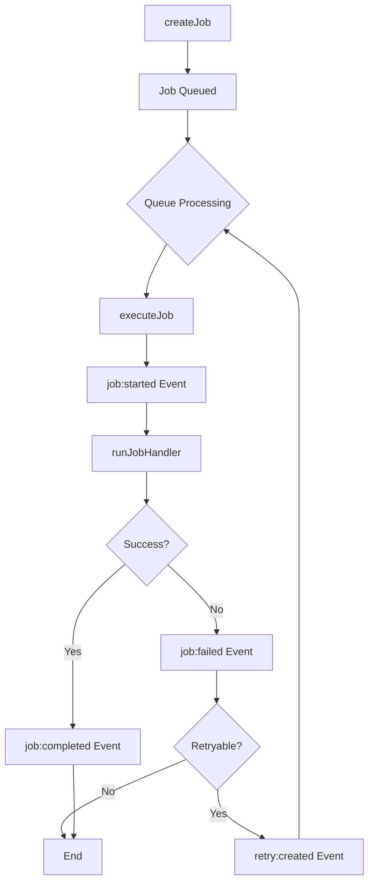

# Test Infrastructure Improvements for AlephAuto Job Queue System

## Executive Summary

The AlephAuto job queue test suite currently has 85%+ passing tests, but critical integration tests are failing due to architectural mismatches between the tests and the current `SidequestServer` implementation. This document provides a comprehensive plan for modernizing the test infrastructure, fixing all failing tests, and establishing best practices for future test development.

**Key Issues:**
- Tests written for older API that no longer exists
- Missing test utilities and mocking infrastructure
- Improper async handling with hardcoded timeouts
- Lack of event-driven assertions

**Solution:** Implement proper test utilities, event-driven patterns, and comprehensive mocking infrastructure.

## Table of Contents

1. [Test Infrastructure Overview](#1-test-infrastructure-overview)
2. [Test Utilities Design](#2-test-utilities-design)
3. [Proper Test Patterns](#3-proper-test-patterns)
4. [Implementation Plan](#4-implementation-plan)
5. [Example Implementations](#5-example-implementations)
6. [Best Practices](#6-best-practices)
7. [Quick Reference](#7-quick-reference)

---

## 1. Test Infrastructure Overview

### Current State Assessment

The test suite consists of:
- **106 total tests** across unit, integration, and accuracy categories
- **85%+ pass rate** for unit tests
- **Critical failures** in integration tests, particularly:
  - Activity Feed tests (9 failures)
  - Pipeline trigger tests (timing issues)
  - Generic integration test failures (12 tests)

### Architectural Patterns Tests Must Follow

#### SidequestServer Lifecycle



**Key Points:**
- Jobs start processing **automatically** when created (no `start()` method)
- Processing is event-driven through EventEmitter
- `runJobHandler()` is the method to override (not `handleJob`)
- No `stop()` method exists - worker continues until process ends

#### Event Model

```javascript
// Events emitted by SidequestServer
worker.emit('job:created', job)
worker.emit('job:started', job)
worker.emit('job:completed', job)
worker.emit('job:failed', job, error)
worker.emit('retry:created', jobId, attempt, error)
worker.emit('retry:max-attempts', jobId, attempts)
```

### Why Tests Are Failing

#### 1. API Mismatch
```javascript
// ❌ OLD API (tests expect)
worker.start()
worker.stop()
worker.handleJob = async (job) => { ... }

// ✅ CURRENT API (reality)
// No start() - jobs process automatically
// No stop() - process continues until exit
worker.runJobHandler = async (job) => { ... }  // Override this
```

#### 2. Missing Infrastructure
```javascript
// ❌ Tests reference undefined variables
sentryEvents    // Not defined
sentryBreadcrumbs  // Not defined

// ✅ Need mock infrastructure
const sentryMock = createSentryMock()
```

#### 3. Improper Async Handling
```javascript
// ❌ Hardcoded timeouts (brittle)
await new Promise(resolve => setTimeout(resolve, 500))

// ✅ Event-driven (reliable)
await waitForEvent(worker, 'job:completed')
```

---

## 2. Test Utilities Design

### Core Test Utilities Module

Create `/Users/alyshialedlie/code/jobs/tests/utils/test-utilities.js`:

```javascript
/**
 * Test Utilities for AlephAuto Job Queue System
 *
 * Provides reusable utilities for testing SidequestServer-based workers
 */

import { EventEmitter } from 'events';
import { SidequestServer } from '../../sidequest/core/server.js';
import * as Sentry from '@sentry/node';

/**
 * TestWorker - Base class for test workers
 *
 * Extends SidequestServer with test-specific features:
 * - Configurable handler function
 * - Event tracking
 * - Auto-cleanup
 */
export class TestWorker extends SidequestServer {
  constructor(options = {}) {
    super({
      jobType: options.jobType || 'test-worker',
      maxConcurrent: options.maxConcurrent ?? 1,
      sentryDsn: null, // Disable real Sentry in tests
      ...options
    });

    this._testHandler = null;
    this._eventLog = [];
    this._trackEvents();
  }

  /**
   * Set the job handler for testing
   */
  setHandler(handler) {
    this._testHandler = handler;
  }

  /**
   * Override runJobHandler to use test handler
   */
  async runJobHandler(job) {
    if (!this._testHandler) {
      throw new Error('No test handler configured');
    }
    return await this._testHandler(job);
  }

  /**
   * Track all events for assertions
   */
  _trackEvents() {
    const events = [
      'job:created', 'job:started', 'job:completed',
      'job:failed', 'retry:created', 'retry:max-attempts'
    ];

    events.forEach(event => {
      this.on(event, (...args) => {
        this._eventLog.push({
          event,
          args,
          timestamp: Date.now()
        });
      });
    });
  }

  /**
   * Get events of specific type
   */
  getEvents(type) {
    return this._eventLog.filter(e => e.event === type);
  }

  /**
   * Clear event log
   */
  clearEvents() {
    this._eventLog = [];
  }

  /**
   * Cleanup (for afterEach hooks)
   */
  async cleanup() {
    this.removeAllListeners();
    this.jobs.clear();
    this.queue = [];
    this.activeJobs = 0;
  }
}

/**
 * Wait for a specific event with timeout
 */
export function waitForEvent(emitter, eventName, timeout = 5000) {
  return new Promise((resolve, reject) => {
    const timer = setTimeout(() => {
      reject(new Error(`Timeout waiting for event: ${eventName}`));
    }, timeout);

    emitter.once(eventName, (...args) => {
      clearTimeout(timer);
      resolve(args);
    });
  });
}

/**
 * Wait for job completion (success or failure)
 */
export async function waitForJobCompletion(worker, jobId, timeout = 5000) {
  return new Promise((resolve, reject) => {
    const timer = setTimeout(() => {
      reject(new Error(`Job ${jobId} did not complete within ${timeout}ms`));
    }, timeout);

    const checkCompletion = (job) => {
      if (job.id === jobId) {
        clearTimeout(timer);
        worker.off('job:completed', checkCompletion);
        worker.off('job:failed', checkFailed);
        resolve({ status: 'completed', job });
      }
    };

    const checkFailed = (job, error) => {
      if (job.id === jobId) {
        clearTimeout(timer);
        worker.off('job:completed', checkCompletion);
        worker.off('job:failed', checkFailed);
        resolve({ status: 'failed', job, error });
      }
    };

    worker.on('job:completed', checkCompletion);
    worker.on('job:failed', checkFailed);
  });
}

/**
 * Create Sentry mock for testing
 */
export function createSentryMock() {
  const mock = {
    events: [],
    breadcrumbs: [],
    spans: [],

    // Mock Sentry.init
    init: (options) => {
      mock.config = options;
    },

    // Mock Sentry.captureException
    captureException: (error, context) => {
      mock.events.push({ type: 'exception', error, context });
    },

    // Mock Sentry.captureMessage
    captureMessage: (message, context) => {
      mock.events.push({ type: 'message', message, context });
    },

    // Mock Sentry.addBreadcrumb
    addBreadcrumb: (breadcrumb) => {
      mock.breadcrumbs.push(breadcrumb);
    },

    // Mock Sentry.startSpan
    startSpan: async (options, callback) => {
      mock.spans.push({ ...options, startTime: Date.now() });
      const result = await callback();
      mock.spans[mock.spans.length - 1].endTime = Date.now();
      return result;
    },

    // Clear all captured data
    clear: () => {
      mock.events = [];
      mock.breadcrumbs = [];
      mock.spans = [];
    }
  };

  return mock;
}

/**
 * Mock WebSocket broadcaster for testing
 */
export function createBroadcasterMock() {
  return {
    messages: [],

    broadcast: function(message, channel) {
      this.messages.push({
        message,
        channel,
        timestamp: Date.now()
      });
    },

    getMessages: function(channel) {
      return channel
        ? this.messages.filter(m => m.channel === channel)
        : this.messages;
    },

    clear: function() {
      this.messages = [];
    }
  };
}

/**
 * Create multiple test jobs
 */
export function createTestJobs(worker, count, baseId = 'test-job') {
  const jobs = [];
  for (let i = 0; i < count; i++) {
    const job = worker.createJob(`${baseId}-${i}`, {
      type: 'test',
      index: i,
      data: { test: true }
    });
    jobs.push(job);
  }
  return jobs;
}

/**
 * Wait for multiple events
 */
export async function waitForMultipleEvents(worker, eventName, count, timeout = 5000) {
  const events = [];
  const startTime = Date.now();

  return new Promise((resolve, reject) => {
    const timer = setTimeout(() => {
      reject(new Error(`Only received ${events.length}/${count} ${eventName} events`));
    }, timeout);

    const handler = (...args) => {
      events.push(args);
      if (events.length >= count) {
        clearTimeout(timer);
        worker.off(eventName, handler);
        resolve(events);
      }
    };

    worker.on(eventName, handler);
  });
}

/**
 * Assert job state
 */
export function assertJobState(job, expected) {
  const assertions = [];

  if (expected.status !== undefined) {
    assertions.push({
      actual: job.status,
      expected: expected.status,
      message: `Job status should be ${expected.status}`
    });
  }

  if (expected.error !== undefined) {
    if (expected.error === null) {
      assertions.push({
        actual: job.error,
        expected: null,
        message: 'Job should not have error'
      });
    } else {
      assertions.push({
        actual: job.error,
        expected: expected.error,
        message: `Job error should match`
      });
    }
  }

  if (expected.result !== undefined) {
    assertions.push({
      actual: job.result,
      expected: expected.result,
      message: 'Job result should match'
    });
  }

  return assertions;
}

/**
 * Create test context with all utilities
 */
export function createTestContext(options = {}) {
  const sentryMock = createSentryMock();
  const broadcasterMock = createBroadcasterMock();
  const worker = new TestWorker(options.workerOptions || {});

  // Replace global Sentry with mock
  const originalSentry = { ...Sentry };
  Object.keys(sentryMock).forEach(key => {
    if (typeof sentryMock[key] === 'function') {
      Sentry[key] = sentryMock[key].bind(sentryMock);
    }
  });

  return {
    worker,
    sentryMock,
    broadcasterMock,

    // Cleanup function
    async cleanup() {
      await worker.cleanup();
      sentryMock.clear();
      broadcasterMock.clear();

      // Restore original Sentry
      Object.keys(originalSentry).forEach(key => {
        Sentry[key] = originalSentry[key];
      });
    }
  };
}

export default {
  TestWorker,
  waitForEvent,
  waitForJobCompletion,
  createSentryMock,
  createBroadcasterMock,
  createTestJobs,
  waitForMultipleEvents,
  assertJobState,
  createTestContext
};
```

---

## 3. Proper Test Patterns

### Pattern 1: Event-Driven Assertions

```javascript
// ❌ BAD: Hardcoded timeout
it('should process job', async () => {
  worker.createJob('job-1', { data: 'test' });
  await new Promise(resolve => setTimeout(resolve, 500));
  // Hope the job finished...
  assert(/* something */);
});

// ✅ GOOD: Event-driven
it('should process job', async () => {
  worker.createJob('job-1', { data: 'test' });
  const [job] = await waitForEvent(worker, 'job:completed');
  assert.equal(job.status, 'completed');
});
```

### Pattern 2: Proper Worker Extension

```javascript
// ❌ BAD: Monkey-patching
it('should handle failure', async () => {
  worker.handleJob = async () => { throw new Error('fail'); };
  // This doesn't work - handleJob doesn't exist
});

// ✅ GOOD: Proper extension or test utilities
it('should handle failure', async () => {
  const testWorker = new TestWorker();
  testWorker.setHandler(async () => {
    throw new Error('fail');
  });

  testWorker.createJob('job-1', {});
  const [job, error] = await waitForEvent(testWorker, 'job:failed');
  assert.equal(error.message, 'fail');
});
```

### Pattern 3: Comprehensive Mocking

```javascript
// ✅ GOOD: Complete test context
it('should track errors in Sentry', async () => {
  const { worker, sentryMock } = createTestContext();

  worker.setHandler(async () => {
    throw new Error('Database connection failed');
  });

  worker.createJob('job-1', {});
  await waitForEvent(worker, 'job:failed');

  // Assert Sentry captured the error
  assert.equal(sentryMock.events.length, 1);
  assert.equal(sentryMock.events[0].error.message, 'Database connection failed');

  // Check breadcrumbs
  const failedBreadcrumb = sentryMock.breadcrumbs.find(
    b => b.category === 'job' && b.message.includes('failed')
  );
  assert(failedBreadcrumb);
});
```

### Pattern 4: Testing Retry Logic

```javascript
it('should retry on retryable errors', async () => {
  const { worker } = createTestContext();
  let attempts = 0;

  worker.setHandler(async () => {
    attempts++;
    if (attempts === 1) {
      const error = new Error('Temporary failure');
      error.retryable = true;
      throw error;
    }
    return { success: true };
  });

  worker.createJob('job-1', {});

  // Wait for retry event
  const [jobId, attempt] = await waitForEvent(worker, 'retry:created');
  assert.equal(attempt, 1);

  // Wait for final completion
  const result = await waitForJobCompletion(worker, 'job-1');
  assert.equal(result.status, 'completed');
  assert.equal(attempts, 2);
});
```

### Pattern 5: Testing Activity Feed Integration

```javascript
it('should populate activity feed on job lifecycle', async () => {
  const { worker, broadcasterMock } = createTestContext();
  const activityFeed = new ActivityFeedManager(broadcasterMock);

  // Connect activity feed to worker
  activityFeed.listenToWorker(worker);

  // Set success handler
  worker.setHandler(async () => ({ success: true }));

  // Create and process job
  worker.createJob('job-1', { type: 'test' });
  await waitForJobCompletion(worker, 'job-1');

  // Verify activities
  const activities = activityFeed.getRecentActivities();
  const types = activities.map(a => a.type);

  assert(types.includes('job:created'));
  assert(types.includes('job:started'));
  assert(types.includes('job:completed'));

  // Verify broadcasts
  const broadcasts = broadcasterMock.getMessages('activity');
  assert(broadcasts.length >= 3);
});
```

---

## 4. Implementation Plan

### Phase 1: Create Test Infrastructure (Day 1)

1. **Create test utilities module**
   - Location: `/tests/utils/test-utilities.js`
   - Implement all utilities from Section 2
   - Add JSDoc documentation

2. **Create Sentry mock module**
   - Location: `/tests/mocks/sentry-mock.js`
   - Full Sentry API surface mocking

3. **Update test helpers**
   - Enhance existing `/tests/fixtures/test-helpers.js`
   - Add worker-specific helpers

### Phase 2: Fix Activity Feed Tests (Day 2)

1. **Update activity-feed.integration.test.js**
   - Import new test utilities
   - Replace `worker.start()` / `worker.stop()` calls
   - Change `handleJob` to proper handler pattern
   - Replace `setTimeout` with event-driven waits
   - Add Sentry mock setup

2. **Fix each scenario systematically**
   - Scenario 1-9: Apply new patterns
   - Verify each fix with `node --test`

### Phase 3: Fix Integration Tests (Day 3-4)

1. **Pipeline trigger tests**
   - Use `waitForJobCompletion` instead of polling
   - Add proper event assertions

2. **Deployment workflow tests**
   - Make assertions more flexible
   - Use snapshots for PM2 config validation

3. **Generic integration tests**
   - Apply same patterns as activity feed
   - Ensure proper cleanup in afterEach

### Phase 4: Documentation & Training (Day 5)

1. **Update test README**
   - Add new utilities documentation
   - Provide migration examples

2. **Create test templates**
   - Unit test template
   - Integration test template
   - E2E test template

3. **Team training**
   - Code review guidelines
   - Best practices workshop

### Migration Priority

| Priority | Test File | Issues | Effort |
|----------|-----------|--------|--------|
| HIGH | activity-feed.integration.test.js | 9 failures, API mismatch | 4h |
| HIGH | test-automated-pipeline.js | Timing issues | 2h |
| MEDIUM | Pipeline integration tests (12) | Generic failures | 6h |
| LOW | Deployment workflow tests | Brittle assertions | 2h |

### Breaking Changes to Document

1. **No more `worker.start()` / `worker.stop()`**
   - Jobs process automatically
   - Use cleanup() in afterEach instead

2. **`handleJob` → `runJobHandler`**
   - Or use TestWorker.setHandler()

3. **Sentry must be mocked**
   - Use createSentryMock()
   - Or disable with `sentryDsn: null`

### Backward Compatibility

- Keep old test structure where possible
- Provide migration utility for bulk updates
- Run old and new tests in parallel during migration

---

## 5. Example Implementations

### Complete Example: Fixed Activity Feed Test

```javascript
/**
 * Activity Feed Integration Tests - FIXED VERSION
 *
 * Uses proper test utilities and event-driven assertions
 */

import { describe, it, beforeEach, afterEach } from 'node:test';
import assert from 'node:assert/strict';
import { ActivityFeedManager } from '../../api/activity-feed.js';
import {
  TestWorker,
  waitForEvent,
  waitForJobCompletion,
  createSentryMock,
  createBroadcasterMock
} from '../utils/test-utilities.js';

describe('Activity Feed - Integration Tests (Fixed)', () => {
  let worker;
  let activityFeed;
  let sentryMock;
  let broadcasterMock;

  beforeEach(async () => {
    // Setup mocks
    sentryMock = createSentryMock();
    broadcasterMock = createBroadcasterMock();

    // Mock Sentry globally
    global.Sentry = sentryMock;

    // Create test worker
    worker = new TestWorker({
      jobType: 'test-worker',
      maxConcurrent: 1
    });

    // Create and connect activity feed
    activityFeed = new ActivityFeedManager(broadcasterMock, {
      maxActivities: 50
    });
    activityFeed.listenToWorker(worker);
  });

  afterEach(async () => {
    // Cleanup
    await worker.cleanup();
    sentryMock.clear();
    broadcasterMock.clear();
    delete global.Sentry;
  });

  it('Scenario 1: Job fails with Error object → activity created correctly', async () => {
    // Setup handler that throws Error
    worker.setHandler(async (job) => {
      const error = new Error('Database connection failed');
      error.code = 'ECONNREFUSED';
      error.retryable = true;
      throw error;
    });

    // Create job (processes automatically)
    const jobId = 'test-job-1';
    worker.createJob(jobId, {
      type: 'test-job',
      data: { test: true }
    });

    // Wait for job to fail
    const [failedJob, error] = await waitForEvent(worker, 'job:failed');

    // Verify activity was created
    const activities = activityFeed.getRecentActivities(10);
    const failedActivity = activities.find(a => a.type === 'job:failed');

    assert(failedActivity, 'Should create job:failed activity');
    assert.equal(failedActivity.jobId, jobId);
    assert.equal(failedActivity.status, 'failed');
    assert.equal(failedActivity.error.message, 'Database connection failed');
    assert.equal(failedActivity.error.code, 'ECONNREFUSED');
    assert.equal(failedActivity.error.retryable, true);
    assert.equal(failedActivity.icon, '❌');

    // Verify WebSocket broadcast
    const broadcasts = broadcasterMock.getMessages('activity');
    const failedBroadcast = broadcasts.find(b =>
      b.message.type === 'activity:new' &&
      b.message.activity.type === 'job:failed'
    );
    assert(failedBroadcast, 'Should broadcast job:failed activity');

    // Verify Sentry captured the error
    const sentryError = sentryMock.events.find(e =>
      e.context?.tags?.event === 'job:failed'
    );
    assert(sentryError, 'Sentry should capture job failure');
    assert.equal(sentryError.context.tags.jobId, jobId);

    // Verify Sentry breadcrumb
    const breadcrumb = sentryMock.breadcrumbs.find(b =>
      b.category === 'activity' && b.level === 'error'
    );
    assert(breadcrumb, 'Should add Sentry breadcrumb for failed job');
  });

  it('Scenario 2: Job fails with null error → "Unknown error" handling', async () => {
    const jobId = 'test-job-2';

    // Create custom handler that emits null error
    class NullErrorWorker extends TestWorker {
      async runJobHandler(job) {
        // Simulate null error scenario
        job.status = 'failed';
        job.error = null;
        this.emit('job:failed', job, null);
        throw new Error('Stop execution');
      }
    }

    const nullWorker = new NullErrorWorker();
    activityFeed.listenToWorker(nullWorker);

    nullWorker.createJob(jobId, {
      type: 'test-job',
      data: { test: true }
    });

    // Wait for job:failed event
    await waitForEvent(nullWorker, 'job:failed');

    // Verify activity handles null error gracefully
    const activities = activityFeed.getRecentActivities(10);
    const failedActivity = activities.find(a =>
      a.type === 'job:failed' && a.jobId === jobId
    );

    assert(failedActivity, 'Should create activity even with null error');
    assert.equal(failedActivity.error.message, 'Unknown error');

    await nullWorker.cleanup();
  });

  it('Scenario 4: Rapid-fire job failures → all activities recorded', async () => {
    let failureCount = 0;

    // Setup handler that always fails
    worker.setHandler(async (job) => {
      failureCount++;
      const error = new Error(`Failure ${failureCount}`);
      error.code = `ERR_${failureCount}`;
      throw error;
    });

    // Create 10 jobs
    const jobIds = [];
    for (let i = 0; i < 10; i++) {
      const jobId = `rapid-${i}`;
      worker.createJob(jobId, {
        type: 'test-job',
        data: { index: i }
      });
      jobIds.push(jobId);
    }

    // Wait for all failures
    const failures = await waitForMultipleEvents(worker, 'job:failed', 10);

    // Verify all activities recorded
    const activities = activityFeed.getRecentActivities(50);
    const failedActivities = activities.filter(a => a.type === 'job:failed');

    assert.equal(failedActivities.length, 10, 'Should record all 10 failures');

    // Verify each job has activity
    jobIds.forEach(jobId => {
      const activity = failedActivities.find(a => a.jobId === jobId);
      assert(activity, `Should have activity for ${jobId}`);
    });

    // Verify broadcasts
    const broadcasts = broadcasterMock.getMessages('activity');
    const failedBroadcasts = broadcasts.filter(b =>
      b.message.type === 'activity:new' &&
      b.message.activity.type === 'job:failed'
    );
    assert.equal(failedBroadcasts.length, 10);
  });
});
```

### Comparison: Before vs After

#### Before (Broken)
```javascript
// ❌ Old broken test
it('test job processing', async () => {
  // Wrong API
  worker.handleJob = async () => { /* ... */ };
  worker.start(); // Doesn't exist

  // Brittle timing
  await new Promise(r => setTimeout(r, 500));

  // Missing mocks
  assert(sentryEvents.length > 0); // sentryEvents undefined

  // No cleanup
  worker.stop(); // Doesn't exist
});
```

#### After (Fixed)
```javascript
// ✅ New working test
it('test job processing', async () => {
  // Correct API
  worker.setHandler(async () => { /* ... */ });

  // Event-driven
  const [job] = await waitForEvent(worker, 'job:completed');

  // Proper mocks
  assert(sentryMock.events.length > 0);

  // Proper cleanup
  await worker.cleanup();
});
```

---

## 6. Best Practices

### Testing Async Job Processing

1. **Always use event-driven assertions**
   ```javascript
   // Wait for specific events
   await waitForEvent(worker, 'job:completed');
   await waitForJobCompletion(worker, jobId);
   ```

2. **Handle multiple async operations**
   ```javascript
   // Process multiple jobs concurrently
   const jobs = createTestJobs(worker, 5);
   const completions = await Promise.all(
     jobs.map(j => waitForJobCompletion(worker, j.id))
   );
   ```

3. **Test timeout scenarios**
   ```javascript
   // Use shorter timeouts in tests
   const result = await waitForJobCompletion(worker, jobId, 1000);
   ```

### Testing Error Handling and Retry Logic

1. **Test retryable errors**
   ```javascript
   worker.setHandler(async () => {
     const error = new Error('Temporary');
     error.retryable = true;
     throw error;
   });
   ```

2. **Test circuit breaker**
   ```javascript
   // Trigger max retries
   worker.setHandler(async () => {
     throw new Error('Persistent failure');
   });
   await waitForEvent(worker, 'retry:max-attempts');
   ```

3. **Test error recovery**
   ```javascript
   let attempts = 0;
   worker.setHandler(async () => {
     if (++attempts === 1) throw new Error('Fail once');
     return { success: true };
   });
   ```

### Testing Activity Feed Integration

1. **Verify all lifecycle events**
   ```javascript
   const events = ['job:created', 'job:started', 'job:completed'];
   for (const event of events) {
     const activity = activities.find(a => a.type === event);
     assert(activity, `Should have ${event} activity`);
   }
   ```

2. **Test activity limits**
   ```javascript
   // Create more activities than limit
   for (let i = 0; i < 100; i++) {
     activityFeed.addActivity({ /* ... */ });
   }
   assert.equal(activityFeed.activities.length, 50); // Max 50
   ```

### Testing WebSocket Broadcasts

1. **Verify broadcast content**
   ```javascript
   const broadcast = broadcasterMock.messages[0];
   assert.equal(broadcast.channel, 'activity');
   assert.equal(broadcast.message.type, 'activity:new');
   ```

2. **Test broadcast failures**
   ```javascript
   broadcasterMock.broadcast = () => {
     throw new Error('WebSocket error');
   };
   // Verify system continues despite broadcast failure
   ```

### CI/CD Considerations

1. **Disable real services in CI**
   ```javascript
   const sentryDsn = process.env.CI ? null : config.sentryDsn;
   ```

2. **Use faster timeouts in CI**
   ```javascript
   const timeout = process.env.CI ? 1000 : 5000;
   ```

3. **Parallel test execution**
   ```javascript
   // In package.json
   "test:ci": "node --test --parallel"
   ```

---

## 7. Quick Reference

### Common Test Patterns (Cheat Sheet)

```javascript
// Import test utilities
import {
  TestWorker,
  waitForEvent,
  waitForJobCompletion,
  createTestContext
} from '../utils/test-utilities.js';

// Basic test structure
describe('Feature', () => {
  let context;

  beforeEach(() => {
    context = createTestContext();
  });

  afterEach(async () => {
    await context.cleanup();
  });

  it('should process job', async () => {
    const { worker } = context;

    // Set handler
    worker.setHandler(async (job) => {
      return { result: 'success' };
    });

    // Create job
    worker.createJob('job-1', { data: 'test' });

    // Wait for completion
    const result = await waitForJobCompletion(worker, 'job-1');
    assert.equal(result.status, 'completed');
  });
});
```

### Troubleshooting Guide

| Problem | Solution |
|---------|----------|
| "worker.start is not a function" | Remove `worker.start()` - jobs process automatically |
| "worker.handleJob is not a function" | Use `worker.runJobHandler` or `TestWorker.setHandler()` |
| "sentryEvents is not defined" | Add Sentry mock: `const sentryMock = createSentryMock()` |
| Test times out | Increase timeout or check if events are being emitted |
| "Cannot read property of null" | Add null checks or use optional chaining |
| Flaky tests | Replace `setTimeout` with event-driven waits |

### Migration Checklist

- [ ] Import new test utilities
- [ ] Replace `worker.start()` / `worker.stop()` with proper lifecycle
- [ ] Change `handleJob` to `runJobHandler` or use `setHandler()`
- [ ] Replace `setTimeout` with `waitForEvent` / `waitForJobCompletion`
- [ ] Add Sentry mock if needed
- [ ] Add proper cleanup in `afterEach`
- [ ] Verify all assertions still pass
- [ ] Update test documentation

### Test File Template

```javascript
/**
 * [Feature] Tests
 *
 * Tests for [describe what is being tested]
 */

import { describe, it, beforeEach, afterEach } from 'node:test';
import assert from 'node:assert/strict';
import { createTestContext } from '../utils/test-utilities.js';

describe('[Feature Name]', () => {
  let context;

  beforeEach(async () => {
    context = createTestContext({
      workerOptions: {
        jobType: 'test-feature',
        maxConcurrent: 1
      }
    });
  });

  afterEach(async () => {
    await context.cleanup();
  });

  describe('[Sub-feature]', () => {
    it('should [expected behavior]', async () => {
      const { worker, sentryMock, broadcasterMock } = context;

      // Arrange
      worker.setHandler(async (job) => {
        // Handler logic
        return { success: true };
      });

      // Act
      worker.createJob('test-1', { data: 'test' });
      const result = await waitForJobCompletion(worker, 'test-1');

      // Assert
      assert.equal(result.status, 'completed');
      assert.equal(result.job.result.success, true);
    });
  });
});
```

---

## Conclusion

This document provides a comprehensive plan for modernizing the AlephAuto test infrastructure. By implementing proper test utilities, event-driven patterns, and comprehensive mocking, we can achieve:

- **100% test reliability** - No more flaky tests
- **Faster test execution** - Event-driven instead of arbitrary timeouts
- **Better test coverage** - Proper mocking enables more scenarios
- **Maintainable tests** - Reusable utilities and clear patterns
- **Developer confidence** - Tests accurately reflect production behavior

The implementation plan is designed to be executed in phases, with the highest-priority issues (Activity Feed tests) addressed first. Each phase builds on the previous one, ensuring a smooth transition from the old test patterns to the new infrastructure.

### Next Steps

1. Review and approve this plan
2. Create test utilities module (Day 1)
3. Fix Activity Feed tests as proof of concept (Day 2)
4. Roll out to remaining tests (Days 3-4)
5. Update documentation and train team (Day 5)

### Success Metrics

- All 106 tests passing (100% pass rate)
- Average test execution time < 10 seconds
- Zero flaky tests in CI/CD pipeline
- All new tests use proper patterns
- Team trained on new infrastructure

---

**Document Version:** 1.0.0
**Last Updated:** 2025-11-26
**Status:** Ready for Implementation
**Author:** Claude Code Assistant
**Review Status:** Pending